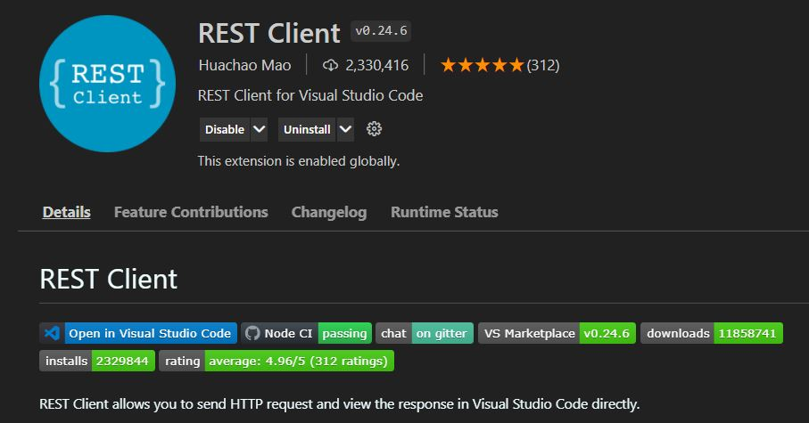
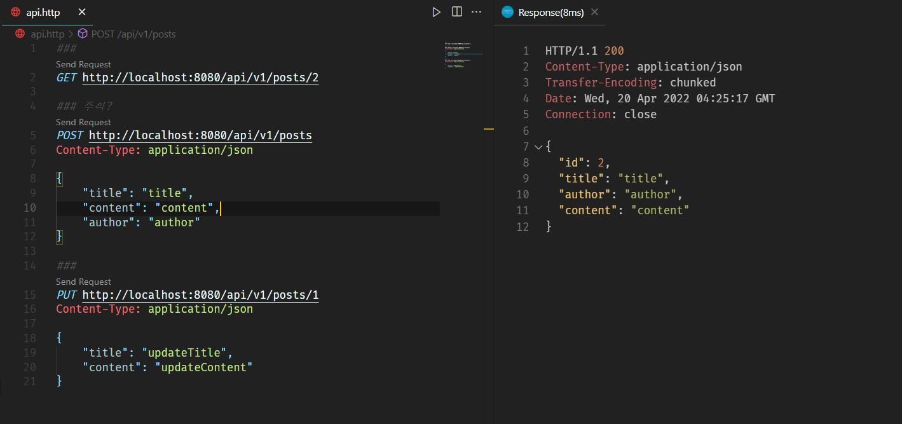

- [REST 맛보기](#rest-맛보기)
  - [REST(Representational State Transfer)란?](#restrepresentational-state-transfer란)
  - [CRUD](#crud)
    - [장점](#장점)
    - [단점](#단점)
  - [REST API 설계](#rest-api-설계)
  - [IDE에서 REST API 사용하기](#ide에서-rest-api-사용하기)
    - [Intellij](#intellij)
    - [VScode](#vscode)
  - [Reference](#reference)

# REST 맛보기

## REST(Representational State Transfer)란?

- 자원을 이름을 구분하여 해당 상태 정보를 주고 받는 것
- 자원(Resource)의 표현
  - 이미지, 문서, 데이터..
- 자원의 표현 - 그 자원을 표현하기 위한 이름
  - 상태전달 by JSON or XML

## CRUD

- HTTP Method(POST, GET, PUT, DELETE)를 통해 CRUD 적용
- Create
- Read
- Update
- Delete

### 장점
- HTTP 프로토콜의 범용성 → 모든 플랫폼 활용 가능
- Server와 Client의 **역할 분리**

### 단점
- 별도 표준이 존재하지 않음

## REST API 설계
**`Bad`**
- 동사 사용
- 대문자 사용
- 단수형 사용
```
api/v1/createMovies
api/v1/seeMovies
api/v1/getMovie/DrStrange
api/v1/deleteMovie/DrStrange
api/v1/updateMovie/DrStrange
...

```
**`Good`**
- 동사 보다는 명사
- 자원에 대한 행위를 HTTP Method(GET, PUT, POST, DELETE)로 표현
- Underscore(_) 보다는 Hyphen(-)사용
```
api/v1/Movies
api/v1/Movies/dr-strange
api/v1/Movies/dr-strange
```

## IDE에서 REST API 사용하기

### Intellij

### VScode

1) REST Extensions 설치


2) 확장자가 .http인 파일 생성 및 실행


## Reference
- [REST란?](https://gmlwjd9405.github.io/2018/09/21/rest-and-restful.html)
- [5분 만에 제대로 설계하는 REST API](https://www.youtube.com/watch?v=4DxHX95Lq2U)
- [REST API 제대로 알고 사용하기](https://meetup.toast.com/posts/92)