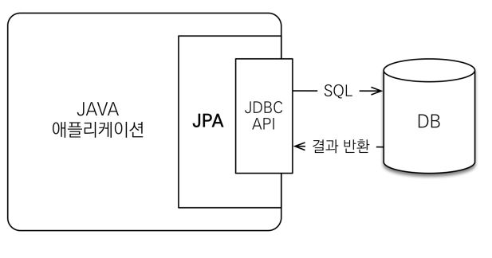

- [JPA (Java Persistence API)](#jpa-java-persistence-api)
  - [배경지식](#배경지식)
    - [객체 지향 프로그래밍 언어 (Object Oriented Programming)](#객체-지향-프로그래밍-언어-object-oriented-programming)
    - [관계형 데이터베이스(Relational Database)](#관계형-데이터베이스relational-database)
  - [JPA 등장배경](#jpa-등장배경)
  - [JPA 특징](#jpa-특징)
    - [ORM (Object Relational Mapping)](#orm-object-relational-mapping)
    - [지연로딩과 즉시로딩](#지연로딩과-즉시로딩)
  - [Reference](#reference)

# JPA (Java Persistence API)

## 배경지식

### 객체 지향 프로그래밍 언어 (Object Oriented Programming)

- Java, Python ...

- 객체에 정보를 저장하고, 객체마다 주어진 `책임`과 `역할`이 존재

### 관계형 데이터베이스(Relational Database)

- 열과 행으로 이루어진 테이블 집합

- 키(key)와 값(value)들의 간단한 관계를 테이블화

- transcation에서 중요한 commit

> "객체를 관계형 DB로 변경해서 저장하고 관계형 DB에서 꺼내어 객체로 저장해서 사용하려고 보니 정말 번거롭다."

## JPA 등장배경

- `객체를 Java Collection에 넣을 수 있듯이 DB를 사용할 순 없을까?` 라는 고민에서 시작

ToDo라는 객체에서 완료 날짜라는 컬럼(complete_date)이 추가되는 경우.. 
컬럼도 추가해줘야하고.. 
기존 Query도 바꿔줘야하고..
JPA에서는 @Column만 추가해주면 된다!

- 객체는 객체대로, 관계형 DB는 관계형 DB대로 설계

- **패러다임 불일치를 해결**

```
// 객체를 테이블에 맞추어 모델링
class Board {
  Long id;
  Long commentId; // COMMENT_ID FK 컬럼 사용
  String title;
  String content;
}

class Comment {
  Long id;
  String title;
  String content;
}

INSERT INTO BOARD (BOARD_ID, COMMENT_ID, BOARD_TITLE, BOARD_CONTENT) VALUES ...
```

```
// 객체를 참조하여 저장
class Board {
  Long id;
  Comment comment;
  String title;
  String content;
}

board.getComment().getId();

INSERT INTO BOARD (BOARD_ID, COMMENT_ID, BOARD_TITLE, BOARD_CONTENT) VALUES ...
```

## JPA 특징

- JPA는 **interface 모음**

- Hibernate : JPA를 구현

- 개발 생산성 증가

```
CREATE : jpa.persist(todo)

READ : Todo toDo = jpa.find(todoId)

UPDATE : todo.setName("변경할 이름)

DELETE : jpa.remove(todo)
```

- SQL 종속적인 개발 벗어나기

- 자바 ORM(Object Relational Mapping) 표준 기술

### ORM (Object Relational Mapping)

- 객체(Object)와 관계형 DB(Relational DB)의 Mapping

- ORM 프레임워크가 중간에서 매핑



- 주문 정보를 DB에 저장

- 유지보수 용이

- 대중적인 언어에서 대부분 ORM 기술이 존재
e.g.) (typescript ORM)[https://github.com/typeorm/typeorm]

### 지연로딩과 즉시로딩

- 지연로딩 : 객체가 실제 사용될 때 로딩

```
Board board = boardDAO.find(boardId); // SELECT * FROM BOARD
Comment comment = comment.getComment();
String commentTitle = comment.getTitle(); // SELECT * FROM COMMENT
```

- 즉시로딩 : JOIN SQL로 한번에 연관된 객체까지 미리 조회
```
Board board = boardDAO.find(boardId); // SELECT BOARD.*, COMMENT.* FROM BOARD JOIN COMMENT
Comment comment = comment.getComment();
String commentTitle = comment.getTitle();

```

## Reference

- [자바 ORM 표준 JPA 프로그래밍 - 기본편](https://www.inflearn.com/course/ORM-JPA-Basic/dashboard)

- [관계형 데이터베이스](https://ko.wikipedia.org/wiki/%EA%B4%80%EA%B3%84%ED%98%95_%EB%8D%B0%EC%9D%B4%ED%84%B0%EB%B2%A0%EC%9D%B4%EC%8A%A4)
