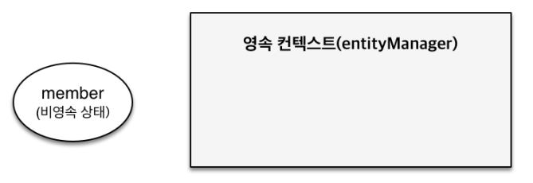
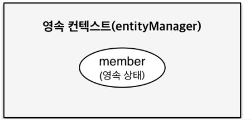
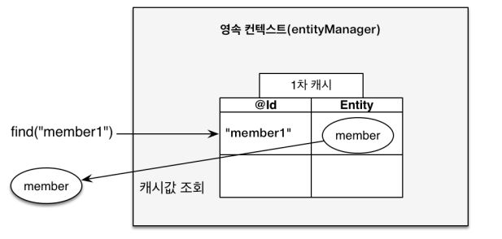
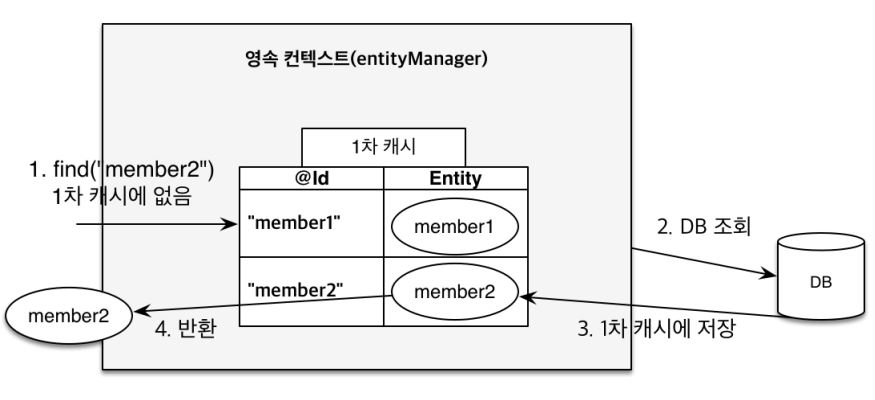
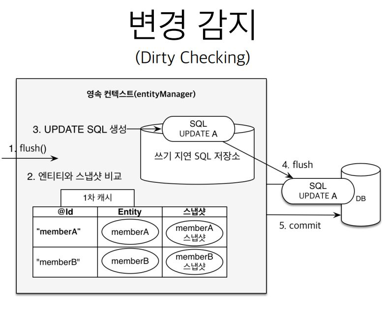

- [영속성 관리](#영속성-관리)
  - [JPA에서의 핵심 개념](#jpa에서의-핵심-개념)
  - [영속성 컨텍스트 (Persistence Context)](#영속성-컨텍스트-persistence-context)
  - [Entity Manager](#entity-manager)
  - [JPA's 4 Lifecycle States](#jpas-4-lifecycle-states)
  - [비영속](#비영속)
  - [영속](#영속)
  - [준영속, 삭제](#준영속-삭제)
  - [영속성 컨텍스트의 이점](#영속성-컨텍스트의-이점)
  - [1차 캐시](#1차-캐시)
    - [1차 캐시에 없을 때](#1차-캐시에-없을-때)
    - [1차 캐시에 있을 때](#1차-캐시에-있을-때)
  - [동일성 보장](#동일성-보장)
  - [변경 감지 (Dirty Checking)](#변경-감지-dirty-checking)
  - [flush](#flush)
    - [특징](#특징)
  - [Reference](#reference)

# 영속성 관리

## JPA에서의 핵심 개념

- 객체(Object)와 관계형 데이터베이스(Relational Database) 매핑

- 영속성 컨텍스트

## 영속성 컨텍스트 (Persistence Context)

- JPA(Java Persistence API)를 이해하는데 가장 중요한 용어

- `"Entity를 영구 저장하는 환경"`

- EntityManager.persist(entity);

## Entity Manager

- 영속성 컨텍스트는 눈에 보이지 않는 논리적 개념

- 영속성 컨텍스트는 Entity Manager를 통해 접근 가능

## JPA's 4 Lifecycle States


## 비영속



```
// DB connection과 관계 없이 그냥 객체만 생성
Member member = new Member();
member.setId(1L);
member.setName("geonyeon");
```

## 영속



```
EntityManager em = emf.createEntityManager();
EntityTranscation tx = em.getTranscation();
tx.begin();

try {
    // 객체 생성 (비영속)
    Member member = new Member();
    member.setId(1L);
    member.setName("geonyeon");

    em.persist(member); // 영속
} catch (Exception e) {
    tx.rollback();
} ...
```

## 준영속, 삭제

```
// member Entity를 영속성 컨텍스트에서 분리
em.detach(member);

// member 객체를 삭제
em.remove(member);
```

## 영속성 컨텍스트의 이점

- 1차 캐시

- 동일성 보장

- 변경 감지(Dirty Checking)

## 1차 캐시

### 1차 캐시에 없을 때



- DB까지 다녀오지 않고 값을 조회

### 1차 캐시에 있을 때



- DB까지 다녀와서 값을 1차 캐시에 저장 후 반환

## 동일성 보장

```
Member findMember1 = em.find(Member.class, 1L);
Member findMember2 = em.find(Member.class, 1L);

System.out.println(findMember1 == findMember2); // true
```

## 변경 감지 (Dirty Checking)

```
EntityManager em = emf.createEntityManager();
EntityTranscation tx = em.getTranscation();
tx.begin();

try {
    // Entity 조회
    Member findMember = em.find(Member.class, 1L);

    // Entity 데이터 변경
    findMember.setName("gyheo");

    // em.update(findMember); // 

    tx.commit();
} catch (Exception e) {
    tx.rollback();
} ...
```



## flush

### 특징

- 영속성 컨텍스트를 초기화 하는 게 X

- 영속성 컨텍스트의 변경 내용을 DB에 동기화

- transaction 작업 단위가 정말 중요

## Reference

- [자바 ORM 표준 JPA 프로그래밍 - 기본편](https://www.inflearn.com/course/ORM-JPA-Basic/dashmember)

- [Entity Lifecycle Model in JPA & Hibernate](https://thorben-janssen.com/entity-lifecycle-model)