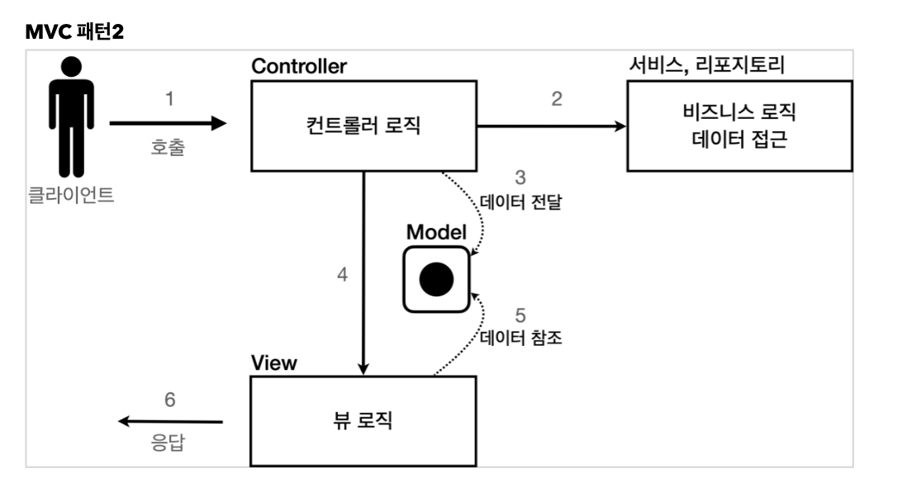

- [Servlet, JSP, MVC](#servlet-jsp-mvc)
	- [Servlet](#servlet)
		- [회원가입](#회원가입)
	- [JSP](#jsp)
		- [Template Engine](#template-engine)
	- [MVC 패턴](#mvc-패턴)
	- [해결](#해결)

# Servlet, JSP, MVC

## Servlet

### 회원가입

`MemberFormServlet.java`

```java
package com.hello.servlet.web.servlet;

import com.hello.servlet.domain.MemberRepository;

import javax.servlet.ServletException;
import javax.servlet.annotation.WebServlet;
import javax.servlet.http.HttpServlet;
import javax.servlet.http.HttpServletRequest;
import javax.servlet.http.HttpServletResponse;
import java.io.IOException;
import java.io.PrintWriter;

@WebServlet(name = "memberFormServlet", urlPatterns = "/servlet/members/new-form")
public class MemberFormServlet extends HttpServlet {
    private MemberRepository memberRepository = MemberRepository.getInstance(); // Singleton

    @Override
    public void service(HttpServletRequest request, HttpServletResponse response) throws ServletException, IOException {
        response.setContentType("text/html");
        response.setCharacterEncoding("utf-8");

        PrintWriter w = response.getWriter();
        w.write("<!DOCTYPE html>\n" +
                "<html>\n" +
                "<head>\n" +
                " <meta charset=\"UTF-8\">\n" +
                " <title>Title</title>\n" +
                "</head>\n" +
                "<body>\n" +
                "<form action=\"/servlet/members/save\" method=\"post\">\n" +
                " username: <input type=\"text\" name=\"username\" />\n" +
                " age: <input type=\"text\" name=\"age\" />\n" +
                " <button type=\"submit\">전송</button>\n" +
                "</form>\n" +
                "</body>\n" +
                "</html>\n");
    }
}
```

**서블릿 한계** : Java로 HTML코드 작성 => 유지보수가 쉽지 않다

## JSP

### Template Engine

- JSP

- Thymeleaf (권장)

- Freemarker

- Velocity

참고로 JSP는 성능, 기능 면에서 많이 쇠퇴하고 있다 (legacy)

`new-form/jsp`

```jsp
<%@ page contentType="text/html;charset=UTF-8" language="java" %>
<html>
<head>
    <title>Title</title>
</head>
<body>
<form action="save" method="post">
    username: <input type="text" name="username"/>
    age: <input type="text" name="age"/>
    <button type="submit">전송</button>
</form>
</body>
</html>
```

`members.jsp`

```jsp
<%@ page import="com.hello.servlet.domain.Member" %>
<%@ page import="java.util.List" %>
<%@ page import="com.hello.servlet.domain.MemberRepository" %>
<%@ page contentType="text/html;charset=UTF-8" language="java" %>
<%
    // 두 가지 일을 하나의 페이지에서 하는 느낌
    MemberRepository memberRepository = MemberRepository.getInstance();
    List<Member> members = memberRepository.findAll();
%>
<html>
<head>
    <title>Title</title>
</head>
<body>
<a href="/index.html">메인</a>
<table>
    <thead>
    <th>id</th>
    <th>username</th>
    <th>age</th>
    </thead>
    <tbody>
    <%
        for (Member member : members) {
            out.write("<tr>");
            out.write("    <td>" + member.getId() + "</td>");
            out.write("    <td>" + member.getUsername() + "</td>");
            out.write("    <td>" + member.getAge() + "</td>");
            out.write("</tr>");
        }
    %>
    </tbody>
</table>
</body>
</html>

```

**JSP의 한계** : Java + HTML 모양으로 비즈니스 로직, 화면에 보여주는 뷰 영역이 뒤섞여 있다

## MVC 패턴

> 비즈니스 로직, 뷰 영역을 깔끔하게 분리하자!




`MvcMemberListServlet.java` => 비즈니스 영역
```java
package com.hello.servlet.web.servlet.servletmvc;

import com.hello.servlet.domain.Member;
import com.hello.servlet.domain.MemberRepository;

import javax.servlet.RequestDispatcher;
import javax.servlet.ServletException;
import javax.servlet.ServletRequest;
import javax.servlet.ServletResponse;
import javax.servlet.annotation.WebServlet;
import javax.servlet.http.HttpServlet;
import java.io.IOException;
import java.util.List;

@WebServlet(name = "mvcMemberListServlet", urlPatterns = "/servlet-mvc/members")
public class MvcMemberListServlet extends HttpServlet {
    private MemberRepository memberRepository = MemberRepository.getInstance();

    @Override
    public void service(ServletRequest request, ServletResponse response) throws ServletException, IOException {
        List<Member> members = memberRepository.findAll();

        request.setAttribute("members", members);

        String viewPath = "/WEB-INF/views/members.jsp";
        RequestDispatcher dispatcher = request.getRequestDispatcher(viewPath);
        dispatcher.forward(request, response); /// 서버 내부에서 다시 호출, 클라이언트는 전혀 인지하지 못함
    }
}
```

`members.jsp` => 뷰 영역(jstl) 활용
```jsp
<%@ page contentType="text/html;charset=UTF-8" language="java" %>
<%@ taglib prefix="c" uri="http://java.sun.com/jsp/jstl/core" %>
<html>
<head>
    <title>Title</title>
</head>
<body>
<a href="/index.html">메인</a>
<table>
    <thead>
    <th>id</th>
    <th>username</th>
    <th>age</th>
    </thead>
    <tbody>
    <c:forEach var="item" items="${members}">
        <tr>
            <td>${item.id}</td>
            <td>${item.username}</td>
            <td>${item.age}</td>
        </tr>
    </c:forEach>
    </tbody>
</table>
</body>
</html>
```

**MVC 한계**

- 공통되는 코드 `viewPath`

- `dispatcher.forward(request, response)`의 중복 호출

## 해결

- FrontController Pattern 도입 (공통 기능 처리)