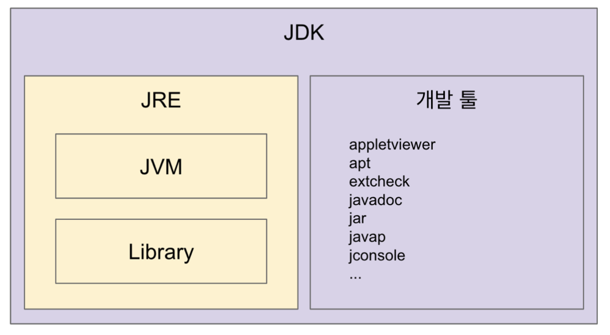

- [JVM](#jvm)
	- [JVM 이해하기](#jvm-이해하기)
		- [JVM (Java Virtual Machine)](#jvm-java-virtual-machine)
		- [JRE (Java Runtime Environment) : JVM + 라이브러리](#jre-java-runtime-environment--jvm--라이브러리)
		- [JDK (Java Developement Kit) : JRE + 개발 tool](#jdk-java-developement-kit--jre--개발-tool)
		- [JVM 언어](#jvm-언어)
	- [JVM 구조](#jvm-구조)
		- [클래스 로더 시스템](#클래스-로더-시스템)
		- [메모리](#메모리)
		- [실행 엔진](#실행-엔진)
		- [JNI (Java Native Interface)](#jni-java-native-interface)
	- [Reference](#reference)

# JVM

## JVM 이해하기

### JVM (Java Virtual Machine)

- 자바 가상 머신으로 자바 바이트 코드(.class 파일)를 OS에 맞는 코드로 변환

- 바이트 코드를 실행하는 *표준(JVM 자체는 표준)이자 구현체(특정 vendor가 구현)

- JVM vender : Oracle, Amazon, Azul ...

- 특정 플랫폼에 종속적

### JRE (Java Runtime Environment) : JVM + 라이브러리

- Java Application을 실행할 수 있도록 구성한 배포판

- JVM과 핵심 라이브러리 및 자바 런타임 환경에서 사용하는 property setting, resource 파일 존재

- 개발 관련 도구는 포함 X

### JDK (Java Developement Kit) : JRE + 개발 tool

- JRE + 개발에 필요한 tool

- 소스 코드를 작성할 때 사용하는 Java 언어는 플랫폼에 독립적

- Oracle의 Java11은 JDK만 제공되며, JRE는 따로 제공하지 않음

### JVM 언어

- JVM 기반으로 동작하는 프로그래밍 언어, 대표적으로 Kotlin

## JVM 구조

### 클래스 로더 시스템

- .class 파일에서 바이트코드를 읽고 메모리에 저장

- 로딩 : 클래스 읽어오는 과정

- 링크 : 레퍼런스를 연결하는 과정

- 초기화 : static 값들 초기화 및 변수에 할당

### 메모리

- 메모리 영역에는 클래스 수준의 정보(클래스 이름, 부모 클래스 이름, 메서드, 변수) 저장

- 힙 영역에는 객체를 저장, 공유 자원

- 스택 영역에는 메서드 호출을 스택 프레임이라 부르는 블럭에 쌓아 놓음

- PC (Program Counter) 레지스터 : 쓰레드마다 쓰레드 내 현재 실행할 스택 프레임을 가리키는 포인터

### 실행 엔진

- 인터프리터 : 바이트 코드를 한 줄씩 실행

- JIT 컴파일러 : 인터프리터 효율을 높이기 위해, 인터프리터가 반복되는 코드를 발견하면 JIT 컴파일러로 반복되는 코드를 모두 네이트 코드로 변경

- GC (Garbage Collect) : 더 이상 참조되지 않는 객체를 모아서 정리

### JNI (Java Native Interface)

- Java 애플리케이션에서 C, C++, 어셈블리로 작성된 함수를 사용할 수 있는 방법 제공

## Reference

[더 자바, 코드를 조작하는 다양한 방법](https://www.inflearn.com/course/the-java-code-manipulation/dashboard)