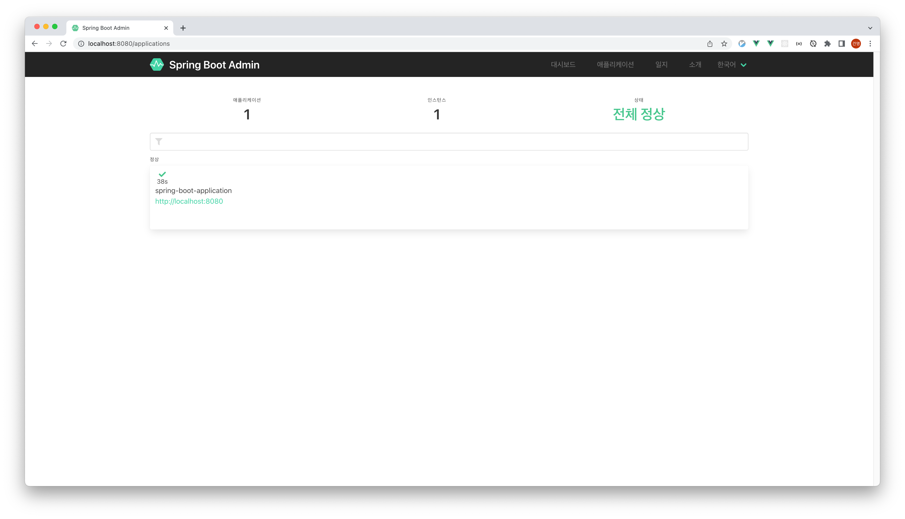
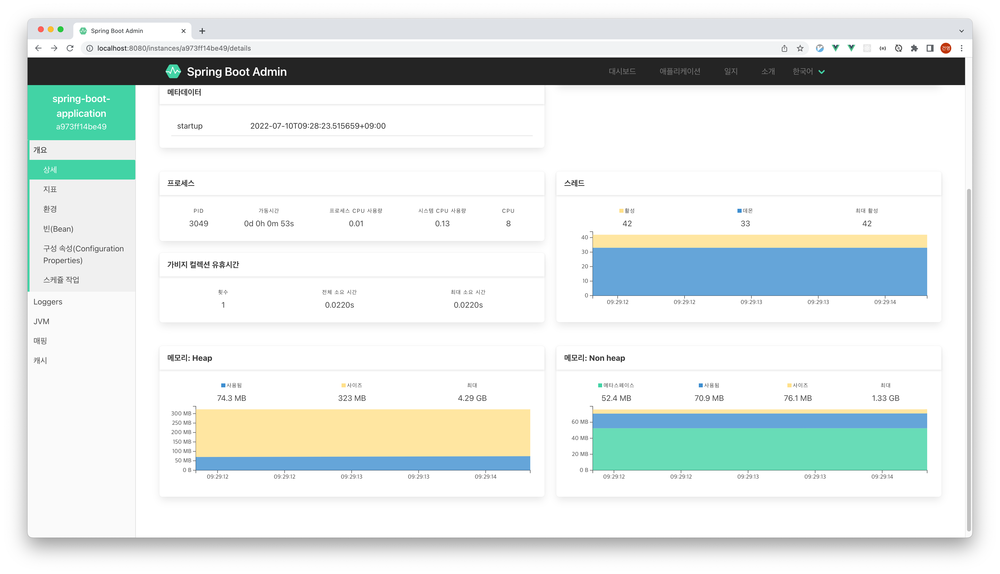

- [Spring Boot Actuator](#spring-boot-actuator)
  - [gradle 및 appication.yml 설정](#gradle-및-appicationyml-설정)
  - [Spring Boot Admin UI](#spring-boot-admin-ui)
    - [Spring Boot Admin UI 설정](#spring-boot-admin-ui-설정)
  - [Reference](#reference)

# Spring Boot Actuator

스프링부트 애플리케이션에서 제공하는 메트릭(CPU, Memory, Heap) 모니터링하기 위한 툴

## gradle 및 appication.yml 설정

gradle 및 yml에 간단한 설정으로 추가 가능

```gradle
implementation 'org.springframework.boot:spring-boot-starter-actuator'
```

```yaml
management:
  endpoints:
    web:
      exposure:
        include: "*"
  endpoint:
    shutdown:
      enabled: true
```

**Actuator 실행 확인**  
`GET http://localhost:8080/actuator`

```json
// http://localhost:8080/actuator

{
  "_links": {
    "self": {
      "href": "http://localhost:8080/actuator",
      "templated": false
    },
    "beans": {
      "href": "http://localhost:8080/actuator/beans",
      "templated": false
    },
    "caches": {
      "href": "http://localhost:8080/actuator/caches",
      "templated": false
    },
    "caches-cache": {
      "href": "http://localhost:8080/actuator/caches/{cache}",
      "templated": true
    },
    "health": {
      "href": "http://localhost:8080/actuator/health",
      "templated": false
    },
    "health-path": {
      "href": "http://localhost:8080/actuator/health/{*path}",
      "templated": true
    },
    "info": {
      "href": "http://localhost:8080/actuator/info",
      "templated": false
    },
    "conditions": {
      "href": "http://localhost:8080/actuator/conditions",
      "templated": false
    },
    "shutdown": {
      "href": "http://localhost:8080/actuator/shutdown",
      "templated": false
    },
    "configprops": {
      "href": "http://localhost:8080/actuator/configprops",
      "templated": false
    },
    "configprops-prefix": {
      "href": "http://localhost:8080/actuator/configprops/{prefix}",
      "templated": true
    },
    "env-toMatch": {
      "href": "http://localhost:8080/actuator/env/{toMatch}",
      "templated": true
    },
    "env": {
      "href": "http://localhost:8080/actuator/env",
      "templated": false
    },
    "loggers-name": {
      "href": "http://localhost:8080/actuator/loggers/{name}",
      "templated": true
    },
    "loggers": {
      "href": "http://localhost:8080/actuator/loggers",
      "templated": false
    },
    "heapdump": {
      "href": "http://localhost:8080/actuator/heapdump",
      "templated": false
    },
    "threaddump": {
      "href": "http://localhost:8080/actuator/threaddump",
      "templated": false
    },
    "metrics": {
      "href": "http://localhost:8080/actuator/metrics",
      "templated": false
    },
    "metrics-requiredMetricName": {
      "href": "http://localhost:8080/actuator/metrics/{requiredMetricName}",
      "templated": true
    },
    "scheduledtasks": {
      "href": "http://localhost:8080/actuator/scheduledtasks",
      "templated": false
    },
    "mappings": {
      "href": "http://localhost:8080/actuator/mappings",
      "templated": false
    }
  }
}
```

**Application 동작 확인**  
`GET http://localhost:8080/actuator/health`

```json
{
  "status": "UP"
}
```

**Metric 정보 확인**  
`GET http://localhost:8080/actuator/metrics`

```json
// http://localhost:8080/actuator/metrics

{
  "names": [
    "application.ready.time",
    "application.started.time",
    "disk.free",
    "disk.total",
    "executor.active",
    "executor.completed",
    "executor.pool.core",
    "executor.pool.max",
    "executor.pool.size",
    "executor.queue.remaining",
    "executor.queued",
    "http.server.requests",
    "jvm.buffer.count",
    "jvm.buffer.memory.used",
    "jvm.buffer.total.capacity",
    "jvm.classes.loaded",
    "jvm.classes.unloaded",
    "jvm.gc.live.data.size",
    "jvm.gc.max.data.size",
    "jvm.gc.memory.allocated",
    "jvm.gc.memory.promoted",
    "jvm.gc.overhead",
    "jvm.gc.pause",
    "jvm.memory.committed",
    "jvm.memory.max",
    "jvm.memory.usage.after.gc",
    "jvm.memory.used",
    "jvm.threads.daemon",
    "jvm.threads.live",
    "jvm.threads.peak",
    "jvm.threads.states",
    "logback.events",
    "process.cpu.usage",
    "process.files.max",
    "process.files.open",
    "process.start.time",
    "process.uptime",
    "system.cpu.count",
    "system.cpu.usage",
    "system.load.average.1m"
  ]
}
```

Metric 정보 중 jvm.memory.used 정보 확인  
`GET http://localhost:8080/actuator/jvm.memory.used`

```json
// http://localhost:8080/actuator/metrics/jvm.memory.used

{
  "name": "jvm.memory.used",
  "description": "The amount of used memory",
  "baseUnit": "bytes",
  "measurements": [
    {
      "statistic": "VALUE",
      "value": 141542056
    }
  ],
  "availableTags": [
    {
      "tag": "area",
      "values": [
        "heap",
        "nonheap"
      ]
    },
    {
      "tag": "id",
      "values": [
        "G1 Old Gen",
        "CodeHeap 'non-profiled nmethods'",
        "G1 Survivor Space",
        "Compressed Class Space",
        "Metaspace",
        "G1 Eden Space",
        "CodeHeap 'non-nmethods'"
      ]
    }
  ]
}
```

## Spring Boot Admin UI

Spring Boot Actuator 정보를 웹 화면에서 보기 쉽게 확인 가능

### Spring Boot Admin UI 설정

```gradle
implementation 'de.codecentric:spring-boot-admin-starter-client'
implementation 'de.codecentric:spring-boot-admin-starter-server'
```

```yaml
server:
  port: 8080

spring:
  boot:
    admin:
      client:
        url: http://localhost:8080
        instance:
          service-url: http://localhost:8080
```

`MonitoringApplication.java`

```java
// Annotation 추가
@EnableAdminServer
@SpringBootApplication
public class MonitoringApplication {

    public static void main(String[] args) {
        SpringApplication.run(MonitoringApplication.class, args);
    }

}

```

`GET http://localhost:8080/applications/` 접속 결과  


**대시보드에서 인스턴스 확인 결과**


## Reference

- [Spring Cloud - Springboot Actuator](https://assu10.github.io/dev/2020/03/26/spring-actuator/)

- [Actuator API](https://docs.spring.io/spring-boot/docs/current/actuator-api/htmlsingle/#overview)
