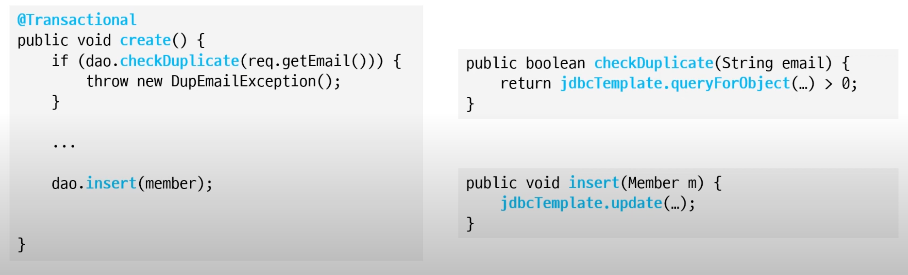

# 트랜잭션

## 개념

여러 읽기/쓰기를 논리적으로 하나로 묶음
- 트랜잭션 시작 → 여러실행 쿼리 → 커밋 또는 롤백
- 커밋을 모두 반영하거나 반영하지 않는다

## 역할 및 특징

- 문제 발생 시 애플리케이션의 데이터 일관성을 보장

- **트랜잭션의 범위는 Connection 기준**

## 트랜잭션 전파

- 여러 메서드 호출이 한 트랜잭션에 묶이도록 하기 위해 필요
- 예) 스프링 프레임워크의 트랜잭션 처리
메서드 간에 connection 객체를 전달하지 않아도 한 트랜잭션으로 묶어서 진행

## 외부 연동

- 외부 연동과 함께 있으면 롤백 처리 주의

## 정리

- 원자성(Atomicity)
  - All or Nothing

- 트랜잭션의 범위

## Reference

- [프로그래밍 초식 : DB 트랜잭션 조금 이해하기](https://www.youtube.com/c/%EC%B5%9C%EB%B2%94%EA%B7%A0)