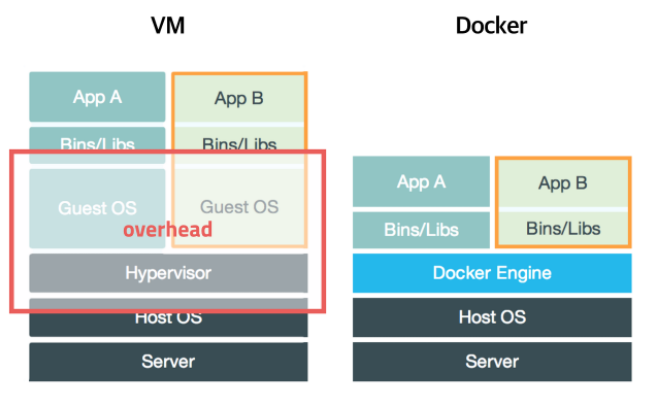

# Docker

## 도커란?

오픈소스 가상화 플랫폼

> 오픈소스 : 문제를 해결하기 위해 보통 등장
> 가상화 : 실제와 거의 ~ 같다

## VM vs Docker

- 가상머신 환경에서 CentOS나 Ubuntu를 설치해보면 알겠지만 운영체제 설치만으로도 많은 시간이 걸린다

- 가상머신 환경에서 또 각각 원하는 개발환경을 구축하려고 하면 너무 시간 오래 걸린다..

## 도커가 해결하고자 했던 문제

- 서버 관리 → 계속해서 유동적으로 바뀌고 변경되는 서버 환경으로 인해 어렵다!

- 배포하고자 하는 운영체제나 환경이 바뀌더라도 어디서라도 잘 배포할 수 있도록 만들어진 기술

## 특징

- 확장성/이식성 - 특정 클라우드 서비스에 종속되어 있지 않다

- 표준성 - 컨테이너라는 방식으로 배포하므로 모든 서비스 배포 과정이 동일해짐 (ruby, nodejs, java..)

- 이미지 - Dockerfile을 이용해서 이미지를 만들 수 있고 Docker hub에서 이미지 관리가 가능

- 다른 프로세스와 `격리`되기 때문에 성능 Overhead가 거의 없다

## 한계

- 각각의 서비스를 `격리`시켜서 컨테이너 단위로 배포하지만 이를 통제할 수 있는 방법이 없다

- 그래서 등장한 것이 Kuberenetes(k8s)

## Reference

- [초보를 위한 도커 안내서](https://www.inflearn.com/course/%EB%8F%84%EC%BB%A4-%EC%9E%85%EB%AC%B8)
