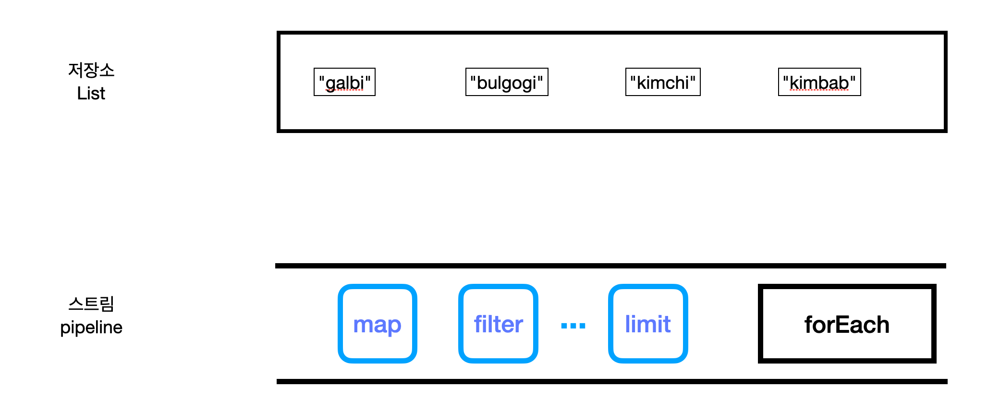

- [Java 8](#java-8)
	- [LTS (Long-Term-Support)](#lts-long-term-support)
	- [주요 기능](#주요-기능)
- [Stream](#stream)
	- [개념](#개념)
	- [특징](#특징)
	- [intermediate operations (중간 오퍼레이션)](#intermediate-operations-중간-오퍼레이션)
	- [terminal operations (종료 오퍼레이션)](#terminal-operations-종료-오퍼레이션)
- [Reference](#reference)

## Java 8

- 2014년 3월 출시
- 현재 72% 사용 중이고 Java 11 사용량이 늘어나는 추세

### LTS (Long-Term-Support)

- 지원기간 5년
- 실제 운영환경에서는 LTS 권장

### 주요 기능

- Lambda
- **Stream**
- Optional<T>
- etc

## Stream

### 개념

- **A sequence of elements** supporting sequential and parallel aggregate operations



### 특징

- No storage 
“List와 같이 데이터를 담는 저장소가 X”
- Functional in nature
“소스를 변경하지 않는다.”
- 스트림으로 처리하는 데이터는 오직 한번만 처리
- Laziness-seeking 
“stream이 제공하는 여러가지 메서드가 존재”

```
package com.gyheo.java;

import java.util.ArrayList;
import java.util.Comparator;
import java.util.List;
import java.util.stream.Collectors;

public class StreamTest {
    public static void main(String[] args) {
        ArrayList<Integer> scoreList = new ArrayList<>();

        scoreList.add(95);
        scoreList.add(40);
        scoreList.add(43);
        scoreList.add(50);
        scoreList.add(89);
        scoreList.add(90);

        System.out.println("50점이상 사람 낮은 성적순으로");
        List<Integer> greateThanFifty = scoreList.stream()
                .filter(s -> s >= 50) // intermediate operation -> 스트림 리턴
                .sorted()
                .collect(Collectors.toList());

        for (Integer score : greateThanFifty) {
            System.out.print(score + " ");
        }
        System.out.println();
        System.out.println();

        System.out.println("문제 잘못 출제해서 모두 5점씩 더해주고 성적 높은순으로 출력");
        scoreList.stream()
                .map(s -> s + 5)
                //.sorted()
                .sorted(Comparator.reverseOrder()) // 역순
                // .forEach(System.out::println); // terminal operation -> 스트림 리턴 X
                .forEach(s -> System.out.print(s + " "));
        System.out.println();
        System.out.println();

        System.out.println("5점씩 더해주는 stream pipeline을 거치고 난뒤 데이터 원본은 바뀌지 않는다.");
        System.out.println(scoreList);
        System.out.println();

        List<String> foodList = new ArrayList<>();

        foodList.add("galbi");
        foodList.add("bulgogi");
        foodList.add("kimchi");
        foodList.add("kimbab");

        System.out.println("스트림 사용하지 않고 모든 글자 대문자로");
        for (String name : foodList) {
            System.out.println(name.toUpperCase());
        }

        // Stream<String> stringStream = list.stream()
        //        .map(String::toUpperCase);

        // 중계 오퍼레이션 -> 스트림 반환
        // 출력 안됨, 그냥 정의만한 것일 뿐
        foodList.stream().map((s) -> {
            System.out.println(s);
            return s.toUpperCase();
        });

        // 스트림은 데이터를 담고 있는 저장소(컬렉션)이 아니다.
        // 중계형 operator는 lazy하게 처리됨
        List<String> collect = foodList.stream().map((s) -> {
            System.out.println(s);
            return s.toUpperCase();
        }).collect(Collectors.toList());
        collect.forEach(System.out::println);
        System.out.println("------");

        // forEach문의 경우 병행처리가 좀 어렵다.
        foodList.forEach(System.out::println);
        System.out.println("------");

        // 병렬 처리가 늘 좋은 것은 아니다. 각 소스코드의 상황에 따라 처리해야한다.
        List<String> collect1 = foodList.parallelStream().map((s) -> {
            System.out.println(s + " " + Thread.currentThread().getName());
            return s.toUpperCase();
        }).collect(Collectors.toList());
        collect1.forEach(System.out::println);
    }
}

```

결과화면
```
50점이상 사람 낮은 성적순으로
50 89 90 95 

문제 잘못 출제해서 모두 5점씩 더해주고 성적 높은순으로 출력
100 95 94 55 48 45 

5점씩 더해주는 stream pipeline을 거치고 난뒤 데이터 원본은 바뀌지 않는다.
[95, 40, 43, 50, 89, 90]

스트림 사용하기 전 방식 모든 음식 글자 대문자로
GALBI
BULGOGI
KIMCHI
KIMBAB
galbi
bulgogi
kimchi
kimbab
GALBI
BULGOGI
KIMCHI
KIMBAB
------
galbi
bulgogi
kimchi
kimbab
------
galbi ForkJoinPool.commonPool-worker-7
kimchi main
kimbab ForkJoinPool.commonPool-worker-3
bulgogi ForkJoinPool.commonPool-worker-5
GALBI
BULGOGI
KIMCHI
KIMBAB
```

Stream operations are divided into ***intermediate*** and ***terminal*** operations,

다수의 intermediate operation, 한 개의 종료 operation으로 구성

### intermediate operations (중간 오퍼레이션)

- **stream을 반환**
- terminal operation을 만나기 전까지 실행되지 않는다
- map, filter, limit, skip, sorted, ...

### terminal operations (종료 오퍼레이션)

- **stream을 반환 X**
- collect, allMatch, count, forEach, min, max

## Reference

- [JetBrain](https://www.jetbrains.com/lp/devecosystem-2021/java/)
- [더 자바, Java 8](https://www.inflearn.com/course/the-java-java8/dashboard)
- [Java Stream Documentaion](https://docs.oracle.com/javase/8/docs/api/java/util/stream/package-summary.html)