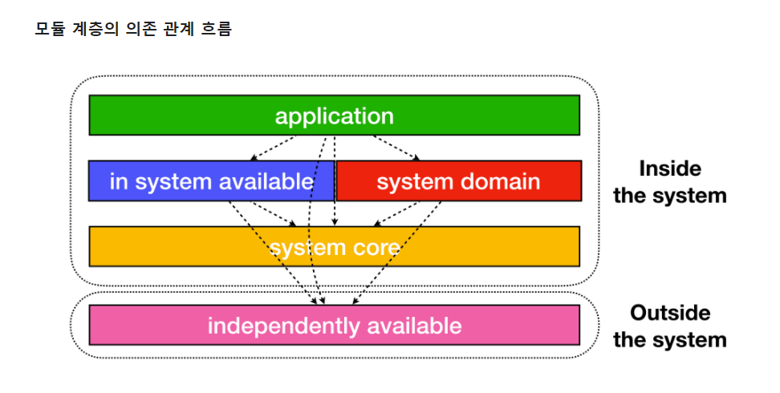

[TOC]


## [백엔드 개발을 위한 준비](https://dh.digitalkds.co.kr/digital/pl/ghpj4cxa77n55nwagewb3mmmdo)


cf ) [주몽 포털 Git](https://vcs.digitalkds.co.kr/jumong/dtproject-portal)


## :pen: 학습 목록

### 1. spring framework와 spring boot 정의와 차이점

#### Spring framework 

- 자바 플랫폼을 위한 오픈소스 애플리케이션 프레임워크

- 특징

  - **경량 컨테이너**

    - 객체를 담고있는 컨테이너, 자바 객체 생성 및 소멸의 라이프사이클 관리

  - **IoC** (제어 역행, Inversion of Control)

    - 프로그램의 생명주기에 대한 제어권이 웹 애플리케이션 컨테이너에 있음

  - **Di** (의존성 주입)

    - IoC 구현 방법 

    - 객체 사이 필요한 의존 관계에 대한 스프링 컨테이너 자동 연결

    - Bean 객체 관리, 클래스 인스턴스 관리

    - 종류

      - xml 설정

      - 어노테이션

        ```
        @Repository : DB에서 정보검색하는 DAO(data access objects)에서 사용
        @service : 서비스 계층 클래스, 데이터 및 비즈니스 로직에 사용
        @Controller: UI 요청 처리에 사용
        ```

  - **AOP** (관점 지향 프로그래밍)


#### Spring Boot

> 스프링 프레임워크의 복잡한 환경 설정을 자동화하며 사용을 도움
> 디펜던시 추가 -> api정의, 내장 톰캣 등으로 서버 실행 


#### 차이점

Spring Boot 는

- Embedded Tomcat 
- starter를 통한 dependency 자동화
  - 각각 디펜던시들의 호환되는 version 관리 필요성 감소
- XML 설정 X
- jar file 이용 -> 자바 옵션만으로 손쉽게 배포 가능
- Spring Actuaor 이용한 애플리케이션 모니터링과 관리


cf) ` spring boot starter`

- starter를 통해 dependency 자동화
- 특정 목적을 위한 의존성 그룹
  ex)jpa 필요시, prom.xml(메이븐) or build.gradle(그래들) 에
  `spring-boot-starter-data-jpa` 만 추가하면 알아서 라이브러리 받아옴
- 형식: `spring-boot-starter-*`


[참고1](https://velog.io/@courage331/Spring-%EA%B3%BC-Spring-Boot-%EC%B0%A8%EC%9D%B4)

[참고2](https://msyu1207.tistory.com/entry/Spring-VS-Spring-Boot-%EC%B0%A8%EC%9D%B4%EC%A0%90%EC%9D%84-%EC%95%8C%EC%95%84%EB%B3%B4%EC%9E%90)

[참고3](https://aristeksystems.com/blog/what-you-need-know-about-spring-boot/)


### 2. MVC 패턴이란 무엇인가.


- **Model**

  - Data 와 애플리케이션이 무엇을 할지 정의
  - 내부 비즈니스 로직 처리

  ```
  ## 규칙 ##
  -  사용자가 편집하기 원하는 모든데이터 소유
  - view, controller 대한 어떤 정보도 X
  - 변경이 일어나면, 변경 통지에 대한 처리방법 구현
  ```

  

- **View**

  - 사용자에게 보여주는 화면(UI)
  - 컨트롤러부터 받은 모델의 결과값을 사용자에게 화면으로 출력
  - 데이터 별도 저장 X
  - 여러개의 View 가능

  ```
  ## 규칙 ##
  - Model의 정보를 따로 저장 X
  - Model, Controller와 같은 다른 구성요소에 몰라야함
  - 변경이 일어나면, 변경 통지에 대한 처리방법 구현
  ```

`Model과 View 는 서로 몰라야함`


- **Controller**

  - Model과 View 사이를 이어주는 인터페이스 역할
  - Model이 데이터를 어떻게 처리할지 알려주는 역할

  > 사용자가 View 요청시 , 해당 업무 수행 Model 호출 > Model 업무 수행 후, View에 전달

``` 
## 규칙 ##
- Model이나 View 에 대해 알고 있어야함
- Model이나 View 변경 모니터링
```


cf)  **JDBC**  (Java Database Connectivity)

 - 자바에서 데이터베이스에 접속할 수 있도록 하는 자바 API
 - 데이터베이스에서 자료를 쿼리하거나 업데이트하는 방법을 제공


#### 장점

- 기능별 코드 분리 > 가독성 , 코드 재사용
- 분업 가능 : 각 구성요소 독립, 맡은 부분만 집중 > 효율성

- 유지보수 & 확장성


#### 한계

- Controller >  Model 과 View 의존성 완전히 분리 X
- 다수의 Model & View 가 Controller로 연결 >> Massive-view- controller 현상
  - 보완 방법
    - MVP, MVVM, Flux, Redux

[참고1](https://velog.io/@seongwon97/MVC-%ED%8C%A8%ED%84%B4%EC%9D%B4%EB%9E%80)


### 3. 빌드 도구 : gradle 과 maven은 무엇이며 둘의 차이는 무엇인가.

실습 : vscode에서 gradle을 사용한 spring boot 프로젝트 생성해보기. 

(참고 : https://esaek.tistory.com/20 )

> 프로젝트 java 코드와 프로젝트 내 필요한 각종 xml, properties, jar 파일들을 
> JVM, WAS가 인식하도록 패키징 해주는 빌드 과정 
> 필요한 라이브러리들을 설정 파일을 통해 자동으로 다운로드 & 간편하게 관리


#### Maven

- Java용 프로젝트 관리도구
  - 자바 소스파일(war or jar 파일) 을 빌드, 라이브러리 의존성, 컴파일, 배포를 해결해주는 도구
- Apache 의 Ant 대안으로 만들어짐
- 외부저장소에서 필요한 라이브러리, 플러그인 다운로드 & 로컬 시스템 캐시에 모두 저장
- 다양한 외부 라이브러리 종속성 관계들을 pom.xml 파일에 명시
- **POM** ( Project Object Model) : pom.xml 에서 주요하게 다루는 기능
  - 프로젝트 정보 : 프로젝트 이름, 라이센스 등
  - 빌드 설정 : 소스, 리소스, 라이프사이클별 실행한 플러그인 등 빌드와 관련된 설정
  - 빌드 환경 : 사용자 환경 별로 달라질 수 있는 프로파일 정보
  - pom 연관 정보 : 의존 프로젝트(모듈), 상위 프로젝트, 포함하고 있는 하위 모듈 등


#### Gradle

- Apache Maven과 Apache Ant 에서 볼 수 있는 개념 사용하는 대안으로 나온 프로젝트 빌드 관리 툴
- 빌드, 프로젝트 구성/관리, 테스트, 배포 도구
- 완전한 오픈 소스
- Groovy 언어를 사용한 Domain-specific-language 사용 
  - cf ) xml 파일 사용하는 maven 보다 간결
- 큰 규모 multi-project 빌드에 용이하게끔 디자인
- 점진적으로 추가 가능
  - 이미 반영된 빌드는 재실행 X >>  빌드 시간 단축 O

cf) Groovy

​	- java 가상 머신에서 실행되는 스크립트 언어


#### 차이점

- Gradle 
  -  `작업 의존성 그래프` 기반
  -  `incremental build` :  어떤 task가 업데이트 되었고 안되었는지 체크 >> 빌드 시간 단축
  -  멀티 프로젝트의 경우, 특정 설정을 다른 모듈에서 사용 시 `설정 주입 방식` 제공
  -  `concurrent` 에 안전한 캐시 허용
- Maven 
  -  `고정적`, `선형적`인 단계의 모델 기반
  -  멀티 프로젝트의 경우, 특정 설정을 다른 모듈에서 사용  시 `상속`을 받아야함


[참고1](https://jisooo.tistory.com/entry/Spring-%EB%B9%8C%EB%93%9C-%EA%B4%80%EB%A6%AC-%EB%8F%84%EA%B5%AC-Maven%EA%B3%BC-Gradle-%EB%B9%84%EA%B5%90%ED%95%98%EA%B8%B0)

[참고2](https://dev-coco.tistory.com/65)


### 4. lombok이란 무엇인가.  

실습 : vscode에서 lombok 추가하기 

(참고 : https://ssyoni.github.io/2020/springboot-3/ )

```
Java는 대부분 변수를 class 안 private으로 저장

So, 접근하기 위해  getter, setter 와 같은 함수 정의 필요
-> 코드가 길어짐/ 변경 시 번거로움 
```

- 사용방법

  - dependency 추가

  - plugin 설치 > restart


​		[참고](https://ooeunz.tistory.com/58)


### 5. swagger란 무엇인가.

실습 : springboot에 swagger 적용하기. (참고 : https://jamong-icetea.tistory.com/373 )

> REST API 서비스 설계, 빌드, 문서화 
>
> API 들이 가지고 있는 스펙을 명세, 관리할 수 있는 프로젝트/문서

- Springboot 에서 Swagger 사용시, 컨트롤러에 명시된 어노테이션 해석 > API 문서 자동 생성
- JAVA 종속 X
- url에 `/swagger-ui.html` 으로 접근 >> swagger 만들어주는 페이지   접근


​	[참고1](https://doozi316.github.io/web/2020/10/16/WEB29/)	    

​	[참고2](https://bamdule.tistory.com/36)

​	[참고3](https://kafcamus.tistory.com/43)


### 6. SpringSecurity란 무엇인가.

> Spring 기반의 애플리케이션 보안(인증과 권한,  인가 등)을 담당하는 스프링 하위 프레임워크

- 인증 (Authentication)
  - 보호된 리소스에 접근한 대상에 대해
  - 해당 사용자가 본인이 맞는지
  - 애플리케이션 작업을 수행해도 되는 주체인지 확인
- 인가 (Authorization)
  - 인가된 사용자가 요청한 자원에 접근 가능한지를 결정하는 절차
- 접근  주체 (Principal)
  - 보호된 리소스에 접근하는 대상
- 권한 
  - 어떤 리소스에 대한 접근 제한, 모든 리소스는 접근 제어 권한


[참고1](https://mangkyu.tistory.com/76)

[참고2](https://www.bottlehs.com/springboot/%EC%8A%A4%ED%94%84%EB%A7%81-%EB%B6%80%ED%8A%B8-spring-security%EB%A5%BC-%ED%99%9C%EC%9A%A9%ED%95%9C-%EC%9D%B8%EC%A6%9D-%EB%B0%8F-%EA%B6%8C%ED%95%9C%EB%B6%80%EC%97%AC/)


### 7. Jwt란 무엇인가. (Json Web Token)

실습 : spring boot 에서 Jwt Tutorial (참고 : https://silvernine.me/wp/?p=1078 )


#### 구조

- Header
  - Signature를 해싱하기 위한 알고리즘 정보
- Payload
  - 서버와 클라이언트가 시스템에서 실제로 사용하는 정보에 대한 내용
- Signature
  - Token의 유효성 검증을 위한 암호화된 문자열
  - 이 문자열을 통해 서버에서는 유효한 Token인지 검증


#### 장점

- 중앙의 인증 서버와 데이터 스토어에 대한 의존성이 없어 `수평 확장`이 용이
- Base64 URL-Safe 인코딩 이용 > URL, Cookie, Header 어디에서든 사용할 수 있는 `범용성`


#### 단점

- 토큰 내부에 정보 저장 > 노출 불가 정보 저장하는 실수
- Payload 저장 정보 많아질 시 트래픽 증가
- 토큰이 각 클라이언트에 저장 > 서버에서 각 클라이언트 조작 불가


#### 실습


- api/authenticate (POST) -> api/user (GET) 


#### API Authorize

- `Bearer <jwt token>`


#### ERROR

- ```
  .ScriptStatementFailedException: Failed to execute SQL script statement #1 of URL [file:/C:/Users/whdls/Documents/220329/jwt-tutorial/bin/main/data.sql]: INSERT INTO USER (USER_ID, USERNAME, PASSWORD, NICKNAME, ACTIVATED) VALUES (1, 'admin', '$2a$08$lDnHPz7eUkSi6ao14Twuau08mzhWrL4kyZGGU5xfiGALO/Vxd5DOi', 'admin', 1); nested exception is org.h2.jdbc.JdbcSQLSyntaxErrorException: Table "USER" not found; SQL statement:
  ```

  - data.sql -> import.sql  (파일명 변경)

- 

- ```
  	// jwt
  	compile group: 'io.jsonwebtoken', name: 'jjwt-api', version: '0.11.2'
  	runtime group: 'io.jsonwebtoken', name: 'jjwt-impl', version: '0.11.2'
  	runtime group: 'io.jsonwebtoken', name: 'jjwt-jackson', version: '0.11.2'
  ```

  - compile -> compileOnly
  - runtime -> runtimeOnly
  - 원인 : gradle 버전문제


- ```
  org.h2.jdbc.JdbcSQLNonTransientConnectionException: Database is already closed (to disable automatic closing at VM shutdown, add ";DB_CLOSE_ON_EXIT=FALSE" to the db URL) [90121-200]
  
  org.springframework.context.ApplicationContextException: Failed to start bean 'documentationPluginsBootstrapper'; nested exception is java.lang.NullPointerException
  ```

  - swagger 적용시 나는 에러

    - ```java
      @Configuration
      @EnableSwagger2
      public class SwaggerConfig extends WebMvcConfigurationSupport {
      	.
      	.
          .
      }  
      ```

    - 스웨거 설정 class 에 WebMvcConfigurationSupport 확장

    - [참고](https://jackyee.tistory.com/24)

      XXXXXXXXXXXXXXXXXXXXXX 하지말자

- ```
  Error creating bean with name 'springSecurityFilterChain' defined in class path resource [org/springframework/security/config/annotation/web/configuration/WebSecurityConfiguration.class]: Bean instantiation via factory method failed; 
  ```

  - SecurityConfig 수정

    - `public class SecurityConfig extends WebSecurityConfigurerAdapter  `

      :arrow_right:  `public class SecurityConfig`

      XXXXXXXXXXXXXXXXXXXXXXXXXXXXXXx 하지말자

- nullexception 

  - ```
    # application.yml
    mvc:
        pathmatch:
          matching-strategy: ant_path_matcher
    ```

  - [참고](https://www.inflearn.com/questions/230160) :

  - 버전 호환성 !!!!!!!!!!!!! :raised_back_of_hand:

[참고1](https://silvernine.me/wp/?p=1078)

[참고2](https://pepega.tistory.com/m/29) : jwt api 권한

[참고3](https://catsbi.oopy.io/c0a4f395-24b2-44e5-8eeb-275d19e2a536)  : security config 

---

### 8. CRUD란 무엇인가


### 9. JPA 와 Mybatis란 무엇이고 둘의 차이는 무엇인가.

실습 : spring boot에서 JPA 사용해보기 (참고 : [https://velog.io/@swchoi0329/Spring-Boot%EC%97%90%EC%84%9C-JPA-%EC%82%AC%EC%9A%A9%ED%95%98%EA%B8%B0](https://velog.io/@swchoi0329/Spring-Boot에서-JPA-사용하기) )

실습 : spring boot에서 Mybatis 사용해보기 (참고 : https://aamoos.tistory.com/53 )   

 

#### JPA (Java Persistence API)

> **자바 ORM 기술** 에 대한 표준 명세
>
> JAVA에서 제공하는 API (스프링에서 제공 X)
>
> 자바 클래스와 DB 테이블을 매핑 (sql 매핑 X)

- **장점**
  - 생산성
    - 쿼리 직접 생성 X
    - 만들어진 객체로 DB 다룸 -> 객체 중심 개발
  - 유지보수
    - sql 직접 작성 X
    - 엔티티 필드가 되는 개체를 다뤄서 DB 동작
      - if  JPA 로 수정 시, 엔티티 클래스 정보만 변경
  - 성능
    - 일반적인 spring 의 encache 기능처럼 동일한 쿼리에 대한 캐시 기능 사용
  - RDBMS 종류와 무관한 코딩
    - 객체 중심 동작 -> oracle, mysql, mssql 등 서로 다른 db 사용시 문법 바꿀 수고 감소

- **단점**
  - 통계 처리와 같이 복잡한 쿼리보다 실시간 처리용 쿼리 최적화


#### Mybatis

> 자바 오브젝트와 SQL 사이의 자동 매핑 기능을 지원하는 ORM 프레임워크
>
> **JDBC** (DB에 접속할 수 있도록 하는 자바 API) 를 통해 DB 엑세스 작업을 캡슐화
>
> 일반 SQL 쿼리, 저장 프로시저 및 고급 매핑 지원, JDBC 코드 및 매개변수 중복작업 제거

##### 특징

- 쉬운 접근성 & 코드의 간결함
  - JDBC의 모든 기능을 대부분 제공
  - 복잡한 JDBC 코드 걷어내고 깔끔한 소스코드 유지
- SQL문과 프로그래밍 코드의 분리
  - sql 변경마다 자바코드 수정 및 컴파일 X > SQL 을 별도의 파일로 분리해서 관리
- 복잡한 쿼리, 다이나믹한 쿼리에 강함
- 다양한 프로그래밍 언어로 구현 가능
  - Java, C#, .NET, Ruby
- SQL mapper 방식


##### 단점

- 개발자가 일일히 CRUD용 쿼리작성
- 컬럼 추가 시 수정 多
- 객체 중심 X , DB 중심 개발


- **ORM**

  (Object-Relation Mapping)

  - DB객체를 자바 객체로 매핑, 객체를 통해 간접적으로 DB 데이터를 다룸
  - SQL쿼리가 아닌 메서드로 데이터 조작
  - 객체 간 관계 바탕으로 sql 자동 생성
  - ex) JPA, Hibernate


[참고1](https://khj93.tistory.com/entry/MyBatis-MyBatis%EB%9E%80-%EA%B0%9C%EB%85%90-%EB%B0%8F-%ED%95%B5%EC%8B%AC-%EC%A0%95%EB%A6%AC)

[참고2](https://velog.io/@changyeonyoo/Mybatis%EB%9E%80-%EC%9E%A5%EC%A0%90-%ED%8A%B9%EC%A7%95-%EC%BB%B4%ED%8F%AC%EB%84%8C%ED%8A%B8)


### 10. 멀티 모듈이란 무엇인가

(참고 : https://techblog.woowahan.com/2637/ ) 
실습 : spring boot, gradle 을 이용한 멀티 모듈 프로젝트 만들어보기. 

[참고1](https://cjw-awdsd.tistory.com/55)

[참고2](https://jojoldu.tistory.com/123)

[참고3](https://github.com/jojoldu/blog-code/blob/master/gradle-multi-modules/module-api/build.gradle)

#### 공통모듈의 저주

- 스파게티 코드

  - 리팩토링 시도 시 영향 범위가 시스템 전체

- 의존성 덩어리

  - 각 어플리케이션이 사용하는 의존성은 다를 수 있음

    ex) DB를 사용하지 않는 어플리케이션이 공통 모듈 사용을 위해 DB와 커넥션

- 공통 설정

  - 고정적으로 공통으로 사용되는  호스트 정보 등은 공통일 수 있으나, 
    그 외 Thread Pool, Connectin Pool, Timeout 등의 설정이 민감하고 중요한 어플리케이션 기준으로 들어감

    ex) DB 커넥션 : 최대 커넥션 개수 정해짐 
    	BUT 공통 모듈을 사용하기  위해 DB 사용않는 애플리케이션도 커넥션 사용 > 문제


#### 멀티 모듈 프로젝트

> 독립적으로 실행 가능한 애플리케이션 모듈 1개 이상 소유
>
> 사용하는 인프라 자원 1개 이상 소유
>
> 독립적으로 실행가능한 애플리케이션들은 서로 다른 책임과 역할 有
>
> -> 하위 모듈 의존성 사용성에 대한 개방, 폐쇄 (for 스파게티 코드, 의존성 덩어리,  설정 등 문제 방지)


#### 모듈

> 독립적으로 운영될 수 있는 의미를 가지는 구성요소 단위




1. **독립 모듈 계층** (independently available)

   - 시스템과 무관하게 어디에서나 사용가능한 라이브러리 성격의 모듈
   - 프로젝트와 성격이 먼 모듈
   - 시스템, 도메인의 비즈니스와 별개, 자체 제작 라이브러리

2. **도메인 모듈 계층**  (system domain)

   - 사용가능 : 독립 모듈 O, 공통 모듈 O

   - 저장소와 밀접한 중심 도메인을 다루는 계층 -> 특별하게 격리 & 관리, 분리

   - 서비스 비즈니스를 모른다

   - 하나의 모듈은 최대 하나의 인프라스트럭처에 대한 책임만 갖는다

   - 도메인 모듈을 조합한 더 큰 단위의 도메인 모듈이 있을 수 있다

   - 다중 인프라스트럭처 사용 모듈

   - 하나의 모듈은 하나의 인프라스트럭쳐만 책임지도록 모듈 작성

3. **내부 모듈 계층** (in system available)

   - 사용가능 : 도메인 모듈 O, 공통 모듈 O

   - 저장소, 도메인 외  시스템에서 필요한 모듈들이 속함 (독립모듈은 시스템에도 전혀 관여 X)
   - 어플리케이션, 도메인 비지니스를 모른다

4. **공통 모듈 계층** (system core)

   - Type,  Util 등을 정의

   - 가능하면 사용 X

   - 시스템 내 모든 모듈들이 의존할 수 있을만큼 얇은 의존성 제공해야함

     -> 프로젝트 내 어떠한 모듈도 의존 X

5. **어플리케이션 모듈 계층** (application)

   - 사용가능 : 도메인 모듈 O, 독립 모듈 O, 공통 모듈 O
   - 독립적으로 실행 가능
   - 하위 설계 모듈을 조립하여 서비스 비지니스 완성


#### 멀티 모듈 구성 효과

- 명확한 추상화 경계

  - 역할과 책임 명확  >> 생산성 향상 / 리팩토링, 기능 변경의 영향 범위 파악 용이
  - 기능의 제공 정도 예측 가능  >>  스파게티 코드 발생 가능성 감소
- 최소 의존성

  - 의존성 관리의 중요성

    - 여지의 개방으로 개발 생산성 떨어뜨림 (무엇이든 끌어다쓰다 스파게티 의존)
    - spring boot 사용으로 불필요한 설정 동작 (spring boot는 클래스 존재만으로도 작동)
    


---

