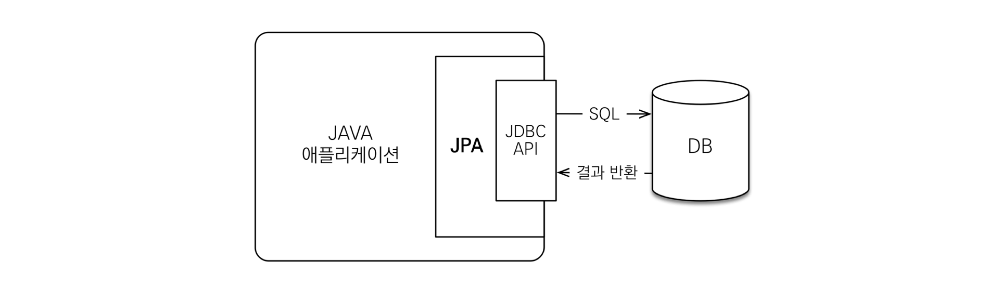
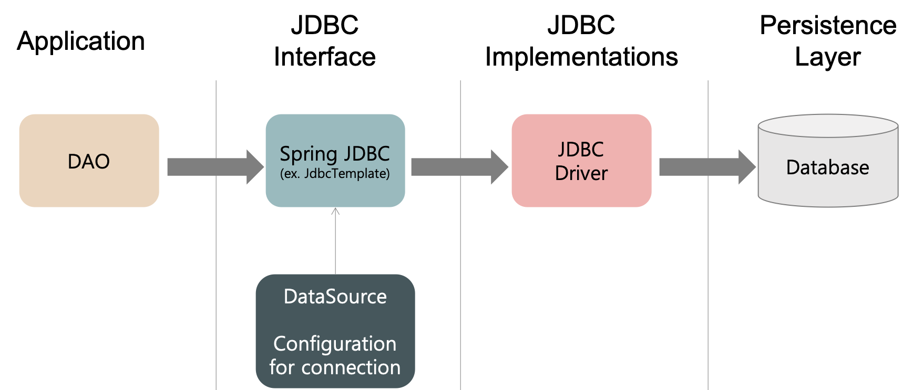
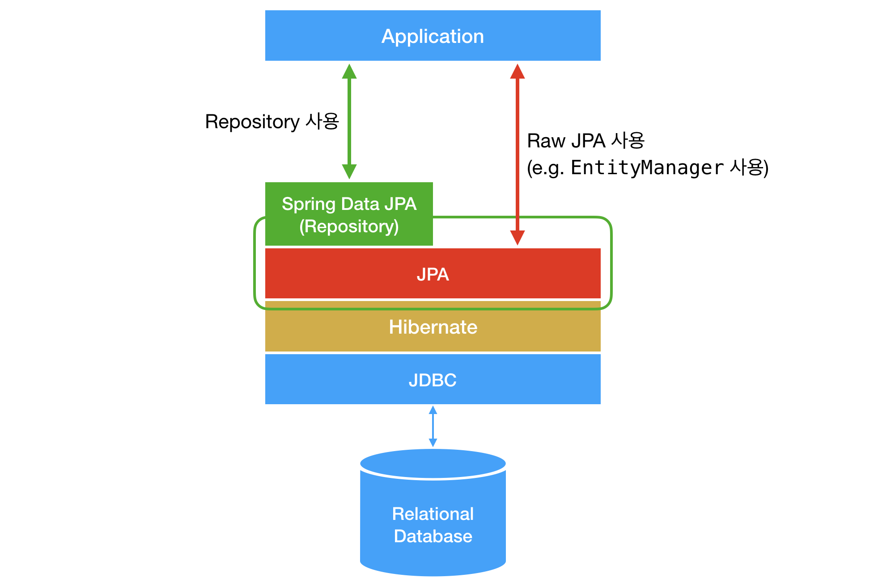

# JPA (Java Persistence Api)


> **자바 ORM기술** 에 대한 표준 명세
JAVA에서 제공하는 **API** (스프링에서 제공 X)
자바 클래스와 DB 테이블을 매핑한다 (sql 매핑 X)

- 참고 이미지
  
    
    

###  장점 ➕

#### 1.생산성 : Mybatis와 비교

- **Mybatis**
  
    > 자바 오브젝트와 SQL 사이의 자동 매핑 기능을 지원하는 ORM 프레임워크
    >
    > **JDBC** (DB에 접속할 수 있도록 하는 자바 API) 를 통해 DB 엑세스 작업을 캡슐화
    >
    > 일반 SQL 쿼리, 저장 프로시저 및 고급 매핑 지원, JDBC 코드 및 매개변수 중복작업 제거
    
    - 개발자가 일일히 CRUD용 쿼리 작성
    - sql mapper 방식
    - 컬럼 추가 시 수정 多
    
    → `객체 중심 개발 X`,    `DB 중심 개발 O ` 
    
    
    
- **JPA**
  
    - 쿼리 직접 생성 X
    - 만들어진 객체로 데이터베이스를 다룸
    
    → `객체 중심 개발 O`


#### 2. 유지보수

- SQL 직접 작성 X
- 엔티티 필드가 되는 개체를 다뤄서 DB 동작 → 간결
    - if JPA로 수정시, 엔티티 클래스 정보만 변경
    - if 쿼리 수정시, DTO 필드 모두 변경

- 성능
    - 일반적인 spring의 encache 기능처럼 동일한 쿼리에 대한 캐시 기능 사용
- RDBMS 종류와 무관한 코딩
    - 객체 중심 동작 → Oracle, Mysql, Mssql 등 서로 다른 DB 사용 시 문법 바꿀 수고 감소


### 단점 ➖ 

- 통계처리와 같이 복잡한 쿼리보다 **실시간 처리용 쿼리**에 최적화
- 통계처럼 미세하고 복잡한 쿼리작업 필요시 mapper방식 효율적

→ Spring 에서 JPA와 Mybatis 혼용 사용 가능, 선택 사용

 


---

### ORM 와 SQL Mapper

- **ORM** (Object-Relation Mapping)
    - DB객체를 자바 객체로 매핑, 객체를 통해 간접적으로 DB 데이터를 다룸
    - SQL쿼리가 아닌 메서드로 데이터 조작
    - 객체 간 관계 바탕으로 sql 자동 생성
    - ex) JPA, Hibernate
    
    
    
- **SQL Mapper**
    - SQL문으로 직접 DB 조작
    - ex) Mybatis, jdbcTemplate
    
    
    
- **JDBC** (Java Database Connectivity)
  
    - DB에 접근할 수 있도록 자바에서 제공하는 API
    
    - 데이터베이스에서 자료를 쿼리하거나 업데이트하는 방법을 제공
    
    - JAVA Data Access 기술의 근간
    
    - 참고 이미지
      
        
        


---

### Spring Data JPA

- 참고 이미지
  
    
    
- JPA를 쉽게 사용하기 위해 Spring에서 제공하는 프레임워크

- JPA : ORM을 위한 자바 EE 표준

- 추상화 정도 : spring data jpa → Hibernate → JPA

- 장점 : 구현체 교체의 용이성, 저장소 교체의 용이성


### 💡 기본 어노테이션


- **@Entity** : 클래스와 테이블 매핑 , 해당 클래스를 엔티티 클래스라고 명
  - 기본 생성자 필수
  - final 클래스, private 생성자 X
- **@Table** : 엔티티 클래스에 매핑할 테이블 정보 (생략시 클래스 이름을 테이블정보로 매핑
- **@Id** : 엔티티 클래스의 필드를 테이블 기본키로 매핑 (DB가 엔티티 구별 시 해당 키 값)
- **@Column** : 필드 컬럼 매핑 (생략시 필드명과 컬럼명 매핑)

- **@ManyToOne, @JoinColumn** : 연관관계 매핑

  - `@JoinColumn(name = "CLASSES_ID")`

  - `@OneToMany(mappedBy = "classes")`

    - 일대다 매핑 정보 추가

    - 학생 쪽에서 사용되는 반 필드명 값으로 추가


### ✔ 개념

- **`EntityManager`**와 **`EntityManagerFactory`**
    - **엔티티매니저**
        - 여러 스레드 동시 접근 사용 X
        - 생성 ≠ 연결 → 연결 필요시 lazy 방식으로 진행, 트랜잭션 시작시 커넥션 획득
    - **엔티티매니저팩토리**
        - 하나를 생성, 공유

- **`Persistence Context`(영속성 컨텍스트)**
    - 엔티티를 영구저장하는 환경
    
    - Entity Manager로 엔티티 저장 or 조회 → 영속성 컨텍스트에 엔티티 보관 및 관리
    
    - 트랜잭션 commit, flush 되는 순간 영속성 컨텐스트에서  엔티티 반영
    
    - <**조회>**
      
        **if**    1차 캐시 내부 데이터 존재 →  DB 뒤지지 않음
        
        **else**   → DB에서 조회, 반환 하면서 1차 캐시에 삽입 &  이후 1차 캐시에서 조회 
        
        ```java
        Member member = new Member();
        member.setId("member1");
        member.setAge(30);
         
        // 1차 캐시에 저장 (이 부분 까지는 데이터가 저장되지 않는다.) -> 쓰기지연
        em.persist(member);
         
        // 1차 캐시에서 조회
        Member findMember = em.find(Member.class, "member");
        ```
        
    - <**수정**>
      
        데이터 변경 후 commit 만 하면 반영
        
        Dirty checking : 엔티티 변경 사항 자동 감지 > update() 명령 필요 X
        
        `@DynamicUpdate` : 수정된 부분만 업데이트하고 싶은 경우
        
        `@DynamicInsert` : null 아닌 필드만 삽입하고 싶은 경우
        
        ```java
        
        @Service
        @Slf4j
        public class MemberServiceImpl implements MemberService {
         
          @PersistenceContext
          private EntityManager entityManager;
         
          @Override
          @Transactional
          public void jpaService() {
         
            try {
              login(entityManager);
            } catch (Exception ex) {
              log.error(ex.getMessage());
            }
          }
         
          private void login(EntityManager em) {
            String id = "wedul";
                
            // 사용자 찾기
            Member findMember = em.find(Member.class, id);
         
            member.setUserName("weduls");
            member.setAge(2);
         
            // 수정
            findMember.setAge(28);
          }
        }
        ```
        
    - <**삭제>**
      
        데이터 조회 → remove 명령어 사용
        
        입력과 같이 바로 삭제 X, 커밋 시 수행
        
    - **Flush**
        - 영속성 컨텍스트의 변경 내용을 DB에 반영
        - 반영하며 컨텍스트에서 지우는 것 X
        - 호출 방법
            - flush() 메서드
            - 트랜잭션 커밋 시 자동 호출
            - JPQL 쿼리 실행시 JPA와 다르게 flush 바로 호출
        
    - **merge**
        - 준영속 or 비영속 상태 → 영속 상태
        - 찾는 엔티티 없을 시 DB조회, 없으면 새로운 엔티티 생성하여 병합


[참고1]( https://velog.io/@adam2/JPA%EB%8A%94-%EB%8F%84%EB%8D%B0%EC%B2%B4-%EB%AD%98%EA%B9%8C-orm-%EC%98%81%EC%86%8D%EC%84%B1-hibernate-spring-data-jpa)

[참고2](https://covenant.tistory.com/243)

[참고3](https://wedul.site/506#at_pco=smlwn-1.0&at_si=62111b4b809611c2&at_ab=per-2&at_pos=0&at_tot=1)

[참고4](https://docs.spring.io/spring-boot/docs/current/reference/html/features.html#data.sql)

