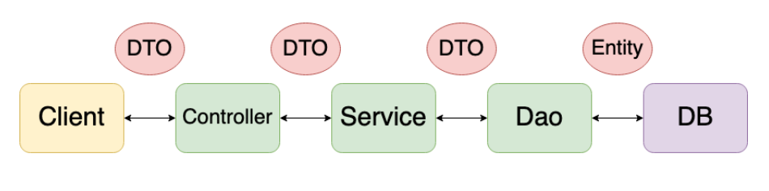

# ⚡ DAO (Data Access Object)

- `repository package`
- 실제 DB에 접근하는 객체 (Persistence Layer) : DB에 data를 CRUD 하는 계층
- 프로젝트의 서비스 모델과 실제 DB 연결하는 역할
  - JPA에서는 DB 데이터를 CRUD하는 Repository 객체들을 의미

- SQL 사용 (개발자 직접 코딩) 하여 DB접근한 후 적절한 CRUD API 제공

```java
public interface UserRepository extends JpaRepository<User, Long> {
}
```


# ⚡ DTO (Data Transfer Object)

- `dto package`

- 계층간 데이터 전달만을 위한 객체 (Java Beans)

  - 로직 X, 순수한 데이터 객체, `getter/setter 메서드`만을 가짐
  - 계층(Layer) : controller, service, repository
  - 주로 직렬화에 사용되는 객체

- DB에서 데이터를 얻어 Service나 Controller로 보낼 때 사용하는 객체

- Request, Response 용 DTO 는 View 를 위한 클래스

  - `toEntity()` 를 통해 DTO에서 필요한 부분 이용해 엔티티 생성
  - controller layer에서 Response DTO 형태로 client 전달

- cf) 

  ```
  VO(Value Object) vs DTO
  ```

  - **VO** : 특정한 비즈니스값을 담는 객체
  - **DTO** : Layer간의 통신 용도로 오고가는 객체
  - VO는 DTO와 비슷한 개념이지만, `read only` 속성을 갖는다


# ⚡ Entity

- `domain package`
- 실제 DB 테이블과 1:1로 매칭될 클래스 / 가장 core한 클래스
- setter 접근 금지 & 기본 생성자 사용 제한(protected)
  - 생성자로 필드에 값 넣어주는 방식 : 순서 부정확성, 필드 불명확성
  -  Builder 패턴 : 필요한 값만 집어넣기 가능

- @Entity, @Column, @Id 등을 이용


## Entity클래스와 DTO 클래스를 분리하는 이유

- View Layer와 DB Layer를 철저하게 분리하기 위해
- 테이블과 매핑된 Entity 변경 -> 여러 클래스에 영향
- View와 통신하는 DTO클래스(Request/Response) 자주 변경되므로 분리
- DTO는 Domain Model을 복사한 형태 + 다양한 Presentation Logic 추가
- Domain Model 객체는 Persistent 만을 위해 사용


# ⚡ VO (Value Object)

- 핵심 역할 : `equals()` 와 `hashcode()` 오버라이딩

- 내부 선언된 속성(field)의 모든 값들이 객체마다 값이 같아야, 똑같은 객체 (위의 오버라이딩 필수 !)

  -> 필드 값이 같다면, 모두 같은 객체

- 특정 값 자체를 표현 >> `read_only`

- 생성자는 불변성 보장을 위해 사용

- 테이블 내 속성 외에 추가적인 속성을 가질 수 있음

```java
public class CarVO { 
    private final String color; 
    public CarVO(String color) {
        this.color = color; 
    } 
    
    @Override 
    public boolean equals(Object o) {
        if (this == o) return true; 
        if (o == null || getClass() != o.getClass()) 
            return false; 
        CarVO carVO = (CarVO) o; 
        return Objects.equals(color, carVO.color); 
    } 
    @Override 
    public int hashCode() { 
        return Objects.hash(color); 
    } 
}
```


cf ) `@EqualsAndHashCode` 

- equals 
  - 두 객체의 내용이 같은지, 동등성(equality) 비교
- hashcode
  - 두 객체가 같은 객체인지, 동일성(identity) 비교

- callSuper 속성 > equals 와 hashCode 메소드 자동 생성 시 부모 클래스의 필드까지 감안할지 여부
  - 기본값 false


---

## Controller

- 요청 url에 따라 적절한 view와 mapping 처리
- 적절한 응답DTO 를 body에 담아 client에 반환

cf) `@Controller` : API & View  동시 사용하는 경우 사용하는 어노테이션

`@ResponseBody` : API 서비스로 사용하는 경우, 객체 반환을 위해 사용 for return view

`@RestController` : `@Controller` + `@ResponseBody` >> view 가 필요없는 API서비스에서 사용

- spring 4.0.1 부터 제공
- data return이 주목적


## Service

- Repository 의 method를 이용
- DAO로 DB  접근, DTO 로 데이터 전달받음 >> 비즈니스 로직 처리 >> 데이터 반환


[참고1](https://jojoldu.tistory.com/134)

[참고2](https://maenco.tistory.com/entry/Java-DTO%EC%99%80-VO%EC%9D%98-%EC%B0%A8%EC%9D%B4)

[참고3](https://sas-study.tistory.com/404)

[참고4](https://n1tjrgns.tistory.com/164)

[참고영상1](https://www.youtube.com/watch?v=J_Dr6R0Ov8E)


---


### cf) Serializable

> 단지 persistence 가 목적이라면 Serializable 은 필요 X
>
> But Entity에 Serializable 구현 하는 것이 권장 사항
>
> Presentation layer에 domain(entity) 객체를 DTO나 VO대신 보낼 때 값으로 전달 
>
> 👉 Serializable을 implements
>
> HTTPSession에 값을 저장할 수도 있기 때문 (caching/optimization 목적으로서)

- 의미
  - 자바 직렬화란 자바 시스템 내부에서 사용되는 `객체` or `데이터`를 
    외부의 자바 시스템에서도 사용할 수 있도록 `바이트(byte)` 형태로 데이터 변환


- **implements Serializable**

  > 개발자가 작성한 클래스가 파일에 읽거나 쓸 수 있도록 하거나
  >
  > 다른 서버로 보내거나 받을 수 있도록 하기 위해 사용

  - remote 서버에 전송할 때 클래스 필드 정보 직렬화하여 사용 (메소드는 포함 X)

  실제 ex) memcached 를 쓸 때 도메인 객체에 Serializable 구현 X >> 에러 

  - 캐시 저장시 도메인 객체 단위로 넣어두곤 하는데, 직렬화된 도메인 객체 정보를 사용하기 때문


- `serialVersionUID`

  -  JVM에서 고유하게 식별하는 상수 

    - 선언 X >> JVM에서 자동으로 생성 BUT 명시하는 것 권장사항 

  - 전송하는 서버, 전송받는 서버가 같은 객체를 다루는지 식별하기 위해 필요

  - 이름이 같은 클래스여도 serialVersionUID 가 다르면 다른 클래스로 인식  

    ```java
    public class SerialDto implements Serializable {
        static final long serialVersionUID = 1L;
    	
        private String id;
        private String name;
        . . .
    }
    ```

    


[참고1](https://dev-cool.tistory.com/10)

[참고2](https://jongminlee0.github.io/2020/03/15/serializable/)

[참고3](https://velog.io/@sa1341/Java-%EC%A7%81%EB%A0%AC%ED%99%94%EB%A5%BC-%ED%95%98%EB%8A%94-%EC%9D%B4%EC%9C%A0%EA%B0%80-%EB%AC%B4%EC%97%87%EC%9D%BC%EA%B9%8C)