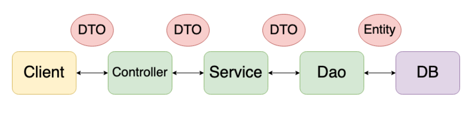

# ⚡ DAO (Data Access Object)

- `repository package`
- 실제 DB에 접근하는 객체 (Persistence Layer) : DB에 data를 CRUD 하는 계층
- SQL 사용 (개발자 직접 코딩) 하여 DB접근한 후 적절한 CRUD API 제공

```java
public interface UserRepository extends JpaRepository<User, Long> {
}
```


# ⚡ DTO (Data Transfer Object)

- `dto package`

- 계층간 데이터 전달만을 위한 객체 (Java Beans)

  - 로직 X, 순수한 데이터 객체, `getter/setter 메서드`만을 가짐
  - 계층(Layer) : controller, service, repository

- DB에서 데이터를 얻어 Service나 Controller로 보낼 때 사용하는 객체

- Request, Response 용 DTO 는 View 를 위한 클래스

  - `toEntity()` 를 통해 DTO에서 필요한 부분 이용해 엔티티 생성
  - controller layer에서 Response DTO 형태로 client 전달

- cf) 

  ```
  VO(Value Object) vs DTO
  ```

  - **VO** : 특정한 비즈니스값을 담는 객체
  - **DTO** : Layer간의 통신 용도로 오고가는 객체
  - VO는 DTO와 비슷한 개념이지만, `read only` 속성을 갖는다


# ⚡ Entity

- `domain package`
- 실제 DB 테이블과 매칭될 클래스 / 가장 core한 클래스
- setter 접근 금지 & 기본 생성자 사용 제한(protected)
- @Entity, @Column, @Id 등을 이용


## Entity클래스와 DTO 클래스를 분리하는 이유

- View Layer와 DB Layer를 철저하게 분리하기 위해
- 테이블과 매핑된 Entity 변경 -> 여러 클래스에 영향
- View와 통신하는 DTO클래스(Request/Response) 자주 변경되므로 분리
- DTO는 Domain Model을 복사한 형태 + 다양한 Presentation Logic 추가
- Domain Model 객체는 Persistent 만을 위해 사용


# ⚡ VO (Value Object)

- 핵심 역할 : `equals()` 와 `hashcode()` 오버라이딩

- 내부 선언된 속성(field)의 모든 값들이 객체마다 값이 같아야, 똑같은 객체 (위의 오버라이딩 필수 !)

  -> 필드 값이 같다면, 모두 같은 객체

- 특정 값 자체를 표현 >> `read_only`

- 생성자는 불변성 보장을 위해 사용

- 테이블 내 속성 외에 추가적인 속성을 가질 수 있음


---

## Controller

- 요청 url에 따라 적절한 view와 mapping 처리
- 적절한 응답DTO 를 body에 담아 client에 반환

cf) `@Controller` : API & View  동시 사용하는 경우 사용하는 어노테이션

`@ResponseBody` : API 서비스로 사용하는 경우, 객체 반환을 위해 사용 for return view

`@RestController` : `@Controller` + `@ResponseBody` >> view 가 필요없는 API서비스에서 사용

- spring 4.0.1 부터 제공
- data return이 주목적


## Service

- Repository 의 method를 이용
- DAO로 DB  접근, DTO 로 데이터 전달받음 >> 비즈니스 로직 처리 >> 데이터 반환


[참고1](https://jojoldu.tistory.com/134)

[참고2](https://maenco.tistory.com/entry/Java-DTO%EC%99%80-VO%EC%9D%98-%EC%B0%A8%EC%9D%B4)

[참고3](https://sas-study.tistory.com/404)

[참고영상1](https://www.youtube.com/watch?v=J_Dr6R0Ov8E)