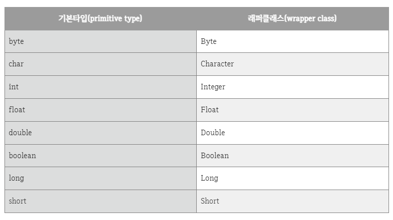
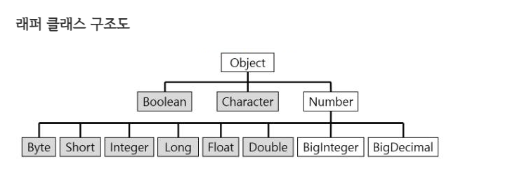
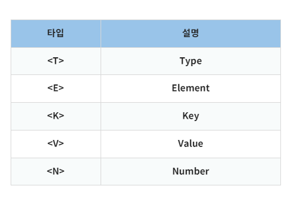

---

# 자바의 자료형

**기본 타입 (primitive type)** 

- 정수, 실수, 문자, 논리 리터럴 등 실제 값을 저장하는 데이터 타입

**참조 타입  (reference type)**

- 배열, 열거, 클래스, 인터페이스 등 객체 위치 참조


## 래퍼(Wrapper class) 클래스

> 기본 자료타입(Primitive type)에 해당하는 데이터를 객체로 다루기 위해 사용하는 클래스 
>
> 👉  **포장 객체**
>
> 👉 **기본 타입의 객체화**
>
> - java.lang 패키지에 포함






- `Object` 
  - 모든 래퍼 클래스의 부모
- `Number`
  - 내부적으로 숫자를 다루는 래퍼 클래스들의 부모


### 용도

> - 객체 또는 클래스가 제공하는 메소드 사용
>
> - 클래스가 제공하는 상수 사용 
>
>   ex) MIN_VALUE, MAX_VALUE
>
> - 숫자, 문자로의 형변환 또는 진법 변환시 사용

​	

1. **박싱 & 언박싱**

>**`박싱`** : 기본 타입 데이터 ➡ 래퍼 클래스 인스턴스 (포장 객체)  
>
>**`언박싱`** : 래퍼 클래스 인스턴스 (포장 객체)  ➡  기본 타입 데이터 
>
> 👉  **`(자료형)Value()`**

```java
public class Wrapper_Ex {
    public static void main(String[] args)  {
        Integer num = new Integer(17); // 박싱
        int n = num.intValue(); //언박싱
        
        // JDK 1.5 이후 자바컴파일러가 자동 처리
        Integer number = 17; // 자동 박싱
        int nb = number; //자동 언박싱
    }
}
```


2. **문자열 -> 기본 타입 값 변환시**

> 정적메서드 :  `parse + 기본 타입명` 

```java
byte b = Byte.parseByte(str);
int i = Integer.parseInt(str);
short s = Short.parseShort(str);
long l = Long.parseLong(str);
float f = Float.parseFloat(str2);
double d = Double.parseDouble(str2);
boolean bool = Boolean.parseBoolean(str3);
```


### ✍ 관련 개념

- **제네릭 (Generic)**

  - 제네릭 사용시 필수로 들어감, primitive type > 에러

    - Wrapper class 는 Primitive Type 과 달리 null도 넣을 수 있기 때문

    ex) `ArrayList<Integer>`

    - 제네릭 타입의 <Integer> 가 자바의 int 자료형과 매핑되는 래퍼 클래스

  

- **Casting(형 변환)**
  - `int strToInt = Integer.parseInt(str);`
    - String 형태의 정수 타입 변수를 int 형태의 기본 타입으로 casting 할때, Integer 래퍼클래스의 parseInt 이용


### 주의

- 래퍼 객체는 내부의 값을 비교하기 위해 `==` 연산자를 사용할 수 X

  👉 `equals` 사용 !

  - 내부의 값이 아닌 래퍼 객체의 **참조 주소를 비교**하기 때문
  - 객체이므로 서로의  참조 주소가 다름

  ```java
  public class Wrapper_Ex {
      public static void main(String[] args)  {
          Integer num = new Integer(10); //래퍼 클래스1
          Integer num2 = new Integer(10); //래퍼 클래스2
          int i = 10; //기본타입
  		 
          System.out.println("래퍼클래스 == 기본타입 : "+(num == i)); //true
          System.out.println("래퍼클래스.equals(기본타입) : "+num.equals(i)); //true
          System.out.println("래퍼클래스 == 래퍼클래스 : "+(num == num2)); //false
          System.out.println("래퍼클래스.equals(래퍼클래스) : "+num.equals(num2)); //true
      }
  }
  ```


- 래퍼 클래스로 감싸고 있는 기본 타입 값은 외부에서 변경할 수 X
  - 변경을 위해서는 새로운 포장 객체를 만들어야 함


[참고1](https://coding-factory.tistory.com/547)

[참고2](https://tragramming.tistory.com/97)


---

### Wrapper

- 정보기술
  - 실제 데이터의 앞에서 어떤 틀을 잡아 주는 데이터 or 다른 프로그램이 성공적으로 실행되도록 설정하는 프로그램

​			ex) http://, ftp:// , <> , ...

- 프로그래밍

  - 활동범위 설정, 다른 중요한 프로그램 실행을 가능케 하는 프로그램 or 스크립트

  


### 일급 컬랙션 

> 콜렉션 wrapping 시, 그 외 다른 멤버 변수가 없는 상태
>
> `collection` 들을 한번 Wrapping 한 컬렉션


- 장점
  - 하나의 인스턴스에서 비지니스 로직 관리


[참고1](https://velog.io/@guswns3371/Wrapper-Class%EB%9E%80)


---

## 제네릭 (Generic)

> 정해진 형식에 의존 X
>
> 클래스 내부에서 지정하는  것이 아닌, 외부에서 사용자에 의해 지정되는 것을 의미
>
> 클래스 외부에서 접근 시 재사용성을 높이기 위해 사용


- 장점
  - 잘못된 타입이 들어올 수 있는 것을 컴파일 단계에서 방지
  - 따로 타입 체크 및 변환 X
  - 코드 재사용성 높아짐




- 예시

  ```java
  public class ClassName <T> { ... }
  public Interface InterfaceName <T> { ... }
  
  public class ClassName <T, K> { ... }
  public Interface InterfaceName <T, K> { ... }
   
  // HashMap의 경우 아래와 같이 선언되어있을 것이다.
  public class HashMap <K, V> { ... }
  ```

  

- 유의점
  - 타입 파라미터로 명시할 수 있는 것은 참조 타입(Reference Type)
  - 즉, 사용자가 정의한 클래스 타입도 가능 ! 


```java
// 제네릭 클래스
class ClassName<E> {
	
	private E element;	// 제네릭 타입 변수
	
	void set(E element) {	// 제네릭 파라미터 메소드
		this.element = element;
	}
	
	E get() {	// 제네릭 타입 반환 메소드
		return element;
	}
	
}
 
class Main {
	public static void main(String[] args) {
		
		ClassName<String> a = new ClassName<String>();
		ClassName<Integer> b = new ClassName<Integer>();
		
		a.set("10");
		b.set(10);
	
		System.out.println("a data : " + a.get());
		// 반환된 변수의 타입 출력 
		System.out.println("a E Type : " + a.get().getClass().getName());
		
		System.out.println();
		System.out.println("b data : " + b.get());
		// 반환된 변수의 타입 출력 
		System.out.println("b E Type : " + b.get().getClass().getName());
		
	}
}

// 실행 결과
// a data : 10
// a E Type : java.lang.String
// b data : 10
// b E Type : java.lang.Integer
```


[참고1](https://st-lab.tistory.com/153)

---

## Casting(형 변환)

> OOP (객체지향 프로그래밍) 에서 매우 중요
>
> 데이터를 바꾸는 것보다 OOP의 **다형성** 측면에서 사용
>
> **데이터 손실**을 막고자 함 !

- **이유**

  - 다형성 
    - 오버라이딩 된 함수를 분리해서 활용 O

  - 상속
    - 캐스팅을 통해 범용적인 프로그래밍 가능


- **예시**
  - `int a = 1.0;`  ➡ Error !
  - `int a = (int)1.0;` >> O
  - `double b = 1;` >> O
    - Why? 
      - 기본형끼리의 캐스팅, 컴파일러가 알고있는 자료형,  추측 O


- **조건**
  - 자료형이 정해진 변수에 값을 넣을 때는 변수가 원하는 정보는 모두 넣어줘야 성립 !
  - 참조형의 경우 서로 관련없는 데이터끼리는 변환되지 않음
  - 관련 O
    1. 상속 관계
    2. 인터페이스로 인해 확장


- **업캐스팅**

  > 묵시적(implicit) 변환

  

  - `Parent parent = (Parent) new Child();`
    - parent 변수는 Parent 자료형 데이터 모두를 원함
    - new Child(); 인스턴스는 Parent 자료형 데이터 모두를 가지고 있음 !
    - 형변환 기호 `(Parent)` 없이도 다형성 측면에서 넘어감 
  - 이유
    - [참고](https://velog.io/@sezzzini/Java-Casting)
    - 다형성 >> 공통적으로 할 수 있는 부분을 간단하게 만들기 위해


- **다운캐스팅**

  > 데이터 손실 O
  >
  > 명시적(explicit) 선언

  

  - `Child child = new Parent();` ➡ 컴파일 Error!

    - 변수가 원하는 정보를 다 채워줄 수 없음

    - Child 클래스가 더 많은 데이터를 가졌을 것.

      ➡ Child 클래스 데이터 전부를 원하는데, Parent 인스턴스는 Parent 데이터만 가짐.

  

  - `Child child = (Child)new Parent();`  ➡ 런타임 Error!

    - 기본 자료형끼리는 추리 가능, 알맞은 데이터 크기로 변환하여 넣어줌
    - BUT 참조형 데이터는 JVM이 알 수 없음 

    

  - 일반적으로 성립 X, BUT 업캐스팅이 선행된 경우 가능

    ```java
    Parent parent = new Child(); // 업캐스팅
    Child child = (Child)parent; // 다운캐스팅
    ```


- `instanceof` 연산자 

  - <객체> instanceof <클래스> 형태

  ex) 업캐스팅 시, 참조 변수가 가리키는 객체의 타입이 어떤 것인지 구분하기 어려울 때 유용

  ```java
  public void casting(Parent parent){
  	if (parent instanceof Child){	// 업캐스팅한 객체 parent 인가
  		Child child = (Child) parent; // 다운 casting
  	}
  }
  ```

  


[참고1](https://mommoo.tistory.com/40)


---

### 동적 형(타입) 변환 - Java Dynamic Casting 


#### 용도

1. **다양한 클래스 타입으로 생성된 객체를 맵(Map<>)을 이용하여 사용**

   - 객체를 업캐스팅하여 `Object` 타입으로 캐스팅
   - 키는 생성된 `클래스의 클래스(.class)`
     - 맵에서 객체를 가져올 때 키를 이용하여 캐스팅 
   - 파라미터 타입 제네릭 선언 ➡ 제네릭 메소드
     - for 동적으로 캐스팅 ! 리턴까지 캐스팅 !
   - 타입 매개변수<T> 반드시 메소드 반환타입 앞
     - <T> :  타입을 제한하지 않아 다양한 타입 사용 가능

   ```java
   import java.util.HashMap;
   import java.util.Map;
   
   public class ClassMap {
   
   	private Map<Class<?>, Object> map = new HashMap<Class<?>, Object>();
   
   	public <T> void put(Class<T> objectClass, T object) {
   		map.put(objectClass, object);
   	}
   
   	public <T> T get(Class<T> objectClass) {
   		return objectClass.cast(map.get(objectClass));
   	}
   }
   ```

   ```java
   @Test
   public void test() {
   	UserVO userVO = new UserVO();
   	userVO.setId("testid");
   	userVO.setName("홍길동");
   
   	OrderVO orderVO = new OrderVO();
   	orderVO.setOrderNumber(1234567890);
   	orderVO.setProductName("사과");
   
   	ClassMap classMap = new ClassMap();
   	classMap.put(UserVO.class, userVO);
   	classMap.put(OrderVO.class, orderVO);
   
   	System.out.println("User Name : " + classMap.get(UserVO.class).getName());
   	System.out.println("Order Product Number : " + classMap.get(OrderVO.class).getOrderNumber());
       
       // 출력 결과
       // User Name : 홍길동
   	// Order Product Number : 1234567890
   }
   ```

   


2. **정보를 Object 타입으로 전달받아 생성된 객체의 멤버 필드에 값을 저장하여 사용**

   - `cast()` 
     - 래퍼클래스와 같은 클래스에서 동작
     - String은 래퍼클래스

   ```java
   @Test
   public void test() {
   	// 주문 정보
       // Object 타입으로 전달받아 생성된 객체의 멤버 필드에 값을 저장
   	Map<String, Object> map = new HashMap<String, Object>();
   	map.put("orderNumber", 1234567890);
   	map.put("productName", "사과");
   		
       // 생성된 객체의 맴버 필드들을 가져옴
   	OrderVO orderVO = new OrderVO();
   
   	Field[] Fields = OrderVO.class.getDeclaredFields();
   	for (Field field : Fields) {
   		if (map.containsKey(field.getName())) {
               
               // 맴버 필드 명으로 맵에서 정보를 가져오고 맴버 필드의 타입으로 캐스팅하여 맴버 필드 값에 저장
   			Object fieldValue = map.get(field.getName());
   			field.setAccessible(true);
   			try {
   				field.set(orderVO, field.getType().cast(fieldValue));
   			} catch (IllegalArgumentException | IllegalAccessException e) {
   				e.printStackTrace();
   			}
   		}
   	}
   
   	System.out.println("Order Product Number : " + orderVO2.getOrderNumber());
   	
       // 실행 결과
       // Order Product Number : 1234567890
   ```

   


[참고1](https://carrotweb.tistory.com/96)

[참고2](https://coder-in-war.tistory.com/entry/Java-08-JAVA%EC%9D%98-%ED%98%95%EB%B3%80%ED%99%98Promotion-Casting)

[참고3](https://pathas.tistory.com/142)

[참고4](https://itmining.tistory.com/23)

