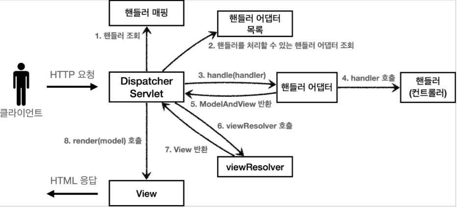
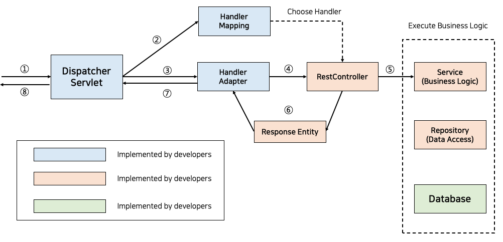
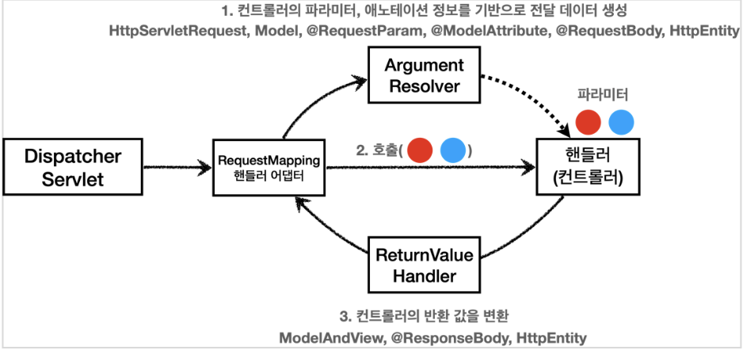

# SpringMVC

- 1. HTTP 요청 처리 가능한 핸들러 조회
  2. 해당 핸들러 어댑터 조회
  3. handle(handler)
  4. handler 호출 >> `RequestMapping핸들러어댑터 `
  5. ModelAndView 반환
  6. viewResolver 호출
  7. View 반환
  8. render(model) 호출






## DispatcherServlet

- 프론트 컨트롤러
  - 서블릿 컨테이너  제일 앞단에서 서버로 오는 모든 HTTP 요청을 받아 처리하는 컨트롤러
  - 세부 경로는 각 Controller에게 뿌려줌
  - 공통/ 최우선 작업 처리
    - 한글 인코딩 등
- 생성 배경 without Spring
  - Controller 없음
    - 일일히 서블릿 객체 생성하고 web.xml에 등록
    - 서블릿 객체 하나는 하나의 경로만 담당
  - 높은 의존성
    - Servlet 객체는 HttpServlet 확장한 객체
      - 클래스끼리 값을 주고받기 까다로움
  - 중복되는 작업
    - 모든 서블릿이 공통을 처리하는 작업
    - 가장 우선시 되야하는 작업 등


## Header

- **종류**
  1. 공통
     - 요청 및 응답 O , 컨텐츠에는 적용 X
     - Date, Cache-Control, Connection
  2. 엔티티, 개체
     - 컨텐츠 길이, [MIME 타입](https://developer.mozilla.org/ko/docs/Web/HTTP/Basics_of_HTTP/MIME_types), Entity Body 자세한 정보
  3. 요청
     - HTTP 요청에 사용 BUT 컨텐츠와의 관련 X
     - Fetch 될 리소스, 클라이언트 정보를 서버로 전달
  4. 응답
     - 위치 or 서버 자체에 대한 정보(이름, 버전)
- **Cache-Control (공통)**
  - 주로 응답 헤더 BUT “클라이언트 - 중개 서버 - 서버” 구조에서 중개 서버 캐시 가져오지 않도록 클라이언트의 요청 헤더에 이 헤더 추가
  - no-store
    - 아무것도 캐싱 X
  - no-cache
    - 모든 캐시를 쓰기 전에 서버에 해당 캐시 사용 여부 확인
  - must-revalidate
    - 만료된 캐시만 서버에 확인
  - public
    - 공유 캐시(또는 중개서버) 에서 저장 O
  - private
    - 브라우저와 같은 특정 사용자 환경에만 저장 O
  - max-age
    - 캐시 유효기간 명시
- **Content-type (엔티티)**
  - 해당 개체에 포함되는 미디어 타입 정보
  - 문자 인코딩 방식 (UTF-8, EUC-KR 등)
  - ex) Content-Type: text/html; charset-latin-1
- **Accept (요청)**
  - 클라이언트가 받을 수 있는 미디어타입 및 우선순위
  - text/plain, application/json, **/**
  - ex) Accept : image/*
- **Access-Control-Allow-Origin (응답)**
  - 요청을 보내는 프론트 주소와 받는 백엔드 주소가 다르면 CORS 에러
    - 프로토콜, 서브 도메인, 도메인, 포트 중 하나만 달라도 에러


# HTTP 요청


### 1. **쿼리 파라미터 (GET)**

- 쿼리 파라미터에 데이터 포함
- `/url?username=sujin&age=25`

ex) 검색, 필터, 페이징 등


### 2. **HTML  Form (POST)**

- `Content-type`: `application/x-www-form-urlencoded`
- 메시지 바디에 쿼리 파라미터 형식으로 전달

ex) 회원 가입, 상품 주문, HTML Form 사용


### 📌 요청 파라미터 (request parameter) 조회 

- 쿼리 파라미터
- HTML  Form

````
 ` 💡 `@RequestParam`

파라미터 이름으로 바인딩 !

**예시**

<Method명>(@RequestParam("username") String memberName) { ... }

- 요청 : ?username=sujin
- 사용 : [log.info](http://log.info/)("username={}", memberName);

**생략 가능 예시

-** 조건 **:** HTTP 파라미터 이름 == 변수 이름 👉 <Method명>(String memberName) { ... }
````

```
💡 `ModelAttribute`

요청 파라미터 → 필요한 객체 생성 → 객체에 값 담기 과정을 자동화 !

**생략 가능**

BUT `RequestParam` 도 생략 가능 →  혼란 가능성

> > > > String, int, Integer 과 같은 단순 타입 : `RequestParam` 
그 외( = argument resolver로 지정한 타입 외) : `ModelAttribute`

**BindException** : 숫자가 들어갈 곳에 문자를 넣는 경우 발생
```


### 3. **HTML message body (POST, PUT, PATCH)**

- 주로 HTTP API 에서 사용
- TEXT (body >> row, text)
  - InputStream(Reader): HTTP 요청 메시지 바디의 내용을 직접 조회
  - OutputStream(Writer): HTTP 응답 메시지의 바디에 직접 결과 출력
- `@HttpEntity`
  - Http header, body 정보를 편리하게 조회
  - 응답에도 사용 가능
  - 요청 파라미터 조회 기능과 관계 없음(RequestParam, ModelAttribyte)

````
 💡 `@RequestBody`

: JSON 요청 → HTTP 메시지 컨버터 → 객체

- HTTP 메시지 바디의 내용을 원하는 문자나 객체 등으로 조회
- 직접 만든 객체 지정 가능

**생략 불가능**
````


# HTTP 응답

### 1. **정적 리소스**

- 웹 브라우저에 정적인 HTML, css, js  제공

```java
Class Path에서 
**아래 디렉토리**에 있는 정적 리소스 제공

/static
/public
/resources
/META-INF/resources

ex) <http://localhost:8080/basic/hello-form.html> 으로 요청 

-> src/main/resources/static/basic/hello-form.html 의 정적 리소스 제공
```


### 2.**뷰 템플릿**

- 웹 브라우저에 동적인 HTML 제공
  - 뷰 템플릿 → HTML 생성 → 뷰가 응답을 만들어 전달
  - 경로 : `src/main/resources/templates`

```java
// ResponseViewController : 뷰 템플릿 호출하는 컨트롤러

@Controller
public class ResponseViewController {

 @RequestMapping("/response-view-v2")
 public String responseViewV2(Model model) {
	 model.addAttribute("data", "hello!!");
	 return "response/hello";
 }

// src/main/resources/templates/response/hello 에 있는 뷰 템플릿 호출 
```


### 3. **Http 메시지**

- HTTP  API 의 경우, 데이터 전달
- → HTTP 메시지 바디에 JSON 같은 형식으로 데이터 전달

### return [String] : View or HTTP 메시지

```
💡 `ResponseBody`


: 객체 → HTTP 메시지 컨버터 → JSON 응답

< O >
- HTTP 의 메시지바디에  문자 내용 직접 반환
- `HttpMessageConverter` 동작

< X >
- `ViewResolver` 동작 


💡 `@RestController` = `@Controller` + `@RequestBody`

Controller 대신에 사용 시 해당 컨트롤러 모두 ResponseBody 적용 효과 → 뷰 템플릿 사용 X → HTTP 메시지 바디에 직접 데이터 입력

= RestAPI(HTTP API) 를 만들 때 사용하는  컨트롤러
```


 

------

**핸들러 어댑터 ↔ 컨트롤러**




<**요청>**

### ArgumentResolver (= `HandlerMethodArgumentResolver`)

> ArgumentResolver 의 supportsParameter() 를 호출해서 해당 파라미터를 지원하는지 체크
>
> 지원하면 resolveArgument() 를 호출해서 실제 객체를 생성

- HttpServletRequest, Model, RequestParam, ModelAttribute 어노테이션 처리
- RequestBody, HttpEntity 등  HTTP 메시지 처리
  - 각각을 처리하는 HTTP 메시지 컨버터를 사용해서 필요한 객체를 생성

- 컨트롤러(핸들러)가 필요로 하는 다양한 파라미터의 값(객체)을 생성
- `RequestMappingHandlerAdaptor`

```java
1. ArgumentResolver 호출
2. 컨트롤러(핸들러)가 필요로 하는 파라미터의 값(객체) 생성
3. 컨트롤러 호출 & 값 전달
```


**<응답>**

### ReturnValueHandler ( = `HandlerMethodReturnValueHandler`)

- ResponseBody, HttpEntity 처리
- HTTP 메시지 컨버터 호출 → 응답 결과 생성


****

# MessageConverter  : 문자나 객체 변환

- 뷰 템플릿으로 HTML 생성하여 응답 X
- HTTP API처럼 JSON 데이터를 HTTP 메시지 바디에서 직접 읽거나 쓰는 경우 편리
- HTTP 요청, HTTP 응답 둘 다 사용
- canRead(), canWrite() : 메시지 컨버터가 해당 클래스, 미디어 타입을 지원하는지 체크
- read(), write() : 메시지 컨버터를 통해 메시지를 읽고 쓰는 기능


| 우선순위   | 0                             | 1                          | 2                                   |
| ---------- | ----------------------------- | -------------------------- | ----------------------------------- |
| 컨버터명   | ByteArrayHttpMessageConverter | StringHttpMessageConverter | MappingJackson2HttpMessageConverter |
| 클래스타입 | byte[]                        | String                     | 객체 또는 HashMap                   |
| 미디어타입 | `*/*`                         | `*/*`                      | `application/json`                  |


- **요청 데이터 읽기 **

  > 메시지 컨버터 조건 : HTTP Content-Type & 컨트롤러 파라미터 타입

  1. 컨트롤러에서 `@RequestBody`, `HttpEntity(RequestEntity)` 파라미터 사용
  2. 메시지 컨버터가 메시지를 쓸 수 있는지 확인하기 위해 HTTP 메시지 컨버터 canRead() 호출
  3. 대상 **클래스 타입**을 지원하는지 ex) @RequestBody 의 대상 클래스 (byte[], String, HelloData )
  4. HTTP 요청의 Content-Type **미디어 타입**을 지원하는가 ex) text/plain, application/json, **/**
  5. canRead() 조건 만족 ➡ read()  호출 & 객체 생성, 반환


- **응답 데이터 생성 **

  >  메시지 컨버터 조건 : HTTP Accept 헤더 & 컨트롤러 반환 타입

  1. 컨트롤러에서 `@ResponseBody`, `HttpEntity(ResponseEntity)`
  2. 메시지 컨버터가 메시지를 쓸 수 있는지 확인하기 위해 HTTP 메시지 컨버터 canWrite() 호출
  3. 대상 **클래스 타입**을 지원하는지 ex) return 의 대상 클래스 (byte[], String, HelloData )
  4. HTTP 요청의 Accept **미디어 타입**을 지원하는가 (@RequestMapping 의 produces) ex) text/plain, application/json, **/**
  5. canWrite() 조건 만족  ➡ write()  호출 & HTTP 응답 메시지 바디에 데이터 생성


