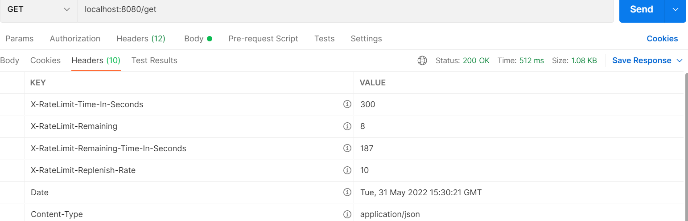
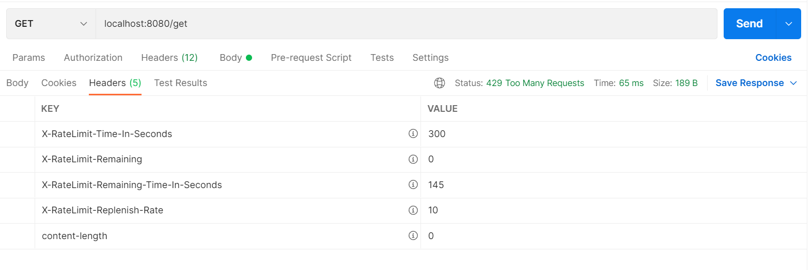
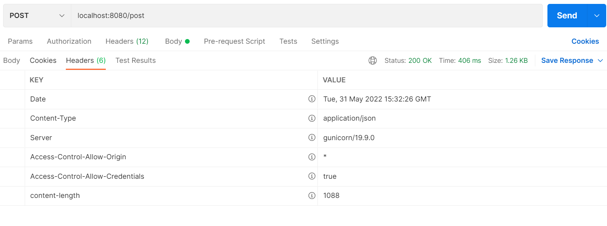
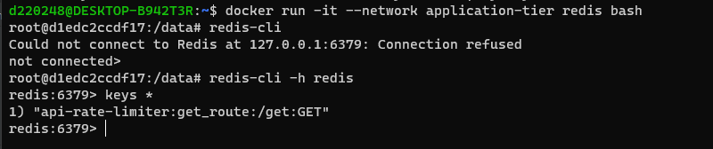
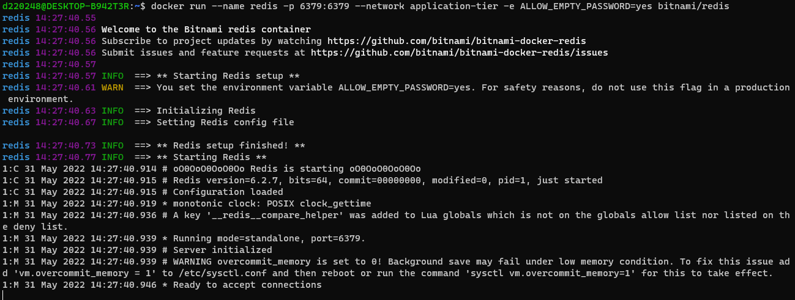
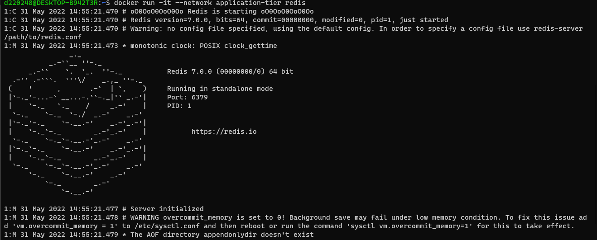

# Api Gateway Rate Limit


> ​        **목표**
>
> 1. 유량 제어 (429 상태 코드 확인)
> 2. client 요청 별 적용 확인 (/get , /post)
> 2. custom rate limiter filter
> 3. db 동기화 (Embedded Redis)


```java
private void builderRouter(CustomRouterLocatorDto customRouter) {
    customRouter.getBuilder().route(r -> r
            .path(customRouter.getPath())
            .filters(f -> {
                if(!customRouter.getRewritePath().equals("/"))
                    f.rewritePath(customRouter.getRewritePath() + "(?<segment>/?.*)", "$\\{segment}");

                f.circuitBreaker(c -> c.setName("cbServicies").setFallbackUri("forward:/offlineservicies/down"));

                if(customRouter.isEnableRateLimiter()) {
                    f.requestRateLimiter()
                       .rateLimiter(RedisRateLimiter.class, rl ->
                       rl.setBurstCapacity(customRouter.getBurstCapacity())
                       .setReplenishRate(customRouter.getReplenishRate())
                       ).and();
                }

                return f;
            })
            .metadata(RouteMetadataUtils.RESPONSE_TIMEOUT_ATTR, RESPONSE_TIMEOUT_ATTR_VALUE_MILLIS)
            .metadata(RouteMetadataUtils.CONNECT_TIMEOUT_ATTR, CONNECT_TIMEOUT_ATTR_VALUE_MILLIS)
            .uri(customRouter.getUriType() + customRouter.getServiceName())
    );
}
```

- `replenishRate` : 초당 10번 '/get' 경로 도달 가능
  - 1초당 몇개까지 요청을 허용할지에 대한 속성 값이다. token buket 이 가득 차는 값. token bucket 에서 downstream 으로 흐르는 요청양 같다.
- `burstCapacity` : 한번에 최대 15개 요청 버스트
  -  1초에 최대 몇개까지 요청을 보낼 수 있는지에 대한 속성 값이다. token bucket 이 가지고 있을 수 있는 토큰 갯수이다. 이 값을 0 으로 설정하면 모든 요청이 block 된다
- 최대 허용 요청 초과시 `429 Too Many Request http status`


```yml
spring:
  application:
    name: custom-limiter
  cloud:
    gateway:
      routes:
        - id: get_route
          uri: http://httpbin.org/
          predicates:
            - Path=/get/**
          filters:
            - name: RequestRateLimiter
              args:
                redis-rate-limiter.replenishRate: 10
                redis-rate-limiter.burstCapacity: 15
        - id: post_route
          uri: http://httpbin.org/
          predicates:
            - Path=/post/**
          

  r2dbc:
    url: r2dbc:postgresql://localhost:5432/postgres
    username: postgres
    password: postgres

```


```properties
# Redis Properties
spring.redis.host=localhost
spring.redis.port=6379
spring.redis.client-type=lettuce

# application.properties
spring.r2dbc.url=r2dbc:postgresql://localhost:5432/postgres
spring.r2dbc.username=postgres
spring.r2dbc.password=postgres

# Since the default spring boot will auto configure redis rate limiter
# We need to exclude this auto configuration to prevent conflict for Rate Limiter bean class
spring.autoconfigure.exclude=org.springframework.cloud.gateway.config.GatewayRedisAutoConfiguration

#  Key 를 찾을 수 없을때에 대해서 block 할지 말지에 대한 설정
spring.cloud.gateway.filter.request-rate-limiter.deny-empty-key=false
spring.cloud.gateway.routes[0].id=get_route
spring.cloud.gateway.routes[0].predicates[0].name=Path
spring.cloud.gateway.routes[0].predicates[0].args[patterns]=/get
spring.cloud.gateway.routes[0].predicates[1].name=Method
spring.cloud.gateway.routes[0].predicates[1].args[methods]=GET

# Properties to apply api limiter in this route
spring.cloud.gateway.routes[0].filters[0].name=RequestRateLimiter


# Apply our custom api limiter to this api limiter configuration
spring.cloud.gateway.routes[0].filters[0].args[rate-limiter]=#{@apiRateLimiter}

# Apply our custom key resolver to this api limiter configuration
spring.cloud.gateway.routes[0].filters[0].args[key-resolver]=#{@apiRateLimiterKeyResolver}
spring.cloud.gateway.routes[0].uri.=http://httpbin.org/

spring.cloud.gateway.routes[1].id=post_route
spring.cloud.gateway.routes[1].predicates[0].name=Path
spring.cloud.gateway.routes[1].predicates[0].args[patterns]=/post
spring.cloud.gateway.routes[1].predicates[1].name=Method
spring.cloud.gateway.routes[1].predicates[1].args[methods]=POST
spring.cloud.gateway.routes[1].uri.=http://httpbin.org/
```

```yml
# 기본으로 제공되는 RequestRateLimiter 필터는 제한이 걸린 요청에 대해 내부적으로 사용하는 응답 포맷 사용 X >> custom filter 사용 필요!
# 참고 링크 : https://devs0n.tistory.com/72?category=865955 
# >> 코틀린 유의 ...

server:
  port: 9000

spring:
  redis:
    host: 127.0.0.1
    port: 6379
    database: 0

  cloud:
    gateway:
      default-filters:
        - name: AuthFilter
          args:
            whiteList:
              chrisToken: chris

      routes:
        - id: all
          uri: http://localhost:8080
          predicates:
            - Path=/**

          filters:
#            - name: RequestRateLimiter
            - name: RequestRateLimitFilter
              args:
                redis-rate-limiter.replenishRate: 1
                redis-rate-limiter.burstCapacity: 1
                redis-rate-limiter.requestedTokens: 1
#                redis-rate-limiter.replenishRate: 20
#                redis-rate-limiter.burstCapacity: 100
#                redis-rate-limiter.requestedTokens: 3
                key-resolver: "#{@userIdAsKeyResolver}"
```

---

```
 * REMAINING_HEADER (X-RateLimit-Remaining) 
 	: 사용자에게 남은 요청을 알리기 위해
 * REPLENISH_RATE_HEADER (X-RateLimit-Replenish-Rate)
 	: 사용자에게 최대 요청을 알리기 위해 
 * REMAINING_TIME_IN_SECONDS_HEADER (X-RateLimit-Remaining-Time-In-Seconds) 
 	: 현재 리미터의 남은 시간을 알려줌.
 * TIME_IN_SECONDS_HEADER (X-RateLimit-Time-In-Seconds)
 	: 현재 제한기에 대한 사용자의 만료 시간을 알려줌.
```

- /get



```shell
$ curl http://172.30.144.1:8080/get
{                                                                                    
  "args": {},                                                                        
  "headers": {                                                                       
    "Accept": "*/*",                                                                 
    "Content-Length": "0",                                                           
    "Forwarded": "proto=http;host=\"172.30.144.1:8080\";for=\"172.30.144.1:64036\"", 
    "Host": "httpbin.org",                                                           
    "User-Agent": "curl/7.75.0",                                                     
    "X-Amzn-Trace-Id": "Root=1-62962613-2ec2423670034cd6738842c8",                   
    "X-Forwarded-Host": "172.30.144.1:8080"                                          
  },                                                                                 
  "origin": "172.30.144.1, 61.75.20.18",
  "url": "http://172.30.144.1:8080/get"
}
=======================================================================
# POSTMAN ver
{
    "args": {},
    "headers": {
        "Accept": "*/*",
        "Accept-Encoding": "gzip, deflate, br",
        "Content-Length": "132",
        "Content-Type": "application/json",
        "Forwarded": "proto=http;host=\"localhost:8080\";for=\"[0:0:0:0:0:0:0:1]:64974\"",
        "Host": "httpbin.org",
        "Postman-Token": "e4153ab5-942e-4c05-81a9-21528db787a3",
        "User-Agent": "PostmanRuntime/7.29.0",
        "X-Amzn-Trace-Id": "Root=1-6296341c-00f70fb972ce94362eaacf5c",
        "X-Forwarded-Host": "localhost:8080",
        "X-Ratelimit-Remaining": "2",
        "X-Ratelimit-Remaining-Time-In-Seconds": "299",
        "X-Ratelimit-Replenish-Rate": "0",
        "X-Ratelimit-Time-In-Seconds": "300"
    },
    "origin": "0:0:0:0:0:0:0:1, 61.75.20.18",
    "url": "http://localhost:8080/get"
}
```


- /post



```shell
# POSTMAN ver
{
    "args": {},
    "data": "{\r\n        \"path\": \"/post\",\r\n        \"method\": \"post\",\r\n        \"threshold\": 20,\r\n        \"ttl\": 300,\r\n        \"active\": true\r\n    }",
    "files": {},
    "form": {},
    "headers": {
        "Accept": "*/*",
        "Accept-Encoding": "gzip, deflate, br",
        "Content-Length": "132",
        "Content-Type": "application/json",
        "Forwarded": "proto=http;host=\"localhost:8080\";for=\"[0:0:0:0:0:0:0:1]:64974\"",
        "Host": "httpbin.org",
        "Postman-Token": "ccc62f3d-f74c-4c6a-b9f3-30ba46c3395a",
        "User-Agent": "PostmanRuntime/7.29.0",
        "X-Amzn-Trace-Id": "Root=1-629633be-1461a1374d811a9b0e05bf30",
        "X-Forwarded-Host": "localhost:8080",
        "X-Ratelimit-Remaining": "2",
        "X-Ratelimit-Remaining-Time-In-Seconds": "299",
        "X-Ratelimit-Replenish-Rate": "0",
        "X-Ratelimit-Time-In-Seconds": "300"
    },
    "json": {
        "active": true,
        "method": "post",
        "path": "/post",
        "threshold": 20,
        "ttl": 300
    },
    "origin": "0:0:0:0:0:0:0:1, 61.75.20.18",
    "url": "http://localhost:8080/post"
}
```


## [Docker 로 환경설정](https://medium.com/@fazazulfikapp/easy-setup-fresh-local-development-environment-with-docker-cae3caaed8b0)

- `Docker` 로 네트워크 구성하기

```shell
# 생성된 모든 네트워크 표시
docker network ls

# 이름이 application-tier 인 네트워크 생성
docker network create application-tier --driver bridge

--------------------------------------------------
NETWORK ID     NAME               DRIVER    SCOPE
--------------------------------------------------
26190b85bbbd   application-tier   bridge    local
--------------------------------------------------

# 실행 중인 컨테이너 로그 표시
docker container logs {container-name}
```


```shell
# Docker 사용시 참고 사항

# 도커 시작
- sudo /etc/init.d/docker start

# 도커 허브 로그인 (https://hub.docker.com/)
- docker login -u {your_ID}
 >> password 입력


# cgroup 관련 에러
- sudo mkdir /sys/fs/cgroup/systemd
- sudo mount -t cgroup -o none,name=systemd cgroup /sys/fs/cgroup/systemd
```


- Docker로 `Redis` 설정

```shell
# Redis 설치와 실행
docker run --name redis -p 6379:6379 --network application-tier -e ALLOW_EMPTY_PASSWORD=yes bitnami/redis

# 컨테이너 실행
docker run -it --network application-tier redis
```

```shell
# 실행 중인 redis 안에서 redis-cli 실행

- docker exec -it {containerId : bb384a89b21a} redis-cli -h localhost -p 6379

cf) i : intereactive, t : terminal
```








- Docker로 `postgres` 설정

```shell
# postgres 컨테이너 생성
docker container create --name postgres --network application-tier -e POSTGRES_PASSWORD=postgres -p 5432:5432 postgres:alpine

# 컨테이너 실행 
docker container start postgres

# psadmin 사용 : postgres client tool
docker run -p 5050:80  -e "PGADMIN_DEFAULT_EMAIL={your_email}" -e "PGADMIN_DEFAULT_PASSWORD={password}"  -d dpage/pgadmin4

# 컨테이너 실행 및 bash 
- docker run --name postgres -e POSTGRES_PASSWORD=postgres -d postgres
- docker exec -it postgres bash
- psql -U postgres

>> sql문 입력 ! ㄱㄱ

```


- postgresql

  ```shell
  - \dt : 테이블 목록 조회
  postgres=# \dt
              List of relations
   Schema |    Name     | Type  |  Owner
  --------+-------------+-------+----------
   public | api_limiter | table | postgres
  (1 row)
  
  postgres=# select * from api_limiter
  postgres-# ;
   id | path | method | threshold | ttl | active
  ----+------+--------+-----------+-----+--------
    1 | /get | GET    |        10 | 300 | t
  (1 row)
  
  
  - \l :테이블 목록 조회
  postgres=# \l
                                   List of databases
     Name    |  Owner   | Encoding |  Collate   |   Ctype    |   Access privileges
  -----------+----------+----------+------------+------------+-----------------------
   postgres  | postgres | UTF8     | en_US.utf8 | en_US.utf8 |
   template0 | postgres | UTF8     | en_US.utf8 | en_US.utf8 | =c/postgres          +
             |          |          |            |            | postgres=CTc/postgres
   template1 | postgres | UTF8     | en_US.utf8 | en_US.utf8 | =c/postgres          +
             |          |          |            |            | postgres=CTc/postgres
  (3 rows)
  ```

  
