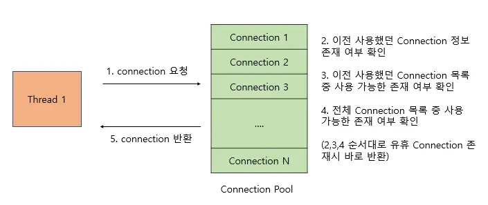
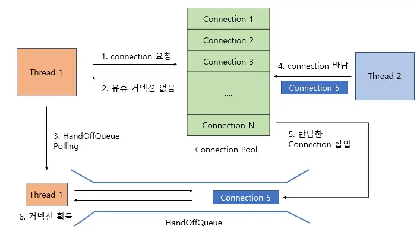

# DB Connection Pool & Context Switch


## DB 커넥션 풀

```java
서버는 동시 사용 가능자 수 개념 O

Connection Pool 이란 동시 접속자가 가질 수 있는 Connection을 하나로 모아서 관리하는 개념
데이터베이스와 연결된 Connection을 미리 만들어서 pool 속에 저장해 두고 있다가 
필요할 때 Connection을 Pool에서 쓰고 다시 Pool에 반환하는 기법

누군가 접속 시 
남아있는 Connection O : 제공
남아있는 Connection X : 대기 상태로 전환

-> Connection이 다시 Pool 에 들어오면
대기 상태의 클라이언트에게 순서대로 제공
```


### Insert문 수행 시 필요 비용

```java
1. Connecting (3) : WAS (Web Application Server) 와 DB사이 연결하는데 필요한 비용
2. Sending query to server (2)
3. Parsing query (2)
4. Inserting row (1)
5. Inserting index(1)
6. Closing (1)
```

WAS 와 DB 연결에 필요한 비용이 Insert문 수행 시 가장 큰 비율

→ Connection 생성은 비용이 많은 작업

→ **Connection Pool** 


### Connection Pool

- 커넥션 수 제한 가능
- 과도한 접속으로 인한 서버 자원 고갈 방지
- DB 접속 모듈 공통화 → 유지 보수 편리


### HikariCP

- 가벼운 용량과 빠른 속도를 가지는 JDBC 커넥션 풀 프레임워크
- 동작법






- 유효 커넥션이 존재 X → HandOffQueue 를 Polling 하며 다른 Thread 커넥션 반납 대기
- 커넥션 풀에 커넥션 반납 시 HandOffQueue에 삽입
- Polling 하던 Thread 는 커넥션 획득


**Q. 커넥션 풀의 크기가 너무 작다면 ?**

A. 대기하는 Thread 수 증가


**Q. 커넥션 풀의 크기가 너무 크다면 ?**

A. Connection을 사용하는 주체인 Thread 수보다 커넥션 풀의 크기가 크다면
    남는 커넥션이 생겨 메모리의 낭비가 발생

→ DB와 WAS 의 Context Switching 의 한계가 있기에 Connection Pool의 크기 중요


**Q. 최적화된 Pool의 크기는?**


- Tn : 전체 Thread 수
- Cm : 하나의 Task에서 동시에 필요한 Connection 수


---

## Context switching

- 현재 진행하고 있는 Task(Process, Thread) 의 상태를 저장하고 
다음 진행할 Task 의 상태 값을 읽어 적용하는 과정
- Context Switching 때 해당 CPU는 일 X → 잦아지면 오버헤드 발생, 효율 저하

```java
멀티 프로세스 환경에서 CPU가 하나의 프로세스 실행하고 있는 상태에서
*인터럽트 요청으로 다음 우선 순위의 프로세스가 실행 되어야 할 때
기존의 프로세스 상태 또는 레지스터 값(Context) 저장
CPU가 다음 프로세스 수행하도록 
새로운 프로세스 상태 or 레지스터 값(Context) 를 교체하는 작업

*인터럽트란?
CPU가 프로그램 실행 중일 때 프로그램 밖에서 예외상황 발생, 처리가 필요한 경우
CPU에게 알려 예외 상황 처리할 수 있도록 하는 것

<Context Switching 일어나는 상황>
- I/O request (입출력 요청)
- time slice expied (CPU 사용시간 만료)
- fork a child (자식 프로세스 만들 때)
- wait for an interrupt (인터럽트 처리를 기다릴 때)

* 우선 순위는 해당 OS의 스케줄러가 우선순위 알고리즘에 의해 정해져 수행
- 라운드로빈 스케줄링
	: 시분할 시스템을 위해 설계된 선점형 스케줄링 
    순서대로 시간단위(Time Quantum) 을 CPU에 할당하는 방식
    효율적인 스케줄링방식
    BUT 시간 단위가 작게 설정 시 CPU 가 조금 일하고 Context Switching 반복 -> 효율저하
>> Context Switch 주체 : OS 스케줄러
```


### Context

- CPU가 해당 프로세스를 실행하기 위한 해당 프로세스의 정보들
- Context는 PCB(Process Controll Block) 에 저장
    - 프로세스 상태 : 생성, 준비, 수행, 대기, 중지
    - 프로세스 카운터 : 프로세스가 다음에 실행할 명령어 주소
    - 레지스터 : 누산기, 스택, 색인 레지스터
    - 프로세스 번호


### 진행 방식

- Task 대부분의 정보는 Register 에 저장, PCB(Process Control Block) 으로 관리
- 현재 실행하고 있는 Task의 PCB 정보 저장 (Process Stack, Ready Queue)


### Context Switching COST

- Cache 초기화
- Memeory Mapping 초기화
- Kernel 은 항상 실행 (for 메모리 접근)
- Process vs Thread
    - Process 가 더 큰 비용
    - Thread는 Stack 영역을 제외한 모든 메모리 공유
    → Context Switching 발생 시 Stack 영역만 변경 진행


자료: https://code-lab1.tistory.com/209, https://nesoy.github.io/articles/2018-11/Context-Switching