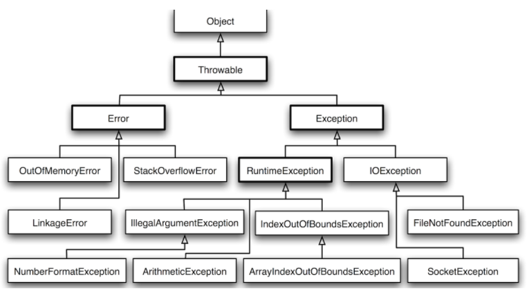
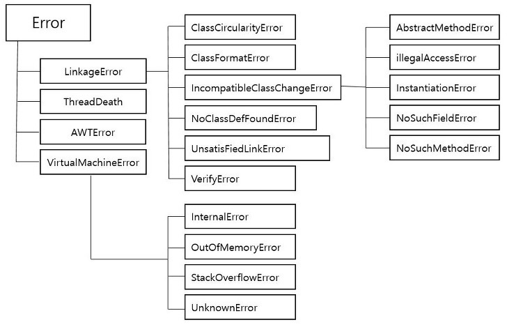
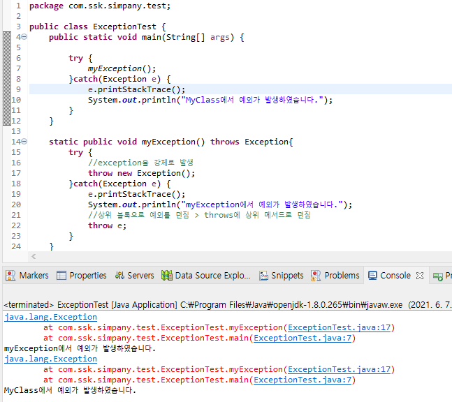

# 에러 & 예외




# 

## 에러



```java
시스템 레벨에서 발생하는 아주 심각한 수준의 문제
ex. 서버 과부하로 인한 outOfMemory
프로그래머가 예측 불가
로직으로 처리할 수 없음
JVM 이 발생시키는 예외 -> JVM 을 종료해야 한다
- 개발자는 JVM 이 종료되기 전 작업 중인 파일 저장 or 예외 로그 파일 쓰기 or 출력
```

- OutOfMemotyError
  - JVM에 설정된 메모리의 한계를 벗어난 상황일 때 발생한다.
  - 힙사이즈가 부족하거나,
  - 너무 많은 class를 로드할때, 가용가능한 swap이 없을때,
  - 큰 메모리의 native메소드가 호출될 때 등이 있다.
  - 이를 해결하기위해 dump 파일분석, jvm 옵션 수정 등이 있다.


## 예외

```java
프로그래머가 작성한 로직에 의해 발생
예외 발생시킬 수 있음
ex. 인덱스범위 검사

코드에 빨간줄 (Java 컴파일러) -> 예외처리를 꼭 해줘야 하는 것들
컴파일 시점에서 체크해주는 예외 == CheckedException

cf) 런타임 시점 발생하는 예외 == UnCheckedException or RuntimeException
```


# Exception , Throwable

- 예외로 던질 수 있는 클래스는 반드시 `Throwable` 클래스를 상속 받아야 함

  

```java
public class Exception extends Throwable {
    ...
}
```

- Exception 은 Throwable 상속

  

```java
public class RuntimeException extends Exception {
    ...
}
```

- 많은 Exception 들은 Exception 상속 → catch (Exception e) 는 대부분의 예외를 잡아냄


### Custom Exception

```java
public class InvalidNumberException extends Exception {
    public InvalidNumberException(String message) {
        super(message);
    }
}
if (desX < 0 || desY < 0) {
    throw new InvalidNumberException("It's not allowed a number under 0 : (x: "
            + desX + ", y: " + desY);
}
```


## 대표적인 Class

```java
NullPointerException (NPE)
: Null 레퍼런스를 참조할때 발생, 뭔가 동작시킬 때 발생한다.
- obj가 null 인데, 도트(.) 연산을 이용해 참조를 따라가려 할 때
- RuntimeException (Unchecked Exception)

(XXX)IndexOutOfBoundsException 
: 배열과 유사한 자료구조(문자열, 배열, 자료구조)에서 범위를 벗어난 인덱스 번호 사용으로 발생

(XXX)FormatException 
: 문자열, 숫자, 날짜 변환 시 잘못된 데이터(ex. "123A" -> 123 으로 변환 시)로 발생, 
보통 사용자의 입력, 외부 데이터 로딩, 결과 데이터의 변환 처리에서 자주 발생한다.

ArthmeticException 
: 정수를 0으로 나눌때 발생

ClassCastException 
: 변환할 수 없는 타입으로 객체를 변환할 때 발생
- 타입캐스팅은 객체와 같은 클래스 혹은 객체의 조상 클래스로만 가능

IllegalArgumentException 
: 잘못된 인자 전달 시 발생

IOException 
: 입출력 동작 실패 또는 인터럽트 시 발생
- 네트워크 전송이나 디스크 사용같은 IO 실행하다가 발생하는 예외

IllegalStateException 
: 객체의 상태가 매소드 호출에는 부적절한 경우

ConcurrentModificationException 
: 금지된 곳에서 객체를 동시에 수정하는것이 감지될 경우 발생

UnsupportedOperationException 
: 객체가 메소드를 지원하지 않는 경우 발생
```


## 주요 메소드

```java
printStackTrace() 
: 발생한 Exception의 출처를 메모리상에서 추적하면서 결과를 알려준다. 
발생한 위치를 정확히 출력해줘서 제일 많이 쓴다. 
void를 리턴한다.

getMessage() 
: 한줄로 요약된 메세지를 String으로 반환해준다.

getStackTrace() 
: jdk1.4 부터 지원, printStackTrace()를 보완, 
StackTraceElement[]이라는 문자열 배열로 변경해서 출력하고 저장한다.
```


# Throw

- Exception 발생 시킬 때 사용하는 키워드
- throw 예약어 뒤에는 `java.lang.Throwable`클래스를 상속받은 자식 클래스의 객체 지정


# Throws

- 메소드 정의할 때 throws 예약어를 시용 → 호출 시 예외 처리 (try 블록으로 감싸줌)
- 해당 메소드에서 발생할 수 있는 Exception 명시적으로 정의
- throws 사용시 try, catch 구문 생성되지 X (예외 처리를 호출부로 위임)

```java
public static int parseInt(String s, int radix) throws NumberFormatException
{
    if (s == null) {
        throw new NumberFormatException("null");
    }
    if (radix < Character.MIN_RADIX) {
        throw new NumberFormatException("radix " + radix +
                " less than Character.MIN_RADIX");
    }
    ....
}
```


# Catch

- Exception 발생 시 프로그램이 죽지 않게 하기 위해서는 `Catch` 키워드로 예외 처리
- Throws 로 명시된 Exception 가 있는 메서드 사용 시 catch를 써주면 좋음

```java
String numStr = "11a";
int sum = 0;
int num = 0;
try {
    int num = Integer.parseInt(numStr);
    sum = sum + num;
} catch (NumberFormatException e) {
    // catch exception
    num = 0;
    sum = 0;
}
```

- NumberFormatException 만 처리 가능
- 만약 RuntimeException 발생 시 프로그램 죽음


```java
String numStr = "11a";
try {
    int num = Integer.parseInt(numStr);
} catch (NumberFormatException e) {
    // catch exception
    throw new IllegalArgumentException("This string is not a number format");
}
```

- 예외의 종류 변경 및 메세지 변경


```java
try { 
    int num = Integer.parseInt(numStr);
} catch (NumberFormatException e) {
    // catch exception
} catch (IllegalArgumentException e) {
    // catch exception
}
```

- 멀티 Catch : 여러 Exception 발생


## Java의 예외처리 방식

1. try-catch 구문을 이용해 예외 상황에 대한 코드 직접 작성

```java
try {
// 일반적인 애플리케이션 로직

} catch (IOException e) {    
// IOException이 발생했을 때 실행되어야 하는 코드

} catch (IllegalArgumentException e) {   
// IllegalArgumentException이 발생했을 때 실행되어야 하는 코드

} finally {
// 예외가 발생하던 발생하지 않던 수행되어야하는 코드
}
```

1. throws Exception 구문을 메소드 시그니처에 작성 → 메소드 호출부에서 예외처리하도록 알려줌

```java
public
class Example {
    
	public void methodA() throws Exception {
        methodB(null);
    }

    
	public void methodB(Object obj) throws Exception {        
		if(obj == null)
        throw new Exception("obj is null");
        System.out.println(obj.toString());
    }

    
public static void main(String[] args) throws Exception 
{
        Example example = new Example();
        example.methodA();
    }
}
Exception in thread "main"
 java.lang.Exception: obj is null 
at Example.methodB(Example.java:8)   
at Example.methodA(Example.java:3)    
at Example.main(Example.java:15)
```

- methodB() 발생 예외가 콜스택을 따라 상위로 전달되다 main() 메소드에서 시스템으로 전달 후 애플리케이션 수행 종료

```java
- Throw 를 통해 예외 발생
- Throws 는 이 예외를 밖으로 던짐 (호출부로 예외 처리 위임)
- 이 둘을 합친 방식 예시
```



------