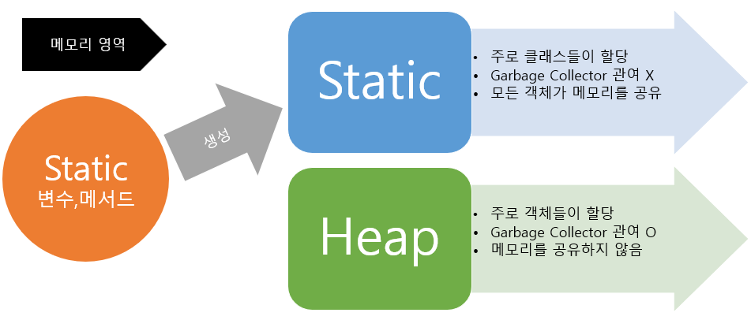

# Static & Final


## @Value Annotation

- @Value : 어플리케이션에 대한 Key/Value 형태의 설정을 클래스 내 변수에 값을 넣어줌

- Example

```java

## application.properties

application.version = v1.0.2

==============================================
## application.yml

application
    version: v1.0.2
```

- 사용
    - 3rd party 서비스 사용 시 Access Key, Secret Key 설정
    - profile 별 설정 파일 분리 관리

## 주의 : Static + @Value

```java
@Component
public class EncryptionUtil {

    @Value("${enc.key}"})
    public static String key;

}
```

- static 변수에 대해 @Value 어노테이션 동작 X
- 항상 null 반환
- 해결 방법 : setter 메소드 추가  & 직접 값 넣기
  
    ```java
    @Component
    public class EncryptionUtil {
    
        public static String key;
    
        @Value("${enc.key}"})
        public void setKey(String value) {
            key = value;
        }
    
    }
    ```
    


## 


## Q. Static 의미와 사용법

```java
정적필드 (Static 변수)
정적메소드 (Static 메소드)

-> 정적 멤버 (클래스 멤버)
= 객체(인스턴스) 소속된 멤버가 아닌 클래스에 고정된 멤버

-> 클래스로더가 클래스 로딩 & 메소드 메모리 영역 적재 시 : 클래스 별로 관리
```

- 특징
    - 모든 객체가 공유, 하나의 멤버를 어디서든 참조 가능
    - GC 관리 영역 밖 → 프로그램 종료시까지 메모리 할당된 채로 존재
        - 시스템 성능 악영향

- 선언 기준 (인스턴스 vs 정적)
    - 공용으로 사용하느냐 아니냐

- **정적필드** 예시

```java
class Number{
    static int num = 0; //클래스 필드
    int num2 = 0; //인스턴스 필드
}

public class Static_ex {
	
    public static void main(String[] args) {
    	Number number1 = new Number(); //첫번째 number
    	Number number2 = new Number(); //두번쨰 number
    	
    	number1.num++; //클래스 필드 num을 1증가시킴
    	number1.num2++; //인스턴스 필드 num을 1증가시킴
    	System.out.println(number2.num); //두번째 number의 클래스 필드 출력
    	System.out.println(number2.num2); //두번째 number의 인스턴스 필드 출력
    }
}
```

```java
1
0
```

- **정적 메소드** 예시
    - 정적 메소드는 유틸리티 함수를 만드는데 유용하게 사용

```java
class Name{
    static void print() { //클래스 메소드
	System.out.println("내 이름은 홍길동입니다.");
    }

    void print2() { //인스턴스 메소드
	System.out.println("내 이름은 이순신입니다.");
    }
}

public class Static_ex {
	
    public static void main(String[] args) {
        Name.print(); //인스턴스를 생성하지 않아도 호출이 가능
    	
        Name name = new Name(); //인스턴스 생성
        name.print2(); //인스턴스를 생성하여야만 호출이 가능
    }
}
```

---

# Final 키워드

- 변수, 메소드, 클래스 에 사용 가능
- 어느 곳에서 사용되냐에 따라 다른 의미
- 무언가 제한한다는 의미 공통적

## 변수

- final + 변수 : 이 변수는 수정할 수 없다 →  초기화 값 필수
- “수정할 수 없다”
    - 변수의 값
    - 다른 객체 참조, 참조하는 객체 내부의 값 변경 O
    
    ```java
    public class Service {
    
      public void variableFinal() {
    
        final int value = 2;
        final Person person = new Person("사바라다", 29);
    
        System.out.println("value = " + value);
        System.out.println("person_1 = " + person);
    
        // value = 2; // 컴파일 에러
        person.setAge(10);
        person.setName("사바라");
    
        System.out.println("person_2 = " + person);
        // person = new Person("염광호", 29); // 컴파일 에러
      }
    }
    
    class Person {
    
      private String name;
    
      private int age;
    
      //.. get, set, toString 메서드 존재하나 길이상 생략
    }
    
    ======================================================================================================
    value = 2
    person_1 = Person{name='사바라다', age=29}
    person_2 = Person{name='사바라', age=10}
    ```
    
    - 기본형 변수 (primitive) : 내부에 값을 가짐 → 값 변경 X
    - 참조형 변수 : 객체의 주소 → 가리키는 객체 변경 X & 객체 내부의 값 변경 가능
    

### 초기화 방법

- **메소드 내부 변수**
    1. 선언 시 초기화
    2. 사용하기 전 초기화

```java
public void variableFinal() {

  final int value = 2;
  final int value_2;

  System.out.println("value = " + value);

  value_2 = 3;
  System.out.println("person_2 = " + value_2);
}
```

- **객체 멤버 변수**
    1. 선언 시 초기화
    2. 생성자를 이용한 초기화
    3. 초기화 block 을 이용한 초기화

```java
public void variableFinal() {
  Person person = new Person("사바라다");
  System.out.println("person = " + person);
}

class Person {

  private final String name;

  private final int age;
  {
    age = 10;
  }

  private final String email = "koangho93@naver.com";

  public Person(String name) {
    this.name = name;
  }

  @Override
  public String toString() {
    return "Person{" +
        "name='" + name + '\'' +
        ", age=" + age +
        ", email='" + email + '\'' +
        '}';
  }
}
```

- **static 변수**
    1. 선언 시 초기화
    2. static 초기화 block 을 이용한 초기화

```java
class Person {

  private static final String DEFAULT_NAME = "염광호";

  private static final int DEFAULT_AGE;
  static {
    DEFAULT_AGE = 10;
  }

  ... person 객체 내부 후략
```

---

## 메소드

- final + 메소드 : override 제한
- 클래스 상속 시 해당 클래스 protected, public 등 접근 제어자를 가진 메소드 상속 & 재구현

## 클래스

- final + 클래스 : 상속 불가능 클래스 → 다른 클래스에서 상속 및 재정의 불가능
    - ex) Integer 과 같은 래퍼(Wrapper) 클래스
    
    ```java
    public final class Integer extends Number implements Comparable<Integer> {
    
    }
    ```