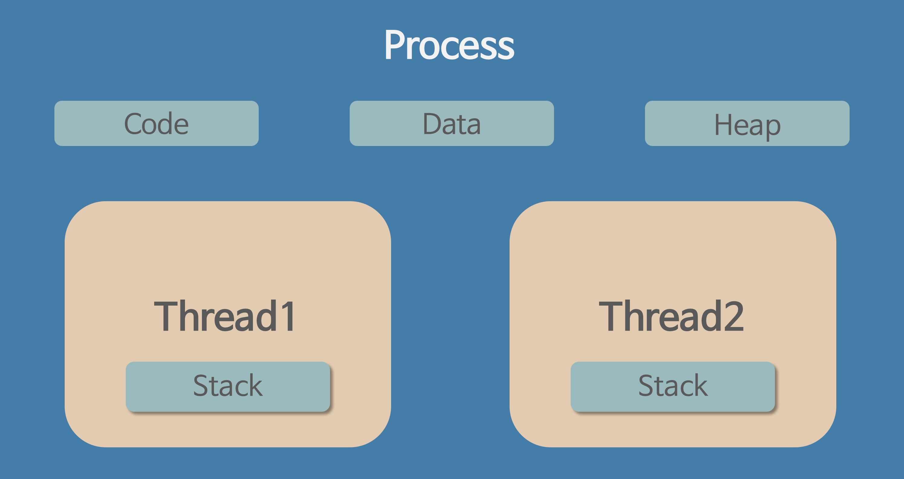
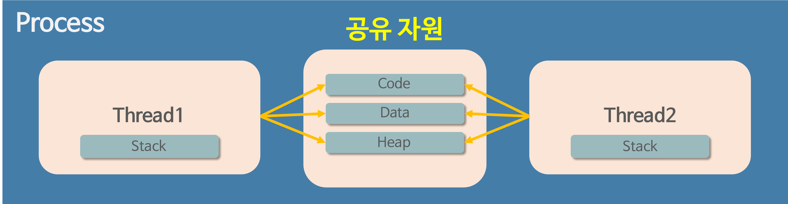

# 프로그램 (Program)

- `**어떤 작업을 위해 실행할 수 있는 파일**`


# 프로세스 (Process)

- `컴퓨터에서 연속적으로 **실행되고 있는 컴퓨터 프로그램**`
- 메모리에 올라와 실행되고 있는 프로그램의 인스턴스 (독립적인 개체)
- OS 로부터 *시스템 자원을 할당 받는 작업 단위
  - *시스템 자원 example
    - CPU 시간
    - 운영되기 위해 필요한 주소 공간


### 특징

- 프로세스는 각각 독립된 메모리 영역 (Code, Data, Stack, Heap의 구조) 할당받음
- 프로세스당 최소 1개의 스레드(메인) 가짐
- 각 프로세스는 별도의 주소 공간에서 실행
- 한 프로세스는 다른 프로세스의 변수나 자료구조에 접근 불가
  - 다른 프로세스의 자원에 접근하기 위해선 프로세스 간 통신 (IPC, inter-process communication) 을 사용
  - ex. 파이프, 파일, 소켓 등을 이용한 통신 방법 이용


# 쓰레드 (Thread)

- **`프로세스 내에서 실행되는 여러 흐름의 단위`**
- 프로세스의 특정한 수행 경로
- 프로세스가 할당 받은 자원을 이용하는 실행 단위




### 특징

- 쓰레드는 프로세스 내에서 각각 Stack만 할당 받고, Code, Data, Heap 영역은 공유
- 한 프로세스 내에서 동작되는 여러 실행의 흐름 → 프로세스 내의 주소 공간, 자원들(힙 공간 등)은 같은 프로세스 내 쓰레드끼리 공유하며 실행 cf) 프로세스는 다른 프로세스 메모리 접근 X
- 각각 쓰레드는 별도의 레지스터와 스택 BUT 힙 메모리 공유
- 한 쓰레드가 프로세스 자원 변경 시, 이웃 쓰레드(Sibling Thread) 도 변경 결과 즉시 확인 가능


# 멀티 프로세스

- 하나의 응용 프로그램을 여러개의 프로세스로 구성
- 각 프로세스가 하나의 작업 처리(Task)


### 장점

- 여러 자식 프로세스 중 하나에 문제 발생 시 해당 자식 프로세스만 죽음 → 영향 확산 X


### 단점

- ```
  ***Context Switching**
  ```

   오버헤드

  - 캐쉬 메모리 초기화 등 무거운 작업, 시간 소모
  - 공유하는 메모리가 없어, 캐쉬의 모든 데이터 리셋 & 다시 캐쉬 정보 불러옴

- 프로세스 사이 어렵고 복잡한 통신 기법 (IPC)

  - 하나의 프로그램에 속하는 프로세스들 사이에서도 변수 공유X

```
*** Context Switching**
```

- 동작 중인 프로세스가 대기 & 해당 프로세스 상태 보관
- 대기 중이던 다음 순서 프로세스 동작 & 보관한 프로세스 상태 복구 작업


# 멀티쓰레드

- 하나의 응용프로그램을 여러 개의 쓰레드로 구성
- 각 쓰레드로 하나의 작업 처리
- window, linux 등 OS 에서 기본적으로 멀티 스레딩 (멀티 프로세싱 지원O)
- 대표적인 멀티 쓰레드 응용 프로그램 : 웹 서버


### 장점

- 시스템 자원 소모 감소 (자원의 효율성 증대)
  - 프로세스 생성 및 자원 할당 시스템 콜 감소 → 자원 효율적인 관리
- 시스템 처리량 증가 (처리 비용 감소)
  - 쓰레드 간 데이터 주고받기 간단, 소모 감소
  - Context Switching 빠름
- 간단한 통신 방법으로 인한 프로그램 응답 시간 단축
  - 프로세스 내의 Stack 영역 제외 모든 메모리 공유


### 단점

- 주의 깊은 설계
- 디버깅 까다로움
- 단일 프로세스 시스템의 경우 효과 X
- 다른 프로세스에서 쓰레드 제어 X
  - 프로세스 밖에서 쓰레드 각각 제어 X
- 멀티 쓰레드의 경우 자원 공유의 문제 (동기화 문제)
- 하나의 쓰레드에 문제 발생 시 전체 프로세스 영향


## Q. (멀티 프로세스 대신) 멀티 쓰레드를 사용하는 이유?

= 프로그램을 여러 개 키는 것보다 하나의 프로그램 안에서 여러 작업 해결

= 여러 프로세스(멀티 프로세스)로 할 수 있는 작업을 하나의 프로세스에서 여러 쓰레드로 나눠가며 하는 이유




## A. 자원의 효율성 증대 (프로세스 생성 및 자원 할당 시스템 콜 감소)

- 프로세스 간 context switching 시 CPU 레지스터 교체 뿐 아니라 RAM, CPU 사이 캐쉬메모리 데이터 모두 초기화
- 쓰레드는 프로세스 내 메모리 공유 → 쓰레드 간 데이터 주고 받기 간단 & 자원 소모 감소


## A. 처리 비용 감소 및 응답 시간 단축

- 프로세스 간 통신(IPC) 보다 통신 비용 적음

  - Stack 영역 외 모든 메모리 공유 → Context Switcing 시 Stack 영역만 처리

  

  ## 주의할점

  - 동기화 문제
  - 쓰레드 간 자원 공유는 전역 변수 사용 → 함께 상용할 때 충돌 발생