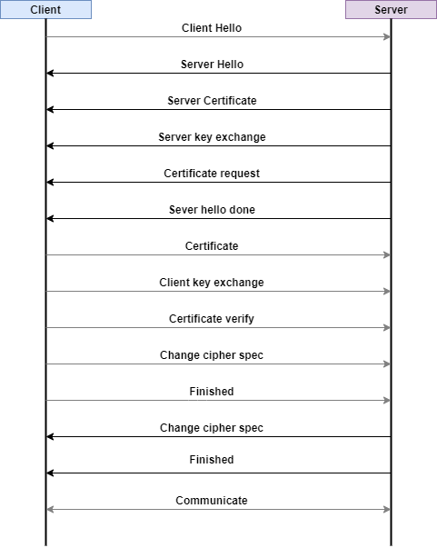
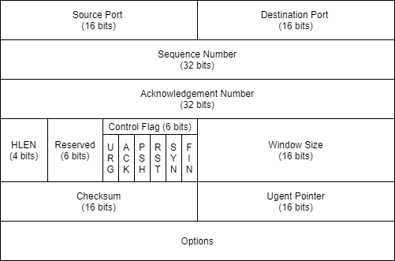
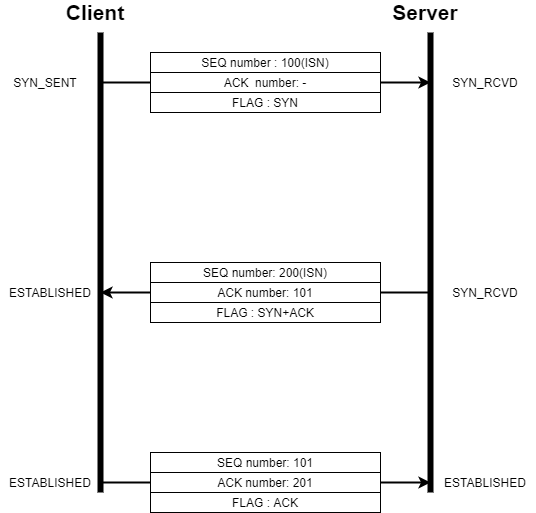
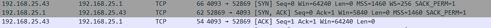
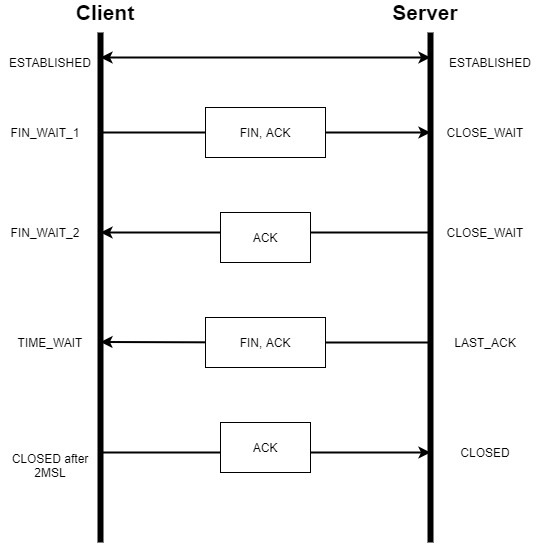

# SSL (Sesure Socket Layer)

### 배경

> 암호화 : 대칭키 암호(공통적으로 알고 있는 키) , 비대칭키 암호 (서로 다른 키)
>
> 대칭키 - (+) : 속도가 빠름 
>
> 			-  (-) : 키 공유 과정 필요, 외부로의 노출 발생 → 가로챈다면 큰 피해 
>
> 비대칭키 - (-) : 느리고 비효율적


<aside> 💡 처음 대칭키를 교환할 때만 비대칭키 암호를 사용 ! → TLS 의 역할


### 보안 기능

- 기밀성
  - 데이터를 훔쳐가도 볼 수 없음
- 무결성
  - 메시지 인증 코드 (MAC: Message Authentication Code) 를 통해 인증 제공
  - 위변조 여부 확인
- 인증
  - 연결 초기 설정에서 주고받는 인증서를 통해 신뢰할 수 있는 개체인지 인증


- 전송 계층 위에서 TLS 계층을 따로 두어 동작
- TLS 사용 어플리케이션 프로토콜은 끝에 s가 붙음 (HTTPS, FTPS)


### TLS의 세부 프로토콜

- Handshake
  - 양쪽 간에 연결을 설정할 때 보안 협상을 위한 프로토콜
- Change Cipher Spec
  - 보안 파라미터 변경 및 적용 시 사용
  - ex) 대칭키 알고리즘 변경 시 프로토콜 사용
- Alert
  - 오류 전송 시 사용하는 프로토콜
- Application Data
  - 실제 데이터 전송될 때 사용되는 프로토콜
- Record
  - 협상된 보안 파라미터를 이용하여 암, 복호화, 무결성 검증 등을 수행하는 프로토콜

 

```
💡 Handshake

TLS 는 세션과 연결 별로 상태 정보를 유지합니다. 
Full Handshake를 통해 세션 생성 
세션 정보를 공유하는 여러 연결 성립

⚡ Abbreviation Handshake : 세션이 이미 존재할 때 사용 
⚡ Full Handshake : 세션 생성

연결 : 서버와 클라이언트 간 통신의 단위

세션 : 연결의 다수

세션은 한번 성립되면 다음 연결을 위해 상태 유지(sessionId 등) 할 수 있음 

ex) 한 번의 연결에서 암호화 방식, 인증서 교환, session id 공유 
→ 할 일 끝나 연결 끊음 
→ 다음 연결에 이 세션 정보를 이용하여 연결 가능
```





💧**1. Client Hello**

- random

  - 32바이트 난수 값 for 비밀 데이터 (master secret)

- session ID

  - 처음 생성 시 빈 값, 이미 생성된 세션이 있다면 그 세션 ID

- Cipher suite

  - 클라이언트가 지원 가능한 키 교환 알고리즘, 대칭키 암호 알고리즘, 해시 알고리즘

  - 서버는 이 중에 최적의 방식 선택

  - ex) 

    TLS_RSA_WITH_AES_128_GCM_SHA256

    - 키교환 알고리즘 : RSA
    - 대칭키 알고리즘 : AES_128_GCM
    - 해시 알고리즘 : SHA256

🩸 **2. Server Hello**

사용할 tls 버전, 지원 가능한 최적의 Cipher suite, 압축 방식 등을 client에게 전달

- random
  - 32바이트 난수 값 for 비밀 값 (master secret)
- session ID
  - 세션 정보

**🩸 3. Server certificate**

해당 인증서를 이용하여 클라이언트는 믿을만한 서버인지 확인

**🩸 4. Server Key exchange**

키 교환에 필요한 정보 제공

ex) 키교환 알고리즘 Diffie-Hellman 사용 → 소수, 원시근 필요 → 이를 전송

**🩸 5. Certificate request**

서버 역시 클라이언트에게 인증서 요구 가능 (하지 않을 수도 있음)

**🩸 6. Server hello done**

💧**7. Certificate**

서버가 요청한 인증서 줌 (요청하지 않았다면 X)

💧**8. Certificate**

키교환 필요 정보(pre-master secret) 를 서버에 제공

```java
**클라이언트** : 서버의 랜덤값, 클라이언트 랜덤값 조합하여 암호화해 전송  (대칭키)

							받은 인증서 안 서버의 공개키로 암호화 

**서버** : pre-master secret을 자신의 개인키로 복호화

-> pre-master secret 공유 성공 -> master secret으로 만듦
```

💧**9. Certificate verify**

클라이언트가 Certificate request 를 받았다면 보낸 인증서에 대한 개인키 있음

handshake 과정의 주고받은 메시지 + master secret 조합한 hash 값에

개인키로 디지털 서명하여 전송

💧**10. Change cipher spec**

협상된 보안 파라미터 적용 및 변경 시 서버에게 알림

💧**11. Finished**

클라이언트 끝

**🩸 12. Change cipher spec**

클라이언트에게 보안 파라미터 변경 알림

**🩸 13. FInished**

서버도 끝

🏋️‍♂️ **14. 통신**

주고받은 비밀키를 통해 안전하게 통신 !


------

# TCP

IP 계층 위에서 동작하는  TCP는 연결 지향 프로토콜

정확한 데이터 전송 요구, 신뢰할 수 있는 프로토콜 (Reliable Protocol)


### 신뢰성 보장을 위한 제어

- 흐름 제어 (Flow Control)
  - 상대가 받을 수 있는 만큼의 양
- 혼잡 제어 (Congestion Control)
  - 네트워크 혼잡 시 송신자가 데이터 전송량 제어
  - 데이터 손실 발생 많아질 시 → 혼잡 상태 판단
- 오류 제어 (Error Control)
  - 오류 발생 시 TCP는 데이터 재전송


### TCP 헤더

- 신뢰성 보장을 위해 많은 정보 포함




**Control Flags**

| FLAG                              | 설명                                                         |
| --------------------------------- | ------------------------------------------------------------ |
| URG (Urgent Pointer)              | Urgent Pointer의 필드가 유효하다는 의미의 FLAG               |
| ACK(Acknowledgement)              | 수신 확인 응답 FLAG                                          |
| PSH (Request for push)            | 송수신 버퍼의 있는 데이터 즉시 처리 요청 FLAG                |
| RST (Reset the connection)        | 연결을 강제 중단합니다. TCP가 유지되고 있을때 이 FLAG를 사용하면 그 즉시 연결을 끊어 버립니다. 해커들이 Hijacking을 위해 피해자의 연결을 끊어버릴때 사용합니다. 보통의 정상적인 종료는 아래의 FIN FLAG를 설정합니다. |
| SYN (Synchronize sequence number) | 연결 설정 FLAG                                               |
| FIN(Terminate the connection)     | 정상 종료의 연결 종료 FLAG                                   |


## TCP 연결 설정 과정 (3-way handshake)

3단계 절차를 통해 연결 성립

FLAG 2가지 사용 (SYN, ACK)




- 최초 클라이언트 쪽에서 SYN FLAG와 SeqNumber 를 임의로 설정하여 보내줌
  - 최초 SeqNumber  : ISN (Initial Sequence Number)
  - 아직 상대방에게서 데이터 수신 X → ACK 필드 비어있음
  - 클라이언트의 적극적인 연결 요청 : `Active Open`
  - 수동적인 서버 : `Passive Open`
- 서버에서 동기화 요청을 받았으면 잘 받았다고 연결 요청
  - 클라이언트에서 보낸 Seq 에 +1 하여 ACK number → 다음 Seq Number 요구
  - ISN 설정
  - ACK, SYN 플래그 사용 (둘 다 유효한 데이터)
  - 패킷 전송 후 서버는 연결 확립 상태 (ESTABLISHED)
- 클라이언트는 이에 대한 응답으로 서버에게 ACK num 설정하여 보냄
  - 이후 클라이언트도 연결 확립 상태 (ESTABLISHED)




## 연결 종료 (4-way handshake)

정상적인 연결 종료는 FIN, ACK 의 플래그를 통해 이루어짐



- 연결 상태에 있던 클라이언트가 연결 종료를 위해 `FIN` 보냄
  - close 요청한 쪽 : `Active Close`
  - close 요청 받은 쪽 : `Passive Close`
- 수신하는 서버는 응답으로 `ACK` 를 보냄
- 서버는 이후 소켓을 받는 시스템 콜(close) 호출 전까지 대기 상태, 소켓 종료 후 `FIN` + `ACK`보냄
- 서버로부터 `FIN` 을 받은 클라이언트는 `ACK` 응답을 하여 2MSL만큼의 시간(보통 1~4분) 이후 연결 종료 상태 (CLOSED)