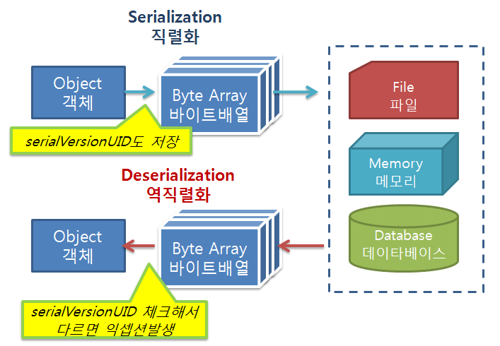

### 자바 객체의 직렬화(Serializable)

자바에서 입출력에 사용되는 것은 스트림이라는 데이터 통로를 통해 이동했습니다. 하지만 객체는 바이트형이 아니라서 스트림을 통해 파일에 저장하거나 네트워크로 전송할 수 없습니다. 따라서 객체를 스트림을 통해 입출력하려면 바이트 배열로 변환하는 것이 필요한데, 이를 **직렬화** 라고 한다. 반대로 스트림을 통해 받은 직렬화된 객체를 원래 모양으로 만드는 과정을 **역직렬화**라고 합니다.

정라하면

**직렬화(Serialize)**

- 자바 시스템 내부에서 사용되는 Object 또는 Data를 외부의 자바 시스템에서도 사용할 수 있도록 byte 형태로 데이터를 변환하는 기술
- JVM(Jaava Virtual Machine 이하 JVM)의 메모리에 상주(힙 또는 스택)되어 있는 객체 데이터를 바이트 형태로 변환하는 기술

**역직렬화(Deserialize)**

- byte로 변환된 Data를 원래대로 Object나 Data로 변환하는 기술
- 직렬화된 바이트 형태의 데이터를 객체로 변환해서 JVM으로 상주시키는 형태

### SerialVersionUID

직렬화된 객체를 역직렬화 할 때엔 직렬화 당시 클래스와 같은 클래스를 사용해야 하는데, 클래스명이 같더라도 내용이 변경된 경우 역직렬화는 실패한다.

클래스 일치여부를 구별하는 기준은 SerialVersionUID로, 직렬화되는 클래스가 명시적으로 serialVersionUID를 선언하지 않으면 직렬화 시 자동 생성되어 직렬화 내용에 포함된다.



### 직렬화

- java.io.Serializable인터페이스를 상속받은 객체는 직렬화 가능

```java
public class Member implements Serializable{
    private String name;
    private int age;
}
```

```java
@Service
public class ObjectHelper {

    // ObjectOutputStream : 객체 직렬화
    @SneakyThrows
    public String toStringBase64(Serializable serializable) {
        ByteArrayOutputStream byteArrayOutputStream = new ByteArrayOutputStream();
        ObjectOutputStream objectOutputStream = new ObjectOutputStream(byteArrayOutputStream);
        objectOutputStream.writeObject(serializable);
        objectOutputStream.close();
        return Base64.getEncoder()
                .encodeToString(byteArrayOutputStream.toByteArray());
    }

    // ObjectInputStream : 스트림으로부터 읽어들인 직렬화된 객체를 역직렬화 해서 객체 생성
    @SneakyThrows
    public Object fromStringBase64(String base64String) {
        byte[] bytes = Base64.getDecoder()
                .decode(base64String);
        ObjectInputStream objectInputStream = new ObjectInputStream(new ByteArrayInputStream(bytes));
        Object object = objectInputStream.readObject();
        objectInputStream.close();
        return object;
    }
}
```

### transient & static

객체 직렬화 후에 **보존하고 싶지 않은 멤버 변수**가 있을 수 있다. 그 멤버 변수에 **transient** 키워드를 사용하면 객체 직렬화 시 저장하지 않는다. 또한 static으로 선언된 변수도 공유 메모리 개념을 가지고 있기 때문에 직렬화 시 제외된다. 보통 비밀번호와 같이 보안상 직렬화되면 안 되는 값에 사용한다

```java
public class TransientTest implements Serializable {

     private String name;
     transient String passwd;
}
```

### 주로 사용되는 곳

#### 서블릿 세션(Servlet Session)

세션을 서블릿 메모리 위에서 운용한다면 직렬화를 필요로 하지 않지만, 파일로 저장하거나 세션 클러스터링, DB를 저장하는 옵션 등을 선택하게 되면 세션 자체가 직렬화가 되어 저장되어 전달한다.

#### 캐시(Cache)

Ehcache, Redis, Memcached라이브러리 시스템을 많이 사용한다.

#### 자바 RMI(Remote Method Invocation)

원격 시스템 간의 메시지 교환을 위해서 사용하는 자바에서 지원하는 기술
