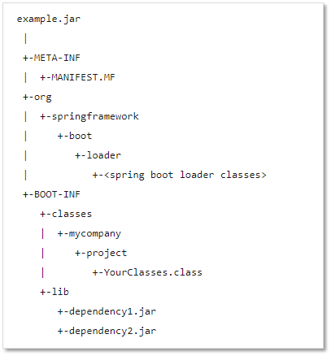
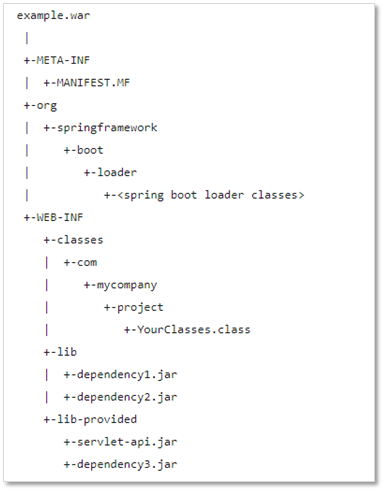

## JAR, WAR

JAR(Java Archive), WAR(Web Application Archive) 모두 JAVA의 jar 툴을 이용하여 생성된 압축(아카이브) 파일이며 어플리케이션을 쉽게 배포하고 동작시킬 수 있도록 있도록 소스들이나 관련 파일(리소스, 속성파일 등)들을 패키징해주는 것이 주 역할이다.

### JAR(Java Archive)

- JAVA 어플리케이션이 동작할 수 있도록 자바 프로젝트를 압축한 파일
- Class (JAVA리소스, 속성 파일), 라이브러리 파일을 포함함
- JRE(JAVA Runtime Environment)만 있어도 실행 가능함 (java -jar 프로젝트네임.jar)

> Sprinag boot에서 가이드하는 표준은 JAR

### WAR(Web Application Archive)

- Servlet / Jsp 컨테이너에 배치할 수 있는 웹 애플리케이션(Web Application) 압축파일 포맷
- 웹 관련 자원을 포함함 (JSP, Servlet, JAR, Class, XML, HTML, Javascript)
- 사전 정의된 구조를 사용함 (WEB-INF, META-INF)
- 별도의 웹서버(WEB) or 웹 컨테이너(WAS) 필요
- 즉, JAR파일의 일종으로 웹 애플리케이션 전체를 패키징 하기 위한 JAR 파일이다.

### Spring에서의 JAR와 WAR

스프링부트 프로젝트를 새로 생성할 때, jar 또는 war 로 패키징 방식을 선택할 수 있다.

두 방식 모두 WAS 컨테이너 위에서 동작하게 되는데, 이는 JAR파일에 WAS가 내장되어 있기 때문입니다. embedded tomcat을 jar에 내장해서, jar파일로도 빌드가 가능허다.

따라서 기존 톰켓과 같은 컨테이너를 이용해야 했던 스프링보다 훨씬 간단하게 어플리케이션을 제작/배포할 수 있다.

하지만 필요에 따라 외부 WAS를 이용해야할 경우도 생기는데, (대부분의 실무에서는 그래서 WAR를 쓰나봅니다.) 때문에 이때는 WAR 파일로 패키징을 해야합니다.

#### JAR File Structure

스프링 부트 공식문서에서 소개하는 JAR 파일은 아래 이미지처럼 BOOT-INF, META-INF, org 세 폴더로 이루어져 있다.

1. BOOT-INF

개발자가 직접 작성한 클래스 파일들(classes)과, 의존성 주입을 통한 jar 파일(lib)들로 구성되어 있다.

- classpath.idx

그림에는 없지만 classpath.idx라는 파일도 포함되어 있는데, 이는 classpath에 추가될 jar 파일들의 목록(lib 폴더 안에 있는 jar 파일)을 정의한 것이다.

이는 "일반적인 JAR 파일은 중첩된 JAR 구조를 지원하지 않는다"는 단점을 보완하기 위해 스프링 부트가 고안해 낸 방법으로, jar 파일 리스트를 확인하여 중첩된 JAR 구조를 지원할 수 있도록 한다.

> - "ojdbc8.jar"
> - "sitemesh-3.0.1.jar"
> - "querydsl-apt-4.1.4.jar"
> - "spring-boot-starter-web-2.3.4.RELEASE.jar"
> - "spring-boot-starter-data-jpa-2.3.4.RELEASE.jar"
> - "querydsl-jpa-4.3.1.jar"
> - "spring-boot-starter-security-2.3.4.RELEASE.jar"
>   ...

2. META-INF

: 프로젝트 매니페스트 파일(MANIFEST.MF)을 포함하는 폴더이다. 매니페스트 파일은 파일 그룹을 위한 메타데이터(이름, 버전 번호, 라이선스, 프로그램의 구성 등)를 포함하는 파일이다.

- MANIFEST.MF

> Spring-Boot-Classpath-Index: BOOT-INF/classpath.idx
>
> Start-Class: com.example.demo.DemoApplication
>
> Spring-Boot-Classes: BOOT-INF/classes/
>
> Spring-Boot-Lib: BOOT-INF/lib/
>
> Spring-Boot-Version: 2.3.4.RELEASE
>
> Main-Class: org.springframework.boot.loader.JarLauncher

일반적인 JAR File의 MANIFEST에서 Main-Class는 Main메서드가 존재하는 클래스로 설정되지만, 스프링 부트의 Main-Class에서는 JarLauncher라는 클래스로 설정되어있다. (cf. WAR File에서는 WarLauncher)

- JarLauncher를 통한 Jar의 실행방식은 아래 순서로 이루어진다.
  1. org.springframework.boot.loader.jar.JarFile: 내장 jar 인식
  2. org.springframework.boot.loader.Launcher 실행
  3. Start-Class에 선언된 클래스의 Main메서드 실행 (com.example.demo.DemoApplication)

3. org

org 폴더 안에는 Springboot loader classes 모듈이 저장되어 있다.

#### JAR 배포 시 JSP 템플릿 프레임워크 작동하지 않음

스프링부트 공식문서에 따르면 JSP 프레임워크는 jar 배포시 작동하지 않는다고 정의되어 있다.

> If possible, JSPs should be avoided. There are several known limitations when using them with embedded servlet containers.

jsp는 jar로 묶을 때, src/main/webapp/WEB-INF/jsp에 위치하다보니 jar에 포함되지 않는다.

만약 jar 배포를 하고 싶은데, jsp를 같이 넣고 싶다면 src/main/resources/META-INF/resources/WEB-INF/jsp에 jsp 파일을 두면 jar에 포함되고, view도 잘 찾는다고 한다.

#### WAR File Structure

WAR 파일은 아래 이미지처럼 WEB-INF, META-INF, org 세 폴더로 이루어져 있다. JAR File과의 차이점은 BOOT-INF 대신 WEB-INF가 있다는 것인데, 웹 애플리케이션의 사전 정의된 구조를 따르기 위한 것으로 보인다.

1. WEB-INF

개발자가 직접 입력한 class와 jar 파일, JSP 일 경우 view 파일들까지 포함되어 있는 디렉터리 이다. 아래 이미지는 Tomcat 사이트에서 설명하는 기본 디렉토리 구조로, WAR File Structure의 구조와 유사하단 것을 알 수 있다. 이처럼 웹 애플리케이션의 사전 정의된 구조를 따르고 있기 때문에, 외장 WAS 나 JSP를 사용할 일이 있다면 WAR를 이용하여 배포해야 한다.

2. META-INF

: JAR File과 동일하게 MANIFEST.MF 파일을 확인할 수 있다. 간혹 WAR파일은 단독으로 실행이 불가능하다는 이야기를 듣곤 했는데, Spring boot의 WAR는 단독으로 실행이 가능하다(bootWar로 빌드하였을 경우). 그 이유는 Main-Class에 Spring loader로 설정되어 있기 때문이다.

### EAR (Enterprise Archive)

추가적으로 EAR 파일은 JAVA EE(Enterprise Edition)쓰이는 파일 형식으로 **한 개 이상의 모듈을 단일 아카이브로 패키징**하여 어플리케이션 서버에 동시에 일관적으로 올리기 위하여 사용되는 포맷입니다.

> Manifest-Version: 1.0
> Start-Class: com.example.demo.DemoApplication
> Spring-Boot-Classes: WEB-INF/classes/
> Spring-Boot-Lib: WEB-INF/lib/
> Spring-Boot-Version: 2.3.4.RELEASE
> Main-Class: org.springframework.boot.loader.WarLauncher
