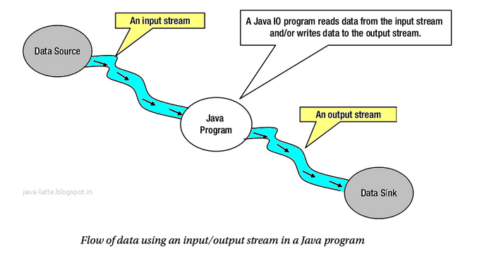
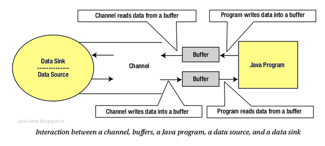

## NIOO

### NIO란

Non-blocking I/O (일반적으로 NIO라고 불리우고 때때로 New I/O라고도 함)은 강력한 I/O 오퍼레이션 기능을 제공하는 자바 프로그래밍 API이다.  NIO는 J2SE 1.4에서 표준I/O를 보완하기 위해서 소개되었다.

또 자바 7로 버전업하면서 IO와 NIO 사이의 일관성 없는 클래스 설계를 바로 잡고 비동기 채널 등의 네트워크 지원을 대폭 강화한 NIO.2 API가 추가되었다.

### IO와 NIO의 차이점

| 구분                   | IO                 | NIO                              |
| ---------------------- | ------------------ | -------------------------------- |
| 입출력 방식            | 스트림             | 채널                             |
| 버퍼 방식              | 넌버퍼(Non-Buffer) | 버퍼(Buffer)                     |
| 비동기 방식            | 지원 안 함         | 지원                             |
| 블로킹 / 넌블로킹 방식 | 블로킹 방식만 지원 | 블로킹 / 넌블로킹 방식 모두 지원 |

### IO

Stream의 사전적의미는 "무엇인가의 끊기지 않는 흐름"이다. Java I/O에서 스트림의 의미는 데이터의 순차적인 흐름이다. 스트림의 데이터는 바이트, 문자, 객체일 수 있다.

Input 스트림을 통한 데이터 소스로 부터 데이터의 흐름은 자바 프로그램으로 전달되고, 자바 프로그램으로부터 데이터 흐름은 output stream을 통해 데이터 싱크로 전달된다. 다시 말하면 자바 프로그램은 input 스트림으로 데이터를 읽고 output 스트림으로 데이터를 쓴다.

### NIO

채널은 양방향 전송 능력을 가지고 있다. 채널은 데이터 읽을 때뿐만 아니라 쓸 때에도 데이터 전송을 위해 사용할 수 있다. 요구에 따라 read-write 채널을 설정할 수 있고, read-only, write-only 채널을 설정할 수 있다.

스트림 기반 I/O에서 데이터 전송의 기본 단위는 byte이다. 그러나 채널기반 NIO에서는 데이터 전송의 기본 단위는 buffer이다.

IO는 스트림에서 읽은 데이터를 즉시 처리하므로 스트림으로부터 입력된 전체 데이터를 별도로 저장하지 않으면,
입력된 데이터의 위치를 이동해 가면서 자유롭게 이용할 수 없다.

NIO는 읽은 데이터를 무조건 버퍼에 저장하기 때문에 버퍼 내에서 데이터의 위치를 이동해 가면서 필요한 부분만 읽고 쓸 수 있다.

버퍼는 bounded data container이다. 즉 버퍼는 정해진 용량을 가지고 있다.

### 블로킹 vs. 넌블로킹

IO는 블로킹(Blocking)된다.

- 입력 스트림의 read()를 호출하면 데이터가 입력되기 전까지 스레드는 블로킹(대기상태)되고
  마찬가지로 출력 스트림의 write()를 호출하면 데이터 출력 전까지 스레드는 블로킹된다.
  IO 스레드가 블로킹되면 다른 일을 할 수 없고 블로킹을 빠져나오기 위해 인터럽트(Interrupt)도할 수 없다.
  블로킹을 빠져나오는 유일한 방법은 스트림을 닫는 것이다.

NIO는 블로킹과 넌블로킹(Non-Blocking)특징을 모두 가진다.

- NIO블로킹은 스레드를 인터럽트(Interrupt)함으로써 빠져나올 수 있다.
- NIO 넌블로킹은 입출력 작업 시 스레드가 블로킹되지 않는 것을 말한다.
  NIO의 넌블로킹은 입출력 작업 준비가 완료된 채널만 선택해서 작업 스레드가 처리하기 때문에 작업 스레드가 블로킹되지 않는다.
