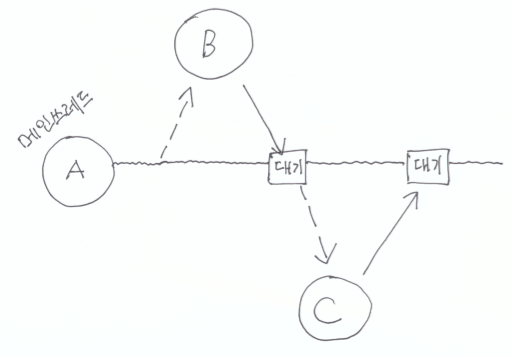
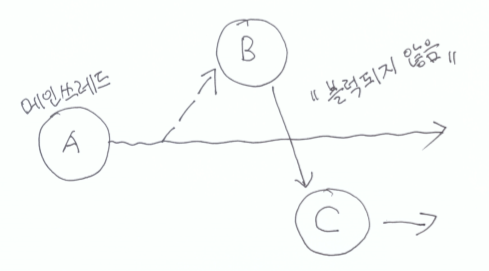

## Future Pattern

### Future Pattern이란?

Netty 학습 중 Netty는 비동기 호출을 위한 두 가지 패턴을 제공한다. 첫 번째는 리액터 패턴의 구현체인 이벤트 핸들러이며 두 번째는 퓨처 패턴이다.

퓨처 패턴은 미래에 완료될 작업을 등록하고, 추후 처리 결과를 확인하는 객체를 통해서 작업의 완료를 확인하는 패턴이다.

그림으로 간단히 알아보면,

#### Future 패턴을 사용하지 않을 경우

출처: https://hamait.tistory.com/748 [HAMA 블로그:티스토리]

 B 에서 일을 처리한 결과를 C 에 입력해서 처리하고 결과를 받아야 한다고 할때 (체이닝이 필요할때) 메인쓰레드에서는 B 의 결과를 기다렸다가 C 에게 넣어주고 또 C 의 결과를 기다려야한다.

#### Future 패턴을 사용하는 경우

출처: https://hamait.tistory.com/748 [HAMA 블로그:티스토리]

메인쓰레드는 그냥 모든것을 잊어버리고 자기 일을 하고 , B 에게 던진일은 알아서 B -> C-> Somthing 이 되게 한다면 효율적으로 작업을 수행할 수 있다.

### 예시

~~~java
Restaurant rest = new Restaurant();
Future  ticket = rest->requestPizza(); //전화로 주문을 한후에, 전자티켓을 받는다.
boolean b = future->isComplete();     // 티켓을 통해서 완료됬는지 (배달이 집앞에 왔는지) 알수있다. 

if(b){

eat(future->getPizza());    // 집앞에 배달이 왔으면 냠냠 먹는다. 

} else{                                      // 배달 안왔으면 하던일을 한다.
      .... // TV 를 보거나 설거지를 한다 ....
       .... // 좀 지나서 

  while(!future->isComplete()){  // 시간이 지나서 배달 올 때쯤에 다시 확인해본다.   
          Sleep(100);                       // 아직 안왔으면 올때까지 기다린다.   
  }

  eat(future->getPizza());         // 피자를 냠냠!!! 

}
~~~