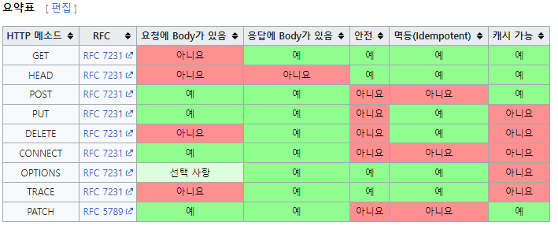

## HTTP 속성
 

> HEAD : GET과 동일하지만 메시지 부분을 제외하고, 상태 줄과 헤더만 반환
>
> OPTIONS : 대상 리소스에 대한 통신 가능 옵션(메서드)를 설명(주로 CORS에서 사용)
>
> CONNECT : 대상 자원으로 식별되는 서버에 대한 터널을 설정
>
> TRACE : 대상 리소스에 대한 경로를 따라 메시지 루프백 테스트를 수행
>

### 안전 (Safe Methods)

- 여러 번 호출해도 리소스를 변경하지 않는다.
  - GET : 단순 조회만 수행하기 때문에 안전
  - POST, PUT, PATCH, DELETE : 호출했을 때 변경이 일어나므로 안전하지 않음

Q. 그래도 계속 호출해서, 로그 같은게 쌓여서 장애가 발생할 경우?
A. 안전은 해당 리소스만 고려한다. 해당 부분까지 고려하지 않는다.

### 멱등 (Idempotent) 

- 한 번 후출하든 두 번 호출하든 100번 호출하든 결과가 똑같아아 함 -> f(x) = f(f(x))
  - GET : 한 번 조회하든, 두 번 조회하든 같은 결과가 조회
  - PUT : 결과를 대체, 따라서 같은 요청을 여러 번 호출해도 최종 결과는 같음
  - DELETE : 결과를 삭제, 같은 요청을 여러 번 호출해도 삭제된 결과는 같음
  - **POST** : 멱등이 아님. 두 번 호출하면 같은 결제가 중복해서 발생할 수 있음

- 활용
  -  자동 복구 메커니즘 : 서버가 TIMEOUT 등으로 정상 응답을 못 주었을 때, 클라이언트가 같은 요청을 다시 해도 되는가? 판단근거

### 캐시가능 (Cacheable)

- 응답 결과 리소스를 캐시해서 사용해도 되는가?
- GET, HEAD, POST, PATCH 캐시 가능
- 실제로는 GET, HEAD 정도만 캐시로 사용
  - POST, PATCH는 본문 애용까지 캐시키로 고려해야 하는데, 구현이 쉽지 않음
