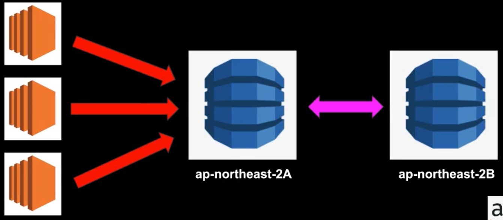
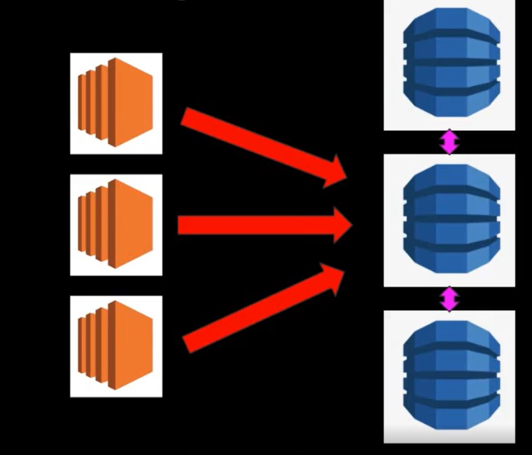

### Multi AZ

* 원래 존재하는 RDS DB에 무언가 변화(e.x: Write)가 생길때 다른 Availability Zone에 똑같은 복제본이 만들어짐 = Synchronize

* AWS에 의해서 자동으로 관리가 이루어짐 ( No admin intervention )
  
* 원본 RDS DB에 문제가 생길 시 자동으로 다른 AZ의 복제본이 사용됨
  
* Disaster Recovery Only!
  
> 성능 개선을 위해서 사용되지는 않음
>
> 성능 개선을 기대하기 위해선 **Read Replica**가 사용되어져야 함!

3개의 EC2 Instance가 하나의 Production RDS DB에 연결되어 write 기능이 수행될 때
2A RDS가 죽으면 2B RDS로 자동으로 failover

### Read Replica

* Production DB의 읽기 전용 복제본이 생성됨
  
* 주로 Read-Heavy DB 작업 시 효율성의 극대화를 위해 사용됨 ( Scaling )
  
* Disaster Recovery 용도가 아님
  
* 최대 5개 Read Replica DB 허용
  
* Read Replica의 Read Replica 생성 가능 ( 단 Latency 발생 )
  
* 각각의 Read Replica는 자기만의 고유 Endpoint 존재

EC2 Instance로부터 write 작업이 수행될 시 Read Replica에 의해 RDS 복제본이 생성된다.

이렇게 되면 하나의 EC2 Instance를 각각의 Read Replica로 연결시킬 수 있어 메인 DB의 워크로드를 낮추고 성능을 높일 수 있다.

### ElastiCache

* 클라우드 내에서 In-memory 캐시를 만들어줌
  
* 데이터베이스에서 데이터를 읽어오는 것이 아니라 캐시에서 빠른 속도로 데이터를 읽어옴
  
* Read-Heavy 어플리케이션에서 상당한 Latency 감소 효과 누림

1. Memcached

* Object 캐시 시스템으로 잘 알려져 있음
  
* ElastiCache는 Memcached의 프로토콜을 디폴트로 따름
  
* EC2 Auto Scaling처럼 크기가 커졌다 작아졌다 가능함
  
* 오픈소스

> Memcached - 이럴 때 사용
> 
> 1. 가장 단순한 캐싱 모델이 필요한가요?
>
> 2. Set, List처럼 advanced 캐싱이 주된 목적이 아닌 Object caching이 주된 목적인가요?
>
> 3. 캐시 크기를 마음대로 scaling 하기를 원하나요?

1. Redis

* Key-Value, Set, List와 같은 형태의 데이터를 In-Memory에 저장 가능함

* 오픈소스

* Multi-AZ 지원

> Redis - 이럴 때 사용
> 
> 1. Multi AZ기능이 사용되어져야 하나요?
>
> 2. Set, List와 같은 데이터셋을 사용하나요?
>
> 3. 리더보드처럼 데이터셋의 랭킹을 정렬하는 용도가 필요한가요?