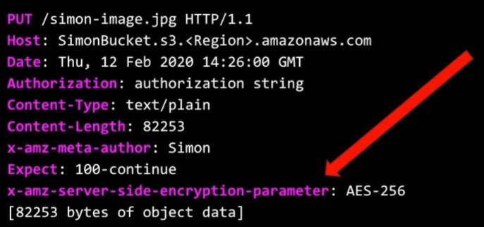

### S3( Simple Storage Service )

* 안전하고 가변적인 Object 저장 공간을 제공 ( ex : Google Cloud, 운영체제 같은 것들은 업로드해서 사용 불가 )
  
* 편리한 UI 인터페이스를 통해 어디서나 쉽게 데이터를 저장하고 불러올 수 있음
  
* 파일 크기는 0KB부터 5TB까지 지원
  
* 저장공간 무제한
  
* Bucket이라는 이름을 사용함( 디렉토리와 유사함 )
  
* Bucket은 보편적인 namespace를 사용함 ( IAM과 마찬가지로 지역이 Global로 되어있어 Region과 상관없이 Bucket 이름은 고유해야 함)

### S3 Object 구성 요소

* Key

* Value
  
* Version ID
  
* Metadata
  
* CORS ( Cross Origin Resource Sharing )

### S3 Data Consistency Model

1. Read after Write Consistency ( PUT )

2. Eventual Consistency ( UPDATE, DELETE )

### S3 Storage

* 일반 S3
  * 가장 보편적으로 사용되는 스토리지 타입
  * 높은 내구성, 가용성 ( Durability, Availability)

* S3 - IA ( Infrequent Access )
  * 자주 접근되지는 않으나 접근시 빠른 접근이 요구되는 파일이 많을 시 유용
  * 일반 S3에 비해 비용은 저렴하나 접근시 추가 비용 발생
  * 멀티 AZ을 통한 데이터 저장
  
* S3 - One Zone IA
  * 단일 AZ를 통한 데이터 저장
  * 단일 AZ에 의한 데이터 접근 제한 (조금 낮은 가용성)
  * 데이터 접근 시 S3 - IA보다 20% 비용 저렴
  
* Glacier
  * 거의 접근하지 않을 데이터 저장 시 유용
  * 매우 저렴한 비용
  * 데이터 접근시 대략 4~5시간 소요

* Intelligent Tiering
  * 데이터 접근 주기가 불규칙할때 매우 유용
  * 2가지 티어 준재
    * Frequent Tier
    * Infrequnt Tier
  * 데이터 접근주기에 따라 두 가지 티어중 하나로 선택됨
  * Frequent Tier가 비용이 약간 더 비쌈
  * 최고의 비용 절감 효율을 누릴 수 있음

### S3 요금

* GB당 0.023$ 정도
* PUT, GET, COPY 요청 횟수당
* 데이터 다운로드시 / 다른 리소스로 전송시
* Metadata ( object tag )

### S3 사용 용례

* 파일 저장소 (로그, 다양한 파일들(이미지, 비디오, 압축파일 등))
* 웹사이트 호스팅 ( CSS, JS 같은 파일을 업로드 한 후 S3 버켓을 도메인 주소로 사용 )
* CORS

#### 최초 S3 버켓 생성시 -> 비공개(PRIVATE)

1. 버켓 정책 변경 ( Bucket Policy )
2. 접근 제어 리스트 변경 ( Access Control List ) ( 파일 하나하나에 다른 접근권한 부여)

### 암호화

* S3에 중요한 파일들을 업로드할 때 암호화과정을 거쳐 외부로부터의 노출을 차단

1. 파일 업로드/ 다운로드시
    * SSL/TLS

2. 가만히 있을시
    1. SEE-S3 : 마스터를 가지고 있으며 일정 시간마다 키값을 변경시킴, 마스터키가 변경하는 키값은 AES-256으로 구성되어있음
    2. SSE-KMS : KMS 암호화 키를 통하여 누가, 언제 어떻게 암호를 풀었는지에 대한 기록이 보관되어 있어 체계적인 관리가 가능
    3. SSE-C : 암호키를 직접 다룰 수 있어 키 값을 변경시켜줘야함

> SSL : Secure Socket Layer
> TSL : Transport Layer Security
> SSE : Server Side Encrytion

### S3 암호화 과정

- S3에 파일을 업로드시 PUT 요청이 생성됨

* 파일이 업로드 될 시 암호화가 이루어 진다면 헤더에 x-amz-server-side-encryption-parameter 추가

