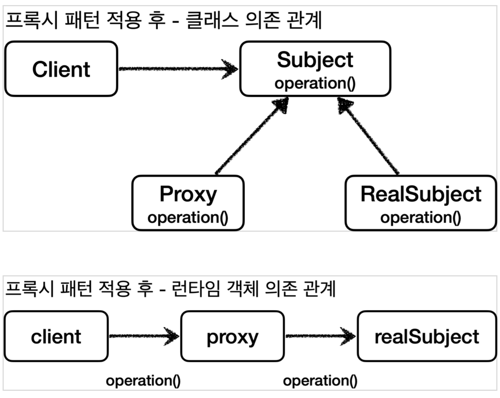

## 프록시(Proxy) [Spring]

### 프록시란?

프록시의 사전적 정의는 '대리인'으로, 간단하게 설명하면 내가 어떤 객체를 사용하려고 할 때 해당 객체에 직접 요청하는 것이 아닌 중간에 가짜 프록시 객체(대리인)를 두어서 프록시 객체가 대신해서 요청을 받아 실제 객체를 호출해 주도록 하는 것이다.


클라이언트와 서버 개념에서 일반적으로 클라이언트가 서버를 직접 호출하고, 처리 결과를 직접 받는다.
이것을 직접 호출이라 한다


그런데 클라이언트가 요청한 결과를 서버에 직접 요청하는 것이 아니라 어떤 대리자를 통해서 대신
간접적으로 서버에 요청할 수 있다. 여기서 대신 요청을 보내는 대리자를 영어로 프록시(Proxy)라 한다.


### 프록시의 주요 기능

프록시를 통해서 할 수 있는 일은 크게 2가지로 구분할 수 있다.

- 접근 제어

  - 권한에 따른 접근 차단
  - 캐싱
  - 지연 로딩

- 부가 기능 추가
  - 원래 서버가 제공하는 기능에 더해서 부가 기능을 수행한다.
  - 예) 요청 값이나, 응답 값을 중간에 변형한다.
  - 예) 실행 시간을 측정해서 추가 로그를 남긴다

### 디자인 패턴

프록시는 사용목적(intent)에 따라 두 가지로 구분할 수 있다.

1. 접근제어 → 프록시(Proxy) 패턴
2. 부가적인 기능 부여 → 데코레이터(Decorator) 패턴

### 프록시(Proxy) 패턴

프록시 패턴은 타깃에 대한 접근 방법을 제어하려는 목적을 가지고 프록시를 사용하는 패턴을 말한다.

프로젝트에서 객체를 생성하는 일은 언제나 비용이 소모된다. 따라서 객체를 최소한으로 생성할수록, 필요 시점까지 생성을 미룰수록 좋다. 프록시를 이용하면 타깃 오브젝트에 대한 레퍼런스가 미리 필요할 때, 객체를 생성해서 넘겨주지 않고 프록시를 먼저 넘겨준 후 프록시의 메서드를 통해 실제로 사용될 때 타깃 오브젝트를 생성할 수 있다.

또한 특정 상황에서 타깃에 대한 접근권한을 제어할 수 있다. 특정 조건이 만족되면 타깃의 핵심 로직을 호출하기 전에 예외를 던져서 접근을 불가능하게 만들 수 있다.

마지막으로 캐싱(cache)이 가능하다. 타깃으로부터 응답으로 받은 데이터가 메모리에 존재할 때, 프록시는 타깃으로 요청을 보내지 않고, 기존 응답의 데이터를 클라이언트에게 전달할 수 있다.



#### ProxyPatternClient

```java
public class ProxyPatternClient {
    private Subject subject;
    public ProxyPatternClient(Subject subject) {
        this.subject = subject;
    }
    public void execute() {
        subject.operation();
    }
}
```

#### Subject 인터페이스

```java
public interface Subject {
    String operation();
}
```

#### RealSubject

```java
@Slf4j
public class RealSubject implements Subject {
    @Override
    public String operation() {
        log.info("실제 객체 호출");
        sleep(1000);
        return "data";
    }
    private void sleep(int millis) {
        try {
            Thread.sleep(millis);
        } catch (InterruptedException e) {
            e.printStackTrace();
        }
    }
}
```

#### CacheProxy

```java
@Slf4j
public class CacheProxy implements Subject {
    private Subject target;
    private String cacheValue;

    public CacheProxy(Subject target) {
        this.target = target;
    }

    @Override
    public String operation() {
        log.info("프록시 호출");
        if (cacheValue == null) {
            cacheValue = target.operation();
        }
        return cacheValue;
    }
}
```

#### ProxyPatternTest

```java
public class ProxyPatternTest {
    @Test
    void cacheProxyTest() {
        Subject realSubject = new RealSubject();
        Subject cacheProxy = new CacheProxy(realSubject);
        ProxyPatternClient client = new ProxyPatternClient(cacheProxy);
        client.execute();
        client.execute();
        client.execute();
    }
}
```

#### 실행결과

> CacheProxy - 프록시 호출
> RealSubject - 실제 객체 호출
> CacheProxy - 프록시 호출
> CacheProxy - 프록시 호출

### 데코레이터(Decorator) 패턴

데코레이터 패턴은 타깃에 부가적인 기능을 런타임 시 다이내믹하게 부여해주기 위해 프록시를 사용하는 패턴을 말한다.

이 패턴의 이름처럼 선물 상자를 포장지로 꾸미는 것처럼 타깃에 부가적인 기능을 부여해줄 수 있다. 또한 선물 상자를 꾸미는데 포장지 제한이 없는 것처럼 하나의 타깃에도 다양한 부가기능을 추가하기 위해 한 개 이상의 프록시를 사용할 수 있다.


#### DecoratorPatternClient

```java
@Slf4j
public class DecoratorPatternClient {
    private Component component;
    public DecoratorPatternClient(Component component) {
        this.component = component;
    }
    public void execute() {
        String result = component.operation();
        log.info("result={}", result);
    }
}
```

#### Component 인터페이스

```java
public interface Component {
 String operation();
}
```

#### RealComponent

```java
@Slf4j
public class RealComponent implements Component {
 @Override
 public String operation() {
 log.info("RealComponent 실행");
 return "data";
 }
}
```

#### MessageDecorator

```java
@Slf4j
public class MessageDecorator implements Component {
    private Component component;
    public MessageDecorator(Component component) {
        this.component = component;
    }
    @Override
    public String operation() {
        log.info("MessageDecorator 실행");
        String result = component.operation();
        String decoResult = "*****" + result + "*****";
        log.info("MessageDecorator 꾸미기 적용 전={}, 적용 후={}", result,
                decoResult);
        return decoResult;
    }
}
```

#### TimeDecorator

```java
@Slf4j
public class TimeDecorator implements Component {
    private Component component;
    public TimeDecorator(Component component) {
        this.component = component;
    }
    @Override
    public String operation() {
        log.info("TimeDecorator 실행");
        long startTime = System.currentTimeMillis();

        String result = component.operation();

        long endTime = System.currentTimeMillis();
        long resultTime = endTime - startTime; // 실행시간
        log.info("TimeDecorator 종료 resultTime={}ms", resultTime);
        return result;
    }
}
```

#### ProxyPatternTest

```java
public class ProxyPatternTest {
    @Test
    void cacheProxyTest() {
        Subject realSubject = new RealSubject();
        Subject cacheProxy = new CacheProxy(realSubject);
        ProxyPatternClient client = new ProxyPatternClient(cacheProxy);
        client.execute();
        client.execute();
        client.execute();
    }
}
```

### 프록시 패턴 vs 데코레이터 패턴

사실 프록시 패턴과 데코레이터 패턴은 그 모양이 거의 같고, 상황에 따라 정말 똑같을 때도 있다.
디자인 패턴에서 중요한 것은 해당 패턴의 겉모양이 아니라 그 패턴을 만든 의도가 더 중요하다. 따라서 의도에 따라 패턴을 구분한다.

- 프록시 패턴의 의도: 다른 개체에 대한 접근을 제어하기 위해 대리자를 제공
- 데코레이터 패턴의 의도: 객체에 추가 책임(기능)을 동적으로 추가하고, 기능 확장을 위한 유연한 대안 제공

#### 정리

프록시를 사용하고 해당 프록시가 접근 제어가 목적이라면 프록시 패턴이고, 새로운 기능을 추가하는 것이 목적이라면 데코레이터 패턴이 된다.
